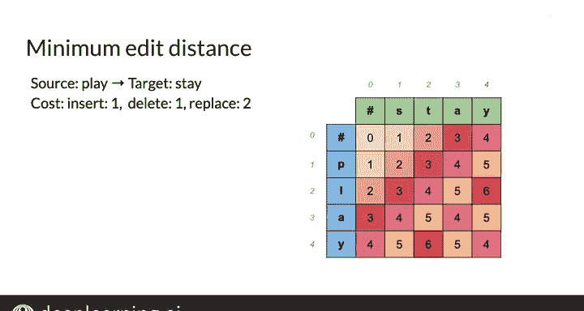

#  058：最小编辑距离算法II 🧮

在本节课中，我们将学习如何用代码实现填充最小编辑距离表格，从而将一个单词转换为另一个单词。我们将从直观方法过渡到公式化方法，并最终完成整个表格的计算。

---

## 表格初始化与边界填充

上一节我们介绍了最小编辑距离的基本概念和表格的直观填充方法。本节中，我们来看看如何使用公式化方法填充表格的其余部分。

你已经填充了表格的一部分，它目前看起来是这样的。现在，要填充表格的其余部分，你必须先填充最左侧列和顶部行的剩余单元格。

实际上，你知道将“play”转换为空字符串只需删除每个字母。因此，你可以按照以下公式从上到下填充这些单元格：对于每个单元格，查看其上方单元格并加上一次额外删除操作的成本，即 **1**。

这意味着要将字符串“P”转换为空字符串，需要一次删除操作。如之前的例子所示，将字符串“PL”转换为空字符串需要删除P和L，即两次删除操作，依此类推。现在，在D[4,0]处，你得到了从“play”到空字符串的最小编辑距离，这当然就是四次删除的成本 **4**。

你可以使用相同的思路填充第一行，通过每次插入一个字母将空字符串转换为“stay”。你可以按照这个略有不同的公式从左到右工作：查看前一个单元格并加上一次额外插入成本 **1**。目前看起来不错。

---

## 核心公式的应用

在之前的例子中，我展示了如何不使用公式计算这个单元格，但你也可以通过应用这个看起来复杂的大公式来找到解决方案。它基于你已经进行的计算，与使用无公式方法的方式完全相同。

虽然其中一些内容可能感觉像是在重复你刚刚学到的知识，但查看公式也很有价值，特别是在准备本周的编程作业时。

因此，到达这个橙色单元格的距离将是从之前三个单元格中的任何一个到达它的最小距离。这听起来很有趣，对吧？起初可能看起来有点抽象，但你可以将其分解为更小的部分。

例如：
*   如果你来自上方的单元格，你将加上删除成本，就像你在第一列中所做的那样。
*   如果你来自左侧的单元格，你将加上插入成本，就像你在顶部行中所做的那样。
*   如果你来自左上方的单元格，你将做两件事之一：如果源单词的第i个字母和目标单词的第j个字母不匹配，则加上替换成本；如果它们匹配，则不加任何成本，因为对于已经相同的字母无需进行编辑。

因此，对于这个单元格，你有以下计算：
*   来自上方：1 + 1 = **2**
*   来自左侧：1 + 1 = **2**
*   来自左上方：由于这两个字母（P和S）不匹配，所以是 0 + 2 = **2**

然后取这三个值中的最小值，即 **2**，并将该值填入单元格。这就是使用定义的公式和成本从“P”到“S”的最小编辑距离。

---

## 完成表格与模式观察

然后，你可以用同样的方式填充表格的其余部分。右下角的M[N, M]条目就是从“play”到“stay”的最小编辑距离，即 **4**。

添加颜色编码或热图可以揭示一些有趣的模式。你能从中间的正方形看出发生了什么吗？没错。一旦你从“PL”转换到“ST”，两个单词的后缀都是相同的“AY”。因此，不再需要更多的编辑操作。这就是为什么这个 **4** 会沿着对角线向下延伸。

现在，你已经知道了如何使用表格高效地构建最小编辑距离算法。做得很好。

---

## 实现注意事项与总结

在你继续之前，关于这种实现风格还有几点值得注意。我将在下一节向你展示这些。

恭喜！现在你已经看到了一些将在编程作业中使用的代码。在下一个视频中，我将向你展示更多技巧，这些技巧将帮助你完成编程作业。下次见。

---

本节课中，我们一起学习了如何用公式化方法填充最小编辑距离表格，理解了从边界初始化到核心单元格计算的完整过程，并观察到了后缀相同时编辑距离沿对角线传播的有趣模式。这为后续的编程实现打下了坚实的基础。