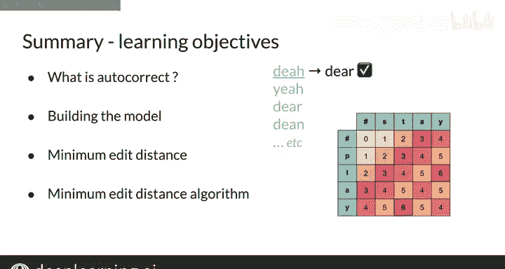

#  059：最小编辑距离算法III 🧮

在本节课中，我们将对最小编辑距离算法进行完整的回顾，并学习如何重构在编辑过程中所采取的路径。

## 算法概述与命名

上一节我们介绍了使用插入、删除和替换三种编辑操作来计算最小编辑距离的方法。本节中我们来看看这个算法的正式名称和一些扩展知识。

您所学习的实现方式，即赋予插入、删除成本为1，替换成本为2来衡量编辑距离，被称为 **莱文斯坦距离**。您可以查阅相关资料了解更多细节。

此外，还存在其他已知的、使用不同编辑规则的替代度量方法。

## 路径回溯

仅找到最小编辑距离本身有时并不能完全解决问题。您通常还需要知道是如何达到这个结果的。为此，我们需要进行**回溯**。

以下是实现回溯的方法：
*   在每个单元格中保存一个指针，用于指示到达该单元格的前一个位置。
*   通过从表格左上角到右下角的路径，您可以清楚地知道所采取的具体编辑操作序列。
*   这在处理字符串对齐等问题时特别有用，不过相关内容我们将在以后讨论。

## 动态编程技术

最后，我们使用的这种基于表格的计算方法，而非暴力穷举，是一种被称为**动态编程**的技术。

本质上，动态编程意味着先解决最小的子问题，然后复用该结果来解决下一个稍大的子问题，如此反复。您在本例中按顺序求解每个单元格的过程，正是这一思想的体现。

动态编程是计算机科学中一项著名的技术，在本课程后续的几周里将会反复出现。

## 总结与回顾

本节课内容非常丰富，您做得很好。您将求解最小编辑距离的问题分解为两个部分，然后逐步使用基于表格的方法实现了高效的算法。这是很棒的工作。😊

现在，您可以尝试编程作业，在那里您将编写此算法的代码，并有一个可选挑战：构建一个回溯工具。

旅程才刚刚开始，接下来的几周将充满更多令人兴奋的内容。但在继续之前，让我们快速回顾一下过去几节课的内容：

*   您学习了许多可能每天都在使用的NLP实际应用。
*   您了解了自动更正是什么以及它如何工作。
*   您逐步学习了如何使用编辑距离和词概率来构建一个可工作的自动更正模型。😊
*   您学习了字符串相似性问题和最小编辑距离这一度量标准。
*   最后，您学习了一种非常酷的、使用被称为动态编程的表格算法技术来解决最小编辑距离问题的方法。

现在，您可以在第一周的编程作业中练习所有这些新技能了。祝您编程愉快，好运！

恭喜您完成本周的学习！最小编辑距离是您对动态编程的第一次应用。

在下一周，您将学习**维特比算法**，它同样会用到动态编程技术。我们很快再见。😊