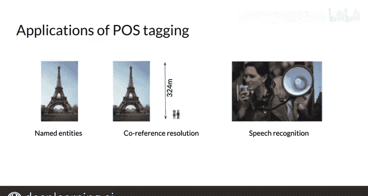

#  062：12_词性标注 📚

在本节课中，我们将要学习**词性标注**。你将了解它的不同应用场景，学习如何计算词性标注器的准确率，并掌握如何使用马尔可夫链和隐马尔可夫模型为文本语料库创建词性标注。最后，我们将介绍维特比算法及其在隐马尔可夫模型中的应用。

## 什么是词性标注？🔍

词性指的是语言中单词或词汇术语的类别。在英语中，这些词汇术语的例子包括名词、动词、形容词、副词、代词、介词等。让我们来看一个句子：“Why not learn something.”。

在文本分析中，完整写出这些术语的名称会变得繁琐。因此，我们将使用一种简短的表示形式，称为**标签**，来代表这些类别。

将标签分配给句子或语料库中单词的过程，被称为**词性标注**，简称**P标注**。

## 词性标注的应用 📊

由于词性标签描述了句子或文本中词汇术语的特征结构，你可以利用它们对语义进行推断。

以下是词性标注的主要应用：

*   **命名实体识别**：用于识别句子中的命名实体。例如，在句子“the Eiffel Tower is located in Paris”中，“Eiffel Tower”和“Paris”都是命名实体。
*   **指代消解**：用于解决指代问题。例如，对于两个句子“the Eiffel Tower is located in Paris. It is 324 m high.”，你可以利用词性标注推断出“It”在此上下文中指的是“the Eiffel Tower”。
*   **语音识别**：在语音识别中，使用词性标签来检查一个单词序列是否具有较高的概率。

## 从马尔可夫链到隐马尔可夫模型 ⛓️

上一节我们介绍了词性标注及其应用。本节中，我们来看看如何使用**马尔可夫链**来解码特定句子的词性。

马尔可夫链是一种数学模型，用于描述一系列可能的事件，其中每个事件的概率仅取决于前一个事件达到的状态。

在词性标注的上下文中，我们可以将词性序列视为一个马尔可夫链。然而，我们实际观察到的是单词序列，而词性标签是隐藏的。这就需要引入**隐马尔可夫模型**。

隐马尔可夫模型包含两种概率：
*   **转移概率**：从一个词性标签转移到下一个词性标签的概率。
*   **发射概率**：在给定某个词性标签的条件下，观察到某个特定单词的概率。

## 维特比算法与解码 🧮

为了在隐马尔可夫模型中找到最可能的隐藏状态（词性标签）序列，我们使用**维特比算法**。

维特比算法是一种动态规划算法，它通过递归地计算每个步骤和每个可能状态的最大概率路径，来高效地找到最优的标签序列。

以下是维特比算法的核心步骤：

1.  **初始化**：为序列的第一个单词和每个可能的词性标签计算初始概率。
2.  **递归**：对于序列中的每一个后续单词，计算到达每个可能词性标签的最大概率，并记录下产生该最大概率的前一个标签。
3.  **终止**：在序列末尾，选择概率最高的词性标签。
4.  **路径回溯**：从终止状态开始，根据记录的前驱信息，反向回溯出整个最可能的词性标签序列。

## 本周实践任务 💻

在本周的编程作业中，你将应用所有这些技能。这是一个重要的环节，你可以通过一个具体的例子来亲自尝试实现词性标注。

## 总结 📝

本节课中，我们一起学习了词性标注的基础知识。我们了解了词性标注的定义、它在命名实体识别、指代消解和语音识别等领域的应用。接着，我们探讨了如何使用马尔可夫链和隐马尔可夫模型来建模词性序列，并重点介绍了用于寻找最优标签序列的维特比算法。通过本周的实践，你将有机会巩固这些概念。