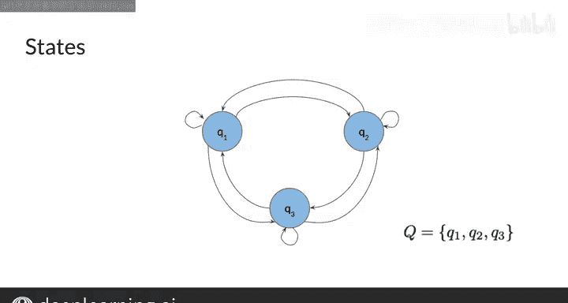

#  063：13_马尔可夫链 🎲

## 概述

在本节课中，我们将要学习**马尔可夫链**。这是一种重要的随机模型，广泛应用于语音识别和词性标注等领域。我们将从一个小例子开始，理解其核心思想，然后学习其基本构成要素：状态和转移概率。

---

## 马尔可夫链简介

上一节我们介绍了本课程的目标，本节中我们来看看什么是马尔可夫链。

马尔可夫链非常重要，因为它们被用于语音识别，同时也用于词性标注。在本视频中，我们将学习转移概率，你也将在开始之前了解状态的概念。

让我们先从一个简单的例子开始，展示你想要完成的任务。然后你将看到马尔可夫链如何帮助完成这个任务。

如果你看这个句子：“why not learn”。单词“learn”是一个动词。你想要回答的问题是，句子中接下来的单词是名词、动词还是其他词性。

如果你熟悉英语，你可能会猜测，如果你在句子中看到一个动词，接下来的单词更有可能是名词，而不是另一个动词。

这里的核心思想是：句子中下一个单词的词性标签的可能性，往往取决于前一个单词的词性标签。这很合理，对吧？

你可以用图形化的方式表示这些不同的可能性。这里有一个代表动词的圆圈，那边有一个代表名词的圆圈。你可以画一个箭头，从动词圆圈指向名词圆圈。同样，你可以画另一个箭头，从动词圆圈出发，绕回来指向它自己。

你可以为每个箭头关联一个数字，其中较大的数字意味着从一个圆圈移动到另一个圆圈的可能性更高。在这个例子中，从动词到名词的箭头概率可能是0.6，而从动词回到动词的箭头概率是0.2。更高的数字0.6意味着从动词到名词的可能性，高于从动词到另一个动词。

这是一个在非常小的规模上展示马尔可夫链如何工作的绝佳例子。

---

## 什么是马尔可夫链？

上一节我们通过例子感受了马尔可夫链的思想，本节中我们来正式定义它。

马尔可夫链是一种**随机模型**，它描述了一系列可能的事件，其中每个事件的概率仅取决于前一个事件的状态。单词“随机”意味着随机性或不确定性。因此，随机模型包含并模拟了具有随机成分的过程。

马尔可夫链可以被描绘成一个**有向图**。在计算机科学的语境中，图是一种数据结构，在视觉上表现为由线条连接的一组圆圈。当连接圆圈的线条带有指示特定方向的箭头时，这被称为有向图。

图中的圆圈代表我们模型的**状态**。状态指的是当前时刻的某种条件。例如，如果你用一个图来模拟水是处于冻结状态、液态状态还是气态状态，那么你会为每个状态画一个圆圈，以代表水在当前时刻可能处于的三种状态。

我将每个状态标记为Q1、Q2、Q3等，给它们各自一个唯一的名称。然后用大写字母Q来指代所有状态的集合。对于这个图，有三个状态：Q1、Q2和Q3。

---

## 应用：词性标注

你现在已经了解了模型中的状态，我们说状态代表条件或当前时刻。这些状态可以被认为是词性标签，也许一个状态对应动词，另一个对应名词，依此类推。

以下是使用马尔可夫链进行词性标注的基本步骤：
1.  **定义状态**：将每个可能的词性（如名词、动词、形容词）定义为一个状态。
2.  **计算转移概率**：基于大量文本数据，统计从一个词性转移到另一个词性的频率，并计算为概率。
3.  **构建模型**：使用这些状态和转移概率构建一个有向图模型。
4.  **进行预测**：给定一个单词序列，利用模型计算最可能的词性标签序列。

在下一个视频中，我们将深入学习词性标签。

---

## 总结

本节课中我们一起学习了**马尔可夫链**。我们了解到它是一种仅依赖前一个状态的随机模型，可以用**有向图**表示，其中节点是**状态**，边是**转移概率**。我们通过一个简单的词性预测例子，直观地理解了它的工作原理，并知道了它在自然语言处理（如词性标注）中的重要性。