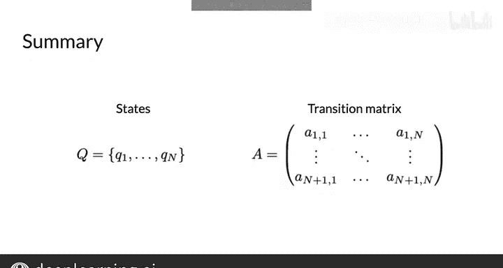

#  064：马尔可夫链与词性标签 🏷️➡️


在本节课中，我们将学习如何将马尔可夫链应用于自然语言处理，特别是用于词性标注。我们将介绍状态、转移概率和马尔可夫性质等核心概念，并了解如何使用转移矩阵来表示模型。

---

## 概述

上一节我们介绍了马尔可夫链中的“状态”概念。本节中，我们将看看如何将这些状态应用于词性标注。具体来说，你将看到如何从一个状态转移到另一个状态。

## 从状态到转移概率

在词性标注中，我们可以将句子视为一系列带有词性标签的单词。这个序列可以用一个图来表示，其中词性标签是可能发生的事件，由我们模型图中的状态来描绘。

例如，`NN` 代表名词，`VB` 代表动词，`Other` 代表所有其他标签。

图的边具有与之相关的权重或**转移概率**，这些概率定义了从一个状态转移到另一个状态的可能性。

## 马尔可夫性质

马尔可夫链还有一个重要属性，即所谓的**马尔可夫性质**。它指出，下一个事件的概率仅取决于当前事件。

马尔可夫性质通过声明确定下一个状态所需的全部信息就是当前状态，从而帮助保持模型简单。它不需要来自任何先前状态的信息。

回想一下水是固态、液态还是气态的类比。如果你看一杯放在室外的水，水的当前状态是液态。在模拟杯中水转变为气态的概率时，你不需要知道水以前的历史——它之前是来自冰块，还是来自雨云。这很合理，对吧？

## 转移概率示例

让我们重新审视之前的例句。

如果你想再次查看这个句子，并想知道 `learn` 之后下一个单词是名词的概率，那么这仅仅取决于你当前所处的状态。在本例中，是动词状态（由 `VB` 表示），因为当前单词 `learn` 是动词。

所以，下一个单词是名词的概率，就是从动词状态转移到名词状态 `NN` 的转移概率。这个转移概率写在从 `VB` 指向 `NN` 的箭头上。如你所见，它是 0.4。

## 转移矩阵

你也可以使用一个表格来存储状态和转移概率。表格是马尔可夫链模型的一种等效但更紧凑的表示形式，这个表格被称为**转移矩阵**。

转移矩阵是一个 `n x n` 的矩阵，其中 `n` 是图中状态的数量。

矩阵中的每一行代表从一个状态到所有其他状态的转移概率。例如，第一行表示当前状态是名词的情况。

列代表可能的下一个未来状态。

表格内的值代表从名词到名词、从名词到动词以及从名词到其他状态的转移概率。

请注意，对于从给定状态出发的所有转移概率，这些转移概率的总和应始终为 1。等效地，在转移矩阵中，每一行的所有转移概率加起来应为 1。

## 初始状态

你们中的一些人可能已经注意到这个模型的一个小缺陷：它没有告诉你如何为句子中的第一个单词分配词性标签。这是因为模型中的所有状态都对应单词，但当没有前一个单词时（例如在句子开头），你该怎么办？

为了处理这种情况，你可以引入所谓的**初始状态**。通过将这些概率包含在表 `A` 中，现在它的维度是 `(n+1) x n`。

请注意，转移矩阵可以写成如下所示的实际矩阵：

```
A = [ [初始概率],
      [从状态1到所有状态的转移概率],
      [从状态2到所有状态的转移概率],
      ... ]
```

## 总结

本节课中，我们一起学习了：
*   **马尔可夫链**由一组状态 `Q = {Q1, Q2, ..., Qn}` 组成。
*   **转移矩阵** `A` 的维度为 `(n+1) x n`，第一行包含初始概率。
*   **马尔可夫性质**简化了模型，使下一个状态的概率仅依赖于当前状态。



到目前为止做得很好。在下一个视频中，你将学习**隐马尔可夫模型**，它用于解码单词的隐藏状态——在我们的例子中，就是该单词的词性。