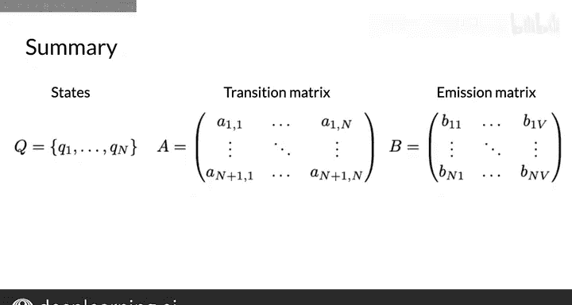

#  065：隐马尔可夫模型 🧩

在本节课中，我们将学习隐马尔可夫模型。你将了解如何使用该模型来解码单词的隐藏状态，在本例中，隐藏状态即单词的词性。我们还将介绍发射概率的概念。

---

## 隐马尔可夫模型概述

上一节我们讨论了马尔可夫模型，现在让我们来看看它的扩展——隐马尔可夫模型。

“隐马尔可夫模型”这一名称意味着状态是隐藏的，或者说无法直接观测。回顾一下马尔可夫模型，其状态代表词性，如名词、动词或其他。现在，你可以将这些状态视为隐藏状态，因为它们无法直接从文本数据中观测到。

你可能会觉得“数据是隐藏的”这个说法有些令人困惑。例如，当你看到“jump”这个单词时，熟悉英语的人能看出它是一个动词。然而，从机器的视角来看，它只看到文本“jump”，并不知道它是动词还是名词。

对于查看文本数据的机器而言，它能观测到的是实际的单词，如“jump”、“run”和“fly”。这些单词被称为可观测值，因为机器能够看到它们。

---

## 转移概率与发射概率

马尔可夫链模型和隐马尔可夫模型都包含转移概率，它可以表示为一个维度为 `(n+1) x n` 的矩阵 **A**，其中 `n` 是隐藏状态的数量。

隐马尔可夫模型还包含额外的概率，称为**发射概率**。它们描述了从隐马尔可夫模型的隐藏状态（即词性，图中用圆圈表示名词、动词等）到可观测值（即语料库中的单词，图中在矩形内表示）的转移过程。

例如，图中展示了隐藏状态“VB”（动词）对应的可观测值“going”、“to”、“eat”。从隐藏状态“动词”到可观测值“eat”的发射概率是0.5。这意味着当模型当前处于动词的隐藏状态时，有50%的概率会发射出单词“eat”。

---

## 发射概率的表示

以下是发射概率的一种等价表格表示形式。

每一行对应一个隐藏状态，每一列对应一个可观测值。例如，隐藏状态“动词”所在的行与可观测值“E”所在的列相交，其值0.5就是从状态“动词”发射出可观测值“E”的发射概率。

发射矩阵 **B** 表示从代表词性的 `N` 个隐藏状态，到语料库中 `M` 个单词的转移概率。同样，每行的概率之和为1。

在这个例子中，你可能已经注意到，我们所有三个词性（名词、动词、其他）的发射概率都大于零。这是因为单词根据其出现的上下文，可以被分配不同的词性标签。

例如，单词“back”在以下两个句子中应有不同的词性标签：
*   在句子“He lay on his back.”中，标签是**名词**。
*   在句子“I‘ll be back.”中，标签是**副词**。

---

## 模型定义与总结

以下是隐马尔可夫模型的快速回顾。

隐马尔可夫模型包含：
*   一组 `N` 个状态 **Q**。
*   转移矩阵 **A**，维度为 `N x N`。
*   发射矩阵 **B**，维度为 `N x V`（`V` 是可观测词汇表的大小）。

在本节课中，我们一起学习了隐马尔可夫模型的表示方法，并了解了如何计算转移概率和发射概率。