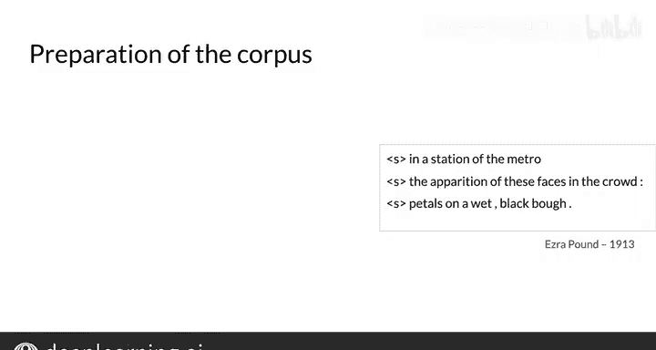

#  066：计算概率 🧮

在本节课中，我们将学习如何根据给定的语料库，计算并填充隐马尔可夫模型中的转移矩阵和发射矩阵的概率。我们将从理解基本概念开始，逐步学习具体的计算方法。

---

## 计算转移矩阵概率

上一节我们介绍了隐马尔可夫模型的基本结构。本节中，我们来看看如何计算状态之间的转移概率，即填充转移矩阵。

转移矩阵存储了马尔可夫模型各状态间的转移概率。为了从概念上理解如何计算这些概率，我们使用一个非常小的训练语料库作为示例。可以看到，词性标签由背景颜色表示。计算转移概率时，实际上只使用训练语料库中的词性标签序列。

要计算蓝色词性标签转移到紫色词性标签的概率，首先需要统计该标签组合在语料库中出现的次数。在这个语料库中，该次数为2。而以蓝色标签开头的所有标签对的总数是3。因此，在训练语料库中，三分之二的标签序列是以蓝色词性标签开始的。换句话说，蓝色标签后接紫色标签的转移概率是2/3。

更正式地说，为了计算马尔可夫模型的所有转移概率，首先需要统计训练语料库中所有标签对的出现次数。我们可以定义一个函数 **`C(ti-1, ti)`**，它返回语料库中标签 `ti-1` 后跟标签 `ti` 的计数。

接下来，计算一个标签 `ti` 跟在另一个标签 `ti-1` 后面的概率，即 **`P(ti | ti-1)`**。分子是 **`C(ti-1, ti)`**，即 `ti-1` 和 `ti` 共同出现的次数。分母是标签 `ti-1` 与所有其他标签 `tj` 共同出现的总次数之和。这将在后续的幻灯片中变得更清晰。

我们可以将概率 **`P(ti | ti-1)`** 写作：该概率由标签 `ti-1` 后出现标签 `ti` 的总次数（由函数 **`C(ti-1, ti)`** 给出，作为分子）除以标签 `ti-1` 出现的总次数（由函数 **`C(ti-1)`** 给出，作为分母）得到。

---

## 实战示例：俳句模型

假设你想为一种日本短诗——俳句训练一个模型。你的训练语料库将是以下由埃兹拉·庞德于1913年创作的俳句。在编程作业中，你会得到一个准备好的语料库。但在这里，为了计算正确的概率，我们需要对语料库进行一些修改。

以下是处理步骤：

首先，将语料库的每一行视为一个独立的句子。在每一行（或句子）的开头添加一个起始标记，以便能够使用前面定义的公式计算初始概率。

然后，将语料库中的所有单词转换为小写，使模型对大小写不敏感。

标点符号应保持原样，因为在这个简单的模型中，标点不影响计算，并且这里没有为不同类型的标点设置单独的标签。

经过这些步骤，你就得到了一个准备就绪的语料库。

---

## 本节总结

本节课中我们一起学习了如何计算词性标签之间的转移概率。你看到了如何从语料库中获取计数，然后如何将这些计数转化为概率。这非常有用，因为它使你能够填充模型的转移矩阵。在接下来的课程中，我们将学习如何计算发射矩阵的概率。