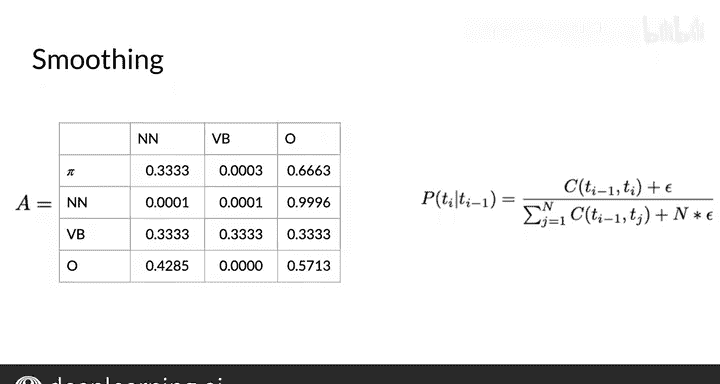

#  067：填充转移矩阵 📊

在本节课中，我们将学习如何填充隐马尔可夫模型中的转移矩阵。你将了解如何计算从一个词性标签转移到另一个词性标签的概率，以及如何处理数据中可能出现的零概率问题。

---

## 概述

转移矩阵用于描述在序列中，从一个状态（例如，一个词性标签）转移到另一个状态的概率。为了填充这个矩阵，你需要计算在给定当前标签的情况下，下一个标签出现的概率。同时，你还需要计算每个标签作为句子开头的概率。此外，我们将介绍一个称为“平滑”的新概念，用于处理数据稀疏性问题。

---

## 填充转移矩阵

上一节我们介绍了转移矩阵的基本概念，本节中我们来看看如何具体计算和填充它。

首先，用相关标签的计数填充矩阵的第一列。记住，矩阵的行代表当前状态，列代表下一个状态。值代表从当前状态转移到下一个状态的概率。

在这个用例中，状态是词性标签。如你所见，定义的标签和语料库中的元素用相应的颜色标记。

对于第一列，你需要计算以下标签组合的出现次数。例如：

*   一个名词跟在起始标记后出现一次。
*   一个名词跟在另一个名词后出现零次。
*   一个名词跟在动词后出现零次。
*   一个名词跟在“其他”标签（O）后出现六次。

矩阵的其余部分也按此方式填充，但这里可以走一个捷径。如你所见，这个语料库是一个没有动词的俳句。因为没有任何包含VB（动词）标签的组合，所以相关计数都是0。

然而，在编程作业中可没有这样的捷径。需要特别注意，“其他”标签（O）跟在起始标记后出现了两次。O跟在名词标签（N）后出现了六次。转移矩阵中最后一个条目，即O跟在O后面，计数为8。

在最后一行，你必须考虑以“A.Wes, wet, comma”结尾的单词，并返回计算正确的计数。

---

## 计算转移概率

现在你已经计算了矩阵中所有标签组合的计数，接下来可以计算转移概率了。

到目前为止，你计算并输入到矩阵中的是计数，这对应着我们公式中的分子。现在，你只需要将每个计数除以对应的行总和。

记住这个行总和代表什么。对于当前状态是名词词性的那一行，该行的总和代表了所有“当前状态是名词，下一个状态是任意词性（无论是名词、动词还是其他）”的词对数量。

因此，对于名词标签（N）跟在起始标记后的转移概率（换句话说，名词标签的初始概率），我们用1除以3。或者，对于“其他”标签后跟名词标签的转移概率，我们用6除以14。

---

## 引入平滑技术

你可能已经意识到这里存在两个问题。第一个问题是，VB（动词）标签的行总和是0，使用这个公式会导致除以0的错误。第二个问题是，转移矩阵中有很多条目是0，这意味着这些转移的概率为0。如果你希望模型能推广到其他可能包含动词的俳句，这将是不可行的。

为了解决这个问题，我们需要稍微修改一下公式：在分子的每个计数上加上一个很小的值ε（epsilon），并在除数上加上n倍的ε（n是状态数量），这样行总和仍然加起来等于1。这个操作也被称为“平滑”，你可能在之前的课程中还记得它。

因此，公式变为：
**P(next_tag | current_tag) = (count(current_tag, next_tag) + ε) / (sum(count(current_tag, *)) + n * ε)**

如果将ε设为一个很小的值，比如0.001，那么你将得到以下转移矩阵。这里显示的值保留到小数点后三位。所以，如果行总和没有精确地加到1，不必担心。

平滑的结果是，如你所见，矩阵中不再有任何零值条目。此外，由于从VB状态出发的所有转移概率实际上都被归一化了，它们变得同等可能。这是合理的，因为你没有任何数据来估计这些转移概率。

---

## 关于平滑的注意事项

在你继续之前，还有一件事需要注意。在一个真实的例子中，你可能不希望将平滑技术应用于转移矩阵第一行的初始概率。

这是因为，如果你通过给可能为0的条目添加一个小值来对该行进行平滑，你实际上是在允许一个句子以任何词性标签（包括标点符号）开头。

---

## 总结

本节课中，我们一起学习了如何填充隐马尔可夫模型的转移矩阵。我们首先通过计数语料库中的标签组合来填充矩阵，然后通过除以行总和将其转换为概率。为了解决数据稀疏性和零概率问题，我们引入了平滑技术，通过添加一个小的ε值来确保所有转移都有非零概率，并使模型更具鲁棒性。同时，我们注意到对初始概率行应用平滑需要谨慎。在下一个视频中，我们将继续学习如何填充另一种称为发射矩阵的矩阵。