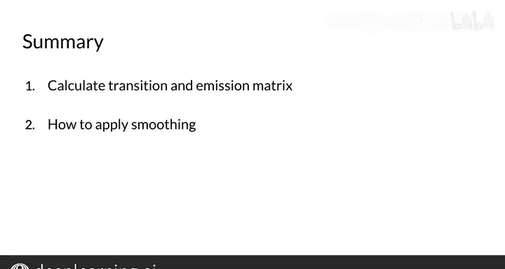

#  068：18_填充发射矩阵 📊

在本节课中，我们将学习如何构建和填充发射矩阵。这是隐马尔可夫模型（HMM）用于词性标注的关键组成部分之一。我们将通过一个简单的例子，一步步演示如何从训练语料中计算发射概率。

---

## 概述

上一节我们介绍了如何计算转移矩阵，它描述了词性标签之间的转换概率。然而，仅知道标签间的转换概率还不足以进行词性标注。我们需要将具体的词语纳入考量。因此，本节将引入一种新的矩阵——发射矩阵。它描述了在给定某个词性标签的条件下，观察到特定词语的概率。

---

## 构建发射矩阵

发射矩阵的核心是计算词性标签与特定词语共同出现的频率。以下是如何从一个小型训练语料库开始构建的过程。

假设我们有一个非常小的训练语料库，其中每个词都带有对应的词性标签（用背景色表示）。与计算转移概率时统计标签对的出现次数不同，这里我们需要统计**一个特定的词性标签与一个特定词语配对的次数**。

例如，在语料库中，词语“you”出现了两次，并且两次都与蓝色的词性标签（例如代词）相关联。同时，蓝色的词性标签在语料库中总共出现了三次。因此，在给定蓝色标签的条件下，发射词语“you”的概率是 **2/3**。

---

## 一个更复杂的例子

让我们继续使用上一课处理过的俳句作为更复杂的例子。我们拥有相同的词性标签集合，现在开始填充计数。

在发射矩阵中，行代表词性标签（如名词、动词、其他标签），列代表词汇表中的词语。我们统计的是：**某个词性标签与某个特定词语配对的次数**。

例如，对于词语“in”：
*   名词标签与词语“in”配对的次数为 **0**。
*   动词标签与词语“in”配对的次数为 **0**。
*   其他标签（O）与词语“in”配对的次数为 **2**（因为“in”在语料中出现了两次，且都被标记为其他标签）。

---

## 发射概率公式与平滑

发射概率 `P(word | tag)` 的计算公式如下。为了模型的泛化性，我们同样引入平滑技术：

`P(w_i | t_i) = (count(t_i, w_i) + 1) / (count(t_i) + V)`

其中：
*   `count(t_i, w_i)` 是词性标签 `t_i` 与词语 `w_i` 的共现次数。
*   `count(t_i)` 是词性标签 `t_i` 在语料中的总出现次数。
*   `V` 是词汇表的大小。
*   加1平滑确保了即使某个词语在给定标签下从未出现，其概率也不会为零。

---

## 总结

本节课我们一起学习了如何填充发射矩阵。你现在已经掌握了计算**转移矩阵**和**发射矩阵**的方法，并且了解了应用平滑技术以提升模型泛化能力的重要性。本周你取得了很大的进步，做得很好！

掌握了发射矩阵和转移矩阵后，在接下来的课程中，你将学习如何将它们结合起来，共同用于计算给定句子的词性标签序列。