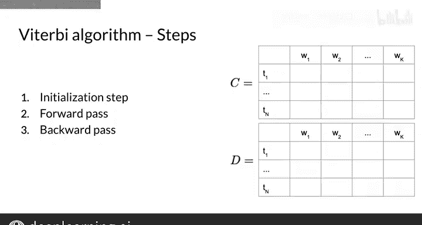

#  069：维特比算法 🧠

## 概述

在本节课中，我们将学习维特比算法。这是一种用于隐马尔可夫模型的动态规划算法，其核心目标是：给定一个观测序列（例如一个句子），找出最有可能产生该观测序列的隐藏状态序列（例如词性标注序列）。我们将通过图解和公式，一步步理解该算法的工作原理。

---

## 从局部最优到全局最优

上一节我们介绍了如何利用转移概率和发射概率来选择单个最可能的下一个状态。然而，为一个完整句子寻找最可能的词性序列，需要从全局角度进行优化。本节中我们来看看如何将问题转化为图搜索，并引入维特比算法。

假设我们有一个简单的隐马尔可夫模型和句子 “I love to learn”。我们的目标是找到概率最高的隐藏状态（词性）序列。请注意，单词 “love” 可能由名词状态 `NN` 或动词状态 `VB` 发射。

算法从一个初始状态 `π` 开始。对于第一个词 “I”，我们选择最可能的状态（例如 `O`），这涉及绿色的转移概率（例如 0.3）和橙色的发射概率（例如 0.5）。观察到 “I” 并经过 `O` 状态的联合概率是 0.15，由转移概率和发射概率相乘得到：`0.3 * 0.5 = 0.15`。

对于第二个词 “love”，存在两条可能路径：经过 `NN` 状态或 `VB` 状态。虽然转移到这两个状态的转移概率相同，但 “love” 从 `VB` 状态发射的概率更高。因此，我们应选择那条路径，其联合概率为 0.25。

后续步骤依此类推，最终得到整个序列的总概率，即所有选定步骤概率的乘积，例如 0.0003。维特比算法的核心在于同时计算多条路径，以找到全局最优的隐藏状态序列。

---

## 算法的矩阵表示与步骤

维特比算法使用隐马尔可夫模型的矩阵表示。该算法可分为三个主要步骤：**初始化**、**前向路径**（动态规划计算）和**后向路径**（回溯最优序列）。

给定转移概率矩阵 `A` 和发射概率矩阵 `B`，算法需要填充并使用两个辅助矩阵：`C`（维特比矩阵）和 `D`（回溯指针矩阵）。

*   **矩阵 `C`**：存储中间的最优概率值。`C[i, t]` 表示在时刻 `t` 以状态 `i` 结束的所有局部路径中的最大概率。
*   **矩阵 `D`**：存储达到 `C[i, t]` 所记录概率时，在时刻 `t-1` 所选择的前一个状态索引。

这两个矩阵的维度为 `N` 行 `K` 列，其中 `N` 是模型中隐藏状态（词性）的数量，`K` 是给定句子中的单词数量。

以下是算法的三个核心步骤：

1.  **初始化**：为第一个单词（`t=1`）的所有可能状态计算初始概率。
    *   公式：`C[i, 1] = π[i] * B[i, word1]`
    *   对于所有状态 `i`，`D[i, 1] = 0`（因为第一个词没有前驱状态）。

2.  **前向路径（递归计算）**：对于句子中的每一个后续单词（`t = 2 到 K`），为每一个可能的状态 `j` 进行计算。
    *   核心是找到能使路径概率最大化的前一个状态 `i`。
    *   公式：`C[j, t] = max_over_i( C[i, t-1] * A[i, j] ) * B[j, word_t]`
    *   同时，`D[j, t] = argmax_over_i( C[i, t-1] * A[i, j] )`

3.  **后向路径（回溯）**：在计算完所有单词后，从最后一个单词概率最大的状态开始，根据矩阵 `D` 中存储的指针，反向追溯出整个最优状态序列。
    *   找到最终最优路径的终点：`best_path[K] = argmax_i( C[i, K] )`
    *   然后反向追溯：`for t from K-1 down to 1: best_path[t] = D[ best_path[t+1], t+1 ]`

---

## 总结

本节课中我们一起学习了维特比算法。我们首先理解了为何需要从全局视角寻找最优序列，而非仅做局部最优选择。接着，我们通过一个简单例子，将问题可视化为在状态图中寻找最优路径。最后，我们详细介绍了算法的三个核心步骤——初始化、前向路径计算和回溯——以及用于实现这些步骤的两个关键矩阵 `C` 和 `D`。维特比算法高效地解决了隐马尔可夫模型中的解码问题，是序列标注任务（如词性标注）的基石。