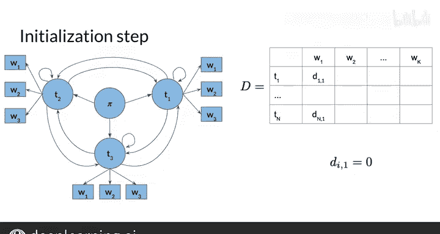

#  070：维特比算法初始化 🧮

在本节课中，我们将学习如何初始化一个矩阵，该矩阵能帮助我们确定句子中每个单词的词性标签。这是维特比算法三个关键步骤中的第一步，为后续计算最可能的词性序列奠定基础。

## 概述

维特比算法通过动态规划寻找隐藏状态（如词性标签）的最可能序列。初始化步骤负责填充两个辅助矩阵 **C** 和 **D** 的第一列。矩阵 **C** 存储概率，矩阵 **D** 存储路径回溯信息。

## 初始化步骤详解

上一节我们介绍了维特比算法的整体框架，本节中我们来看看具体的初始化操作是如何进行的。

初始化步骤的目标是计算从“起始状态”到第一个单词所有可能词性标签的联合概率。这对应着图中从起始节点到第一个隐藏状态（标签）和第一个观测值（单词）的路径。

为了清晰说明，下图展示了一个包含三个隐藏状态的模型初始化情况：

### 填充矩阵 C 的第一列

矩阵 **C** 的第一列（`C[i, 1]`）代表从起始状态 `π` 转移到第一个标签 `T_i`，并观测到第一个单词 `W_1` 的联合概率。

其计算公式为初始转移概率与对应发射概率的乘积：

**C[i, 1] = A[1, i] * B[i, index(W_1)]**

其中：
*   `A[1, i]` 是转移矩阵 **A** 的第一行元素，表示从起始状态到第 `i` 个标签的初始概率。
*   `B[i, index(W_1)]` 是发射矩阵 **B** 中的元素，表示在标签 `T_i` 下观测到单词 `W_1` 的概率。`index(W_1)` 函数返回单词 `W_1` 在矩阵 **B** 中的列索引。

### 填充矩阵 D 的第一列

矩阵 **D** 用于存储回溯路径，即记录在寻找最可能词性序列时经过的各个状态标签。

由于第一列没有前驱状态（前面没有单词），因此 **D** 矩阵的第一列所有条目均设置为 0。

以下是初始化步骤的关键点总结：

*   **矩阵 C 第一列**：计算每个可能标签作为句子第一个词标签的初始概率。
*   **矩阵 D 第一列**：全部置零，表示路径起点。

## 总结

本节课中我们一起学习了维特比算法的初始化步骤。我们了解到，这一步通过结合初始概率（来自转移矩阵 **A**）和发射概率（来自矩阵 **B**），填充了概率矩阵 **C** 的第一列，同时将路径回溯矩阵 **D** 的第一列初始化为零。这为算法的下一步——递归地填充矩阵的其余部分——做好了准备。

在下一节视频中，你将学习如何继续填充这两个矩阵，并最终利用它们解码出给定句子最可能的词性标签序列。维特比算法不仅可用于词性标注，也广泛应用于语音识别等领域。

