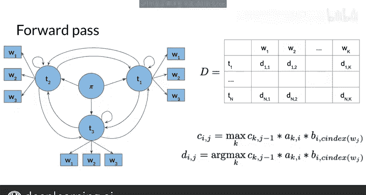

#  071：维特比前向传递 🧮

在本节课中，我们将学习如何使用维特比算法，继续填充你在上一节视频中初始化的两个矩阵。你将看到如何为句子中的特定词语分配词性标签。让我们来看看具体如何操作。

上一节我们介绍了矩阵C和D的初始化，本节中我们来看看如何通过前向传递来填充它们。

前向传递是填充矩阵C和D三个步骤中的第二步。现在你已经初始化了矩阵C和D，这两个矩阵中所有剩余的条目将在前向传递过程中逐列填充。

对于矩阵C，其条目通过以下看似复杂的函数计算得出：

`C[j, i] = max_k ( C[k, j-1] * a[k, i] * b[i, w_j] )`

让我们通过图示来明确下一步。假设你想计算条目C[1, 2]。你可以从公式的最后一项开始代入数值。

公式的最后一项就是从词性标签T1到词语W2的发射概率 `b[i, w_j]`。

公式中还有 `a[k, i]`，这是从前一个词性标签Tk到当前标签Ti的转移概率。而 `C[k, j-1]` 则代表了你已经遍历的前序路径的概率。你需要选择使整个公式值最大的k。

在这种情况下，存在三个非初始状态。因此，k可以是1、2或3。

对于每个D[j, i]，你只需保存使C[j, i]条目最大化的那个k值。这里同样有三个非初始状态，所以k是1、2或3。这由以下看似复杂的公式定义，该公式与C[j, i]的公式相同，只是去掉了前面的max函数：

`D[j, i] = argmax_k ( C[k, j-1] * a[k, i] * b[i, w_j] )`

argmax函数返回的是使函数参数最大化的k值，而不是最大值本身。

快完成了，只差最后一步。你现在已经使用维特比算法计算出了概率矩阵。在下一节视频中，你将看到如何利用刚刚创建的这个概率矩阵来重构路径，从而为每个词语确定其词性。

本节课中我们一起学习了维特比算法的前向传递步骤，理解了如何逐列填充概率矩阵C和回溯矩阵D，为后续的路径回溯和词性标注奠定了基础。