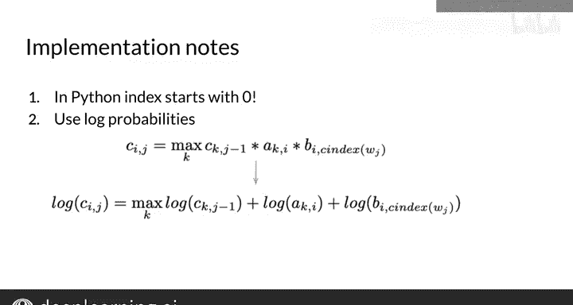

#  072：维特比后向传递 🧭

在本节课中，我们将学习维特比算法的最后一步——后向传递。我们将利用前向传递中计算出的概率矩阵，回溯并找出最可能的词性标注序列，从而为句子中的每个单词分配一个词性标签。

---

## 概述

上一节我们介绍了如何通过前向传递填充概率矩阵C和路径矩阵D。本节中，我们来看看如何利用矩阵D进行后向传递，从而从终点回溯，重建出最可能的隐藏状态（即词性标签）序列。

## 后向传递步骤详解

后向传递是维特比算法的第三步，用于为给定的单词序列检索最可能的词性标签序列。

以下是执行后向传递的具体步骤：

1.  **确定终点状态**：首先，在矩阵C的最后一列（对应最后一个单词）中，找到概率值最高的条目。该条目对应的行索引 `s` 代表了在观测到最后一个单词时，我们所处的最后一个隐藏状态。其概率值代表了生成整个单词序列的最可能隐藏状态序列的概率。
    *   **公式表示**：`s = argmax_i C[i][K]`，其中 `K` 是序列长度。

2.  **开始回溯**：使用上一步得到的索引 `s`，从矩阵D的最后一列开始，向左遍历（即向序列开头回溯）。矩阵D存储了前向传递过程中记录的最佳前驱状态索引。

3.  **重建序列**：
    *   将索引 `s` 对应的状态标签（如 `T1`）添加到序列末尾。
    *   在矩阵D的当前列（例如第 `K` 列）的第 `s` 行找到存储的值，这个值指明了到达当前状态 `s` 的最可能的前一个状态索引。
    *   将这个值作为新的 `s`，并移动到矩阵D的前一列（第 `K-1` 列）。
    *   重复此过程，直到回溯到序列的第一个单词。

## 示例演示

假设我们有一个包含4个状态（`T1`, `T2`, `T3`, `T4`）的模型，以及一个长度为5的单词序列。我们已计算出矩阵C和D。

**步骤1：找到终点**
在矩阵C的最后一列（第5列）中，假设第一行的概率0.01最高。因此，`s = 1`。这意味着最后一个单词 `W5` 最可能的状态是 `T1`。我们将 `T1` 加入序列。

**步骤2：第一次回溯**
查看矩阵D第5列的第1行（因为 `s=1`）。假设该单元格的值为3。这意味着在观测第4个单词时，我们最可能来自状态 `T3`。因此，单词 `W4` 的标签是 `T3`。更新 `s = 3`，并移动到第4列。

**步骤3：继续回溯**
查看矩阵D第4列的第3行（因为 `s=3`）。假设该单元格的值为1。这意味着在观测第3个单词时，我们最可能来自状态 `T1`。因此，单词 `W3` 的标签是 `T1`。更新 `s = 1`，并移动到第3列。

重复此过程，直到第一列。最终，我们得到重建的词性标签序列，例如 `[T2, T3, T1, T3, T1]`。

## 实现注意事项

在编程实现维特比算法时，有两点需要特别注意：

*   **索引偏移**：Python中列表和矩阵的索引从0开始，而非1。在实现时，需要仔细处理索引的转换，确保与数学公式和逻辑描述保持一致。
    *   **代码提示**：在访问数组时，通常需要将算法描述中的索引减1。

*   **数值下溢**：当连续乘以大量极小的概率值时，可能导致计算结果超出计算机浮点数的精度范围（数值下溢）。为了避免这个问题，通常使用对数概率。
    *   **核心概念**：将对数概率相加，等价于原始概率相乘。即 `log(p1 * p2) = log(p1) + log(p2)`。这能有效保持数值稳定性。课程后续会再次讨论这个概念。

---

## 总结

本节课中，我们一起学习了维特比算法的后向传递过程。我们掌握了如何利用前向传递计算出的路径矩阵D，从最后一个单词开始回溯，逐步重建出为整个句子生成的最可能的词性标注序列。词性标注在搜索、机器翻译、语音识别和句法分析等领域都有广泛应用。

至此，你已经了解了维特比算法及其在词性标注中的应用。下一周，我们将开始学习一种不同类型的任务——N元语法语言模型。