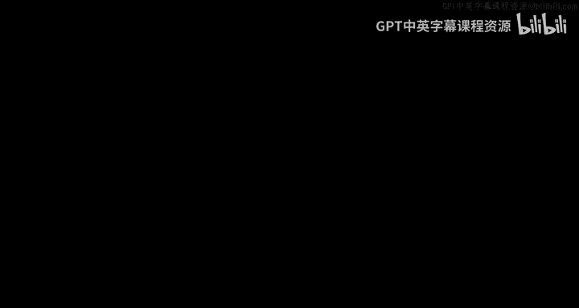
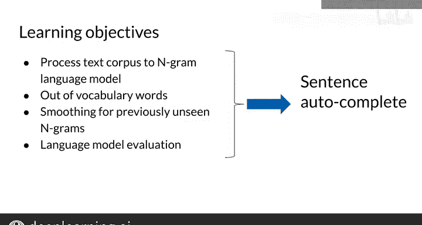

#  075：N元语法概述 🧠

在本节课中，我们将要学习自然语言处理（NLP）中的一个基础概念——N元语法（N-gram）。N元语法是构建语言模型的核心技术，广泛应用于语音识别、拼写纠正、辅助沟通等多个领域。我们将了解如何从文本语料库构建N元语法模型，并探索其在句子自动补全等任务中的应用。

---

## 什么是N元语法？

N元语法是NLP中的基本概念。你可以将其应用于语音识别、拼写纠正、辅助沟通以及许多其他任务。

上一节我们介绍了N元语法的重要性，本节中我们来看看它的具体应用场景。

N元语法模型可以从一个文本语料库中创建。文本语料库通常是一个大型文本数据库，例如维基百科的所有页面、某位作者的所有书籍，或某个账户的所有推文。

语言模型是一种计算句子概率的工具。你可以将一个句子视为一个**单词序列**。

语言模型还可以根据已知的单词历史，来估计下一个即将出现的单词的概率。例如，如果你开始写一封邮件“Hello, how are”，你的邮件应用程序可能会猜测你想写的下一个单词是“you”，从而补全为“Hello, how are you”。

在接下来的实践中，你将构建自己的N元语法语言模型，并将其应用于自动补全给定的句子。

---

## 语言模型的应用

虽然本周我们将重点学习自动补全应用，但语言模型在其他领域也有广泛的应用。

以下是语言模型的一些主要应用场景：

*   **语音识别**：用于将声学模型的输出转换为正确的单词。例如，如果声学模型将语音转换为文本，听到“I saw a van”，语音转文本系统可以利用语言模型判断，句子更可能是“I saw a van”，而不是听起来相似的“Eyes are often”。
*   **拼写纠正**：根据单词在句子中的概率，识别并纠正可能拼写错误的单词。
*   **辅助沟通系统**：这类系统可以接收用户的一系列手势来帮助他们组成单词和句子。像斯蒂芬·霍金这样无法用语言或手语交流的人，可以使用简单的动作从菜单中选择单词，然后由系统替他们发声。利用语言模型进行**单词预测**，可以为菜单推荐可能的单词。

---

## 本周学习路线图

现在我们对N元语法有了基本了解，接下来让我们看看本周具体要掌握哪些技能。

以下是本周你将完成的学习步骤：

1.  **构建基础语言模型**：首先，你将把文本语料库转化为一个语言模型。该模型能够根据一个句子的前几个单词，返回下一个单词的概率。
2.  **处理未知词汇**：接下来，你将调整你的语言模型，以处理在训练过程中未曾见过的单词。这些单词被称为**集外词**。
3.  **应用平滑技术**：平滑是另一种处理未见输入的技术。通过这种方法，即使对于未见过的单词和句子，也能成功估计其概率。平滑技术本质上会**假设每个单词和短语在训练语料库中至少出现一次**。这有助于计算概率，即使是对于不常见的单词和序列。
4.  **评估模型性能**：最后，我将向你展示如何使用**困惑度**指标来选择最佳的语言模型。这是你工具箱中的一个新工具。

当你掌握了这些技能，就能在本周的作业中成功实现一个句子自动补全模型。

---

## 总结

本节课中，我们一起学习了N元语法的基本概念及其在构建语言模型中的核心作用。我们了解了语言模型在语音识别、拼写纠正和辅助沟通等领域的应用，并概述了本周从构建模型、处理未知词汇、应用平滑技术到评估模型性能的完整学习路径。

现在你已经对将要学习的内容有了一个概览，在下一个视频中，我们将深入探讨，从展示N元语法的概率计算开始。