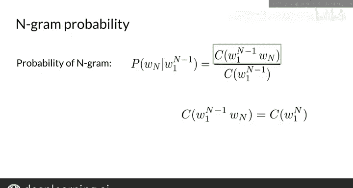

#  076：吴恩达《自然语言处理》P76 - N元语法与概率 📚

在本节课中，我们将要学习N元语法（N-gram）语言模型。这将使你能够编写第一个能够自主生成文本的程序。

## 什么是N元语法？ 🤔

首先，我们来了解什么是N元语法。简单来说，一个N元语法就是一个单词序列。请注意，它不仅仅是一个单词集合，因为单词的顺序至关重要。N元语法也可以由字符或其他元素构成，但目前我们将专注于单词序列。

在处理语料库时，标点符号被视为单词，但所有其他特殊字符（如引号）将被移除。

让我们看一个例子：“I am happy because I am learning”。

*   **一元语法** 是文本中所有出现的、唯一的单个单词的集合。例如，单词“I”在语料库中出现两次，但在单词语集合中只包含一次。前缀“uni”代表“一”。
*   **二元语法** 是语料库中所有成对出现的、相邻的两个单词的集合。同样，二元语法“I am”在文本中可以找到两次，但在二元语法集合中只包含一次。前缀“bi”代表“二”。请注意，单词必须彼此相邻出现才能被视为一个二元语法。另一个二元语法的例子是“am happy”。另一方面，序列“I happy”不属于二元语法集合，因为该短语没有出现在语料库中。即使单个单词“I”和“happy”都出现在文本中，“I happy”也被省略了。
*   **三元语法** 代表语料库中连续出现的、唯一的三个单词的组合。前缀“tri”代表“三”。

以下是一些你将要用到的符号表示法。如果你有一个包含500个单词的文本语料库，单词序列可以表示为 **W1, W2, W3, ..., W500**。语料库长度用变量 **M** 表示。

现在，对于该词汇表的一个子序列，如果你想指代从单词1到单词3的序列，则可以将其表示为 **W₁³**。要指代语料库的最后三个单词，你可以使用符号 **W_{M-2}^M**。

## 从语料库估计N元语法的概率 📊

上一节我们介绍了N元语法的基本概念，本节中我们来看看如何从语料库中估计它们的概率。

### 一元语法概率

让我们从一元语法开始。例如，在这个语料库“I am happy because I am learning”中，语料库大小是 **M = 7**。一元语法“I”的计数等于2。因此，其概率为 **2 / 7**。对于一元语法“happy”，概率等于 **1 / 7**。

一个单词 **W** 的一元语法概率可以通过计算单词 **W** 在语料库中出现的次数，然后除以语料库的总大小 **M** 来估计。公式如下：

**P(W) = count(W) / M**

这与你在前几周使用的单词概率概念类似。

### 二元语法概率

现在，让我们计算二元语法的概率。让我们从一个例子开始，然后我将展示通用公式。

在例子“I am happy because I am learning”中，如果前一个单词是“I”，那么单词“am”出现的概率是多少？它将是二元语法“I am”的计数除以一元语法“I”的计数。所以，你得到 **count(“I am”) / count(“I”)**。

在这个例子中，二元语法“I am”出现两次，一元语法“I”也出现两次。因此，在“I”立即出现的情况下，“am”出现的条件概率等于 **2 / 2**。换句话说，二元语法“I am”的概率等于 **1**。

对于二元语法“I happy”，概率等于 **0**，因为该序列从未出现在语料库中。最后，二元语法“am learning”的概率是 **1/2**。这是因为单词“am”后面跟着单词“learning”，构成了你语料库中二元语法的一半。

以下是二元语法概率的通用表达式。二元语法由单词 **X** 后跟单词 **Y** 表示。因此，单词 **Y** 紧接在单词 **X** 之后出现的概率，是给定 **X** 时 **Y** 的条件概率。

给定 **X** 时 **Y** 的条件概率可以估计为二元语法 **(X, Y)** 的计数，然后除以所有以 **X** 开头的二元语法的计数。这可以简化为：

**P(Y|X) = count(X, Y) / count(X)**

最后这一步仅在 **X** 后面跟着另一个单词时成立。

### 三元语法及N元语法概率

接下来，让我们使用之前的同一个例子计算一些三元语法的概率。短语“I am”后面跟着单词“happy”的概率计算为 **1** 除以语料库中短语“I am”的出现次数，即 **2**。

一个三元语法（或连续三个单词的序列）的概率，是前两个单词已经以正确顺序出现的情况下，第三个单词出现的概率。这是给定前两个单词出现时，第三个单词的条件概率。

给定前两个单词时，第三个单词的条件概率，是所有三个单词一起出现的次数除以前两个单词以正确顺序出现的次数。现在，所有三个单词出现的次数的符号表示为前两个单词（记为 **W₁²**）后跟一个空格，然后是 **W₃**。所以这只是整个三元语法的计数，写成一个二元语法后跟一个一元语法。

如果你想考虑任意数字 **N** 呢？让我们将公式推广到任意数字 **N** 的N元语法。

单词 **W_N** 跟随序列 **W₁ 到 W_{n-1}** 出现的概率，估计为N元语法 **W₁ 到 W_N** 的计数除以N元语法前缀 **W₁ 到 W_{n-1}** 的计数。公式如下：

**P(W_N | W₁ ... W_{n-1}) = count(W₁ ... W_N) / count(W₁ ... W_{n-1})**

注意，这里单词 **W₁ 到 W_N** 的N元语法计数写作 **count(W₁^{n-1} W_N)**。这等价于 **C(W₁^n)**。

## 总结 ✨

本节课中我们一起学习了N元语法，以及一元语法、二元语法和三元语法的具体例子。我们还通过计算它们在语料库中的出现次数来计算了它们的概率。这是很棒的工作。

现在你知道了N元语法是什么，以及如何使用它们来计算下一个单词的概率。接下来，你将学习使用它来计算整个句子的概率。