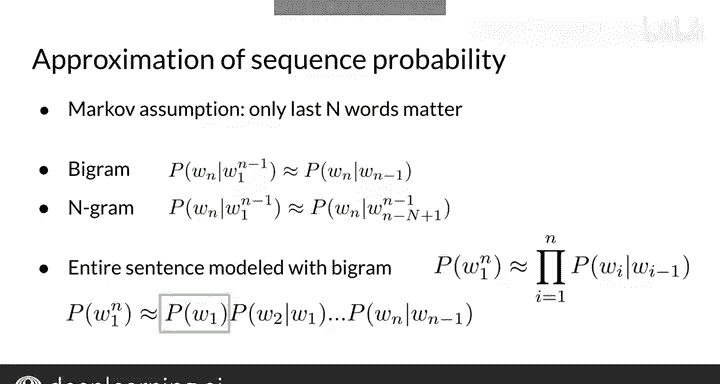

#  077：自然语言处理 | 序列概率建模 📊

## 课程编号：P77

在本节课中，我们将学习如何使用 n-gram 概率来建模整个句子。这将为我们后续生成文本奠定基础。

---

### 概述

首先，我们需要理解如何计算一个句子或整个单词序列的概率。例如，如何计算句子“The teacher drinks tea”的概率？

---

### 条件概率与链式法则回顾

上一节我们介绍了序列概率的基本概念，本节中我们来看看如何通过条件概率和链式法则来计算句子概率。

条件概率是指单词 B 在单词 A 之后出现的概率。其公式可以表示为：

**P(B|A) = P(A, B) / P(A)**

通过重新排列，我们可以得到联合概率的公式：

**P(A, B) = P(A) × P(B|A)**

链式法则将这一概念推广到更长的序列。对于一个由单词 A、B、C、D 依次组成的句子，其联合概率为：

**P(A, B, C, D) = P(A) × P(B|A) × P(C|A, B) × P(D|A, B, C)**

这个公式直观地表明，序列中每个后续单词的概率都取决于它之前所有单词的序列。

---

### 应用链式法则计算句子概率

现在，我们可以应用链式法则来计算句子“The teacher drinks tea”的概率。公式如下：

**P(“The teacher drinks tea”) = P(The) × P(teacher|The) × P(drinks|The teacher) × P(tea|The teacher drinks)**

在理想情况下，训练语料库中有足够的数据来计算所有这些概率。然而，这种方法存在局限性。

---

### 直接方法的局限性

由于自然语言的高度可变性，查询句子甚至句子的较长部分在训练语料库中出现的可能性非常小。对于句子“The teacher drinks tea”，其完整序列和前缀“The teacher drinks”在语料库中的计数很可能为零，导致无法计算概率。随着句子变长，精确顺序出现的可能性越来越小。

---

### 引入马尔可夫假设与 N-gram 近似

为了解决数据稀疏性问题，我们可以采用马尔可夫假设进行近似。马尔可夫假设认为，一个单词的概率仅依赖于其有限的、长度为 N 的历史记录，而忽略更早的单词。

如果我们只考虑前一个单词（即使用二元语法或 bigram），那么句子“The teacher drinks tea”的概率可以近似为：

**P(“The teacher drinks tea”) ≈ P(The) × P(teacher|The) × P(drinks|teacher) × P(tea|drinks)**

以下是应用 bigram 近似后的计算步骤：

1.  **P(teacher|The)**：在“The”之后出现“teacher”的条件概率。
2.  **P(drinks|teacher)**：在“teacher”之后出现“drinks”的条件概率。
3.  **P(tea|drinks)**：在“drinks”之后出现“tea”的条件概率。

将这些条件概率相乘，就得到了整个句子的近似概率。此时，句子概率的估计公式简化为**所有 bigram 条件概率的乘积**。

对于 bigram（N=2），我们近似地认为单词 W_n 的条件概率仅依赖于前一个单词 W_{n-1}，公式为：

**P(W_n | W_1, ..., W_{n-1}) ≈ P(W_n | W_{n-1})**

公式中的第一项 **P(The)** 是句子中第一个单词的单字（unigram）概率。这与朴素贝叶斯方法不同，朴素贝叶斯在估计句子概率时不考虑任何单词历史。

---

### 总结

本节课中，我们一起学习了如何使用 n-gram 概率和马尔可夫假设来建模和计算整个句子的概率。我们回顾了条件概率和链式法则，指出了直接计算长序列概率的局限性，并引入了 bigram 近似作为解决方案。通过只考虑前一个单词的历史，我们能够有效地估计句子概率，为后续的文本生成任务做好准备。下一节，我们将学习如何从语料库中计算这些 n-gram 概率。