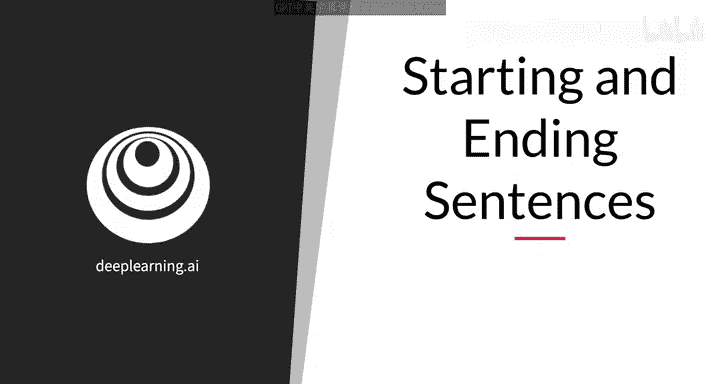
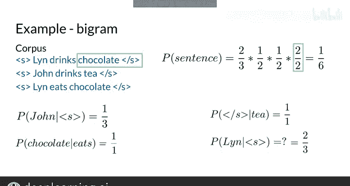

#  078：句子开始与结束 🧩


在本节课中，我们将学习在实现N元语言模型时，如何处理句子的开始与结束。我们将了解为何需要引入特殊的开始与结束标记，以及如何将它们应用到句子中，以确保概率计算的完整性和一致性。

---

## 处理句子边界

上一节我们介绍了使用滑动窗口计算条件概率。本节中我们来看看，当窗口位于句子的开头或结尾时会发生什么。



让我们仔细看看句子最开头和最结尾的情况。我将展示如何使用两个新符号来修改句子，这两个符号分别表示句子的开始和结束。你将看到这些新符号的重要性。然后，你将学会如何为二元模型和一般的N元模型，在句子的开头和结尾添加它们。

---

## 句子的开始

现在我来解释如何解决二元近似中的第一项。

让我们回顾之前的句子：“The teacher drinks tea.”。对于第一个词“The”，你没有前一个词的上下文，因此无法计算二元概率，而这是进行预测所必需的。

以下是解决方法：
*   添加一个特殊的标记，使得语料库中的每个句子都变成一个可以计算概率的二元组。
*   例如，使用开始标记 `<s>`。现在你可以这样计算第一个词“The”的二元概率：`P(The | <s>)`。

类似的原则也适用于N元模型。例如，对于三元模型，前两个词没有足够的上下文。因此，你需要使用第一个词的一元概率和前两个词的二元概率。可以通过在句子开头添加两个句子开始符号 `<s> <s>` 来解决缺失的上下文问题。现在，句子概率就变成了三元概率的乘积。

为了将其推广到N元模型，在每个句子的开头添加 **n-1** 个开始标记 `<s>`。

---

## 句子的结束

现在你可以处理句子开头的N元组了。那么句子的结尾呢？

回想一下，给定词X时词Y的条件概率被估计为所有二元组 `(X, Y)` 的计数除以所有以X开头的二元组的计数。你将分母简化为所有一元组X的计数。

但在一种情况下，这种简化不成立：当词X是句子的最后一个词时。

例如，如果你查看语料库中的词“drinks”，所有以“drinks”开头的二元组之和只等于1，因为唯一以“drinks”开头的二元组是“drinks chocolate”。另一方面，词“drinks”在语料库中出现了两次，另一次是作为一元组出现。

为了继续使用条件概率的简化公式，你需要添加一个句子结束标记。

---

## 概率归一化问题

你的N元概率还存在另一个问题。

假设你有一个非常小的语料库，只有三个句子，包含两个独特的词：“Yes”和“No”。语料库由三个句子组成：“Yes no”、“Yes yes”和“No no”。这些都是从词“Yes”和“No”生成的、以开始符号 `<s>` 开头的所有可能的长度为2的句子。

为了计算句子“Yes yes”的二元概率，取带有开始符号的“Yes”的概率，乘以“Yes”作为第二个词（且前一个词也是“Yes”）的概率。带有开始符号的“Yes”的概率，是以“Yes”开头的二元组计数除以所有以开始符号开头的二元组计数。你只能在分母中使用二元组计数的总和。

接下来，处理剩余的一元组。将第一项乘以二元组“Yes yes”的计数除以所有以词“Yes”开头的二元组计数的分数。你得到 `(2/3) * (1/2)`，等于 `1/3`。这样你就得到了句子“Yes yes”的概率，估计值为 `1/3`。

现在你计算句子“Yes no”的概率，再次得到 `1/3`。接着计算句子“No no”的概率，再次得到 `1/3`。最后，句子“No yes”的概率等于0，因为语料库中没有二元组“No yes”。

现在，令人惊讶的事情来了。如果你将所有四个句子的概率相加，总和等于1。这正是你追求的目标。干得好。

---

## 扩展到更长句子

那么，让我们看看所有由词“Yes”和“No”生成的可能的三词句子。首先计算句子“Yes yes yes”的概率，然后是“Yes yes no”，依此类推，直到你计算出所有8个可能长度为3的句子的概率。最后，当你将所有可能长度为3的句子的概率相加时，你再次得到总和为1。

然而，你真正想要的是所有长度为任意值的句子的概率总和等于1，这样你才能比较两个不同长度句子的概率。换句话说，你想要所有两词句子的概率加上所有三词句子的概率，再加上所有其他任意长度句子的概率，并且你希望这个总和等于1。

---

## 解决方案：添加结束标记

有一个非常简单的方法可以解决这个问题。你可以在预处理训练语料库时，在每个句子后面添加一个特殊的符号，用来表示句子的结束，我们将其表示为 `</s>`。

例如，当使用二元模型时，对于句子“The teacher drinks tea”，在词“tea”后面追加符号 `</s>`。现在，句子概率计算包含了一个新项。这一项代表了句子在词“tea”之后结束的概率。

这也解决了特定长度句子概率总和归一化的问题。

让我们看看这是否也解决了你二元概率公式的问题。现在，以词“drinks”开头的二元组有两个：“drinks chocolate”和“drinks </s>”。而一元组“drinks”的计数保持不变。太好了，你可以继续使用简化公式进行二元概率计算。

---

## 推广到N元模型

你如何将这一修正推广到一般的N元模型呢？事实证明，即使对于N元模型，在语料库中每个句子只添加一个结束标记就足够了。

例如，在计算三元模型时，原始句子将被预处理为包含两个开始标记和一个结束标记。

---

## 实际计算示例

让我们看一个在稍大语料库上生成的二元概率的例子。

以下是语料库：
```
<s> I am happy
<s> I am learning
<s> learning is fun
```

以下是其中一些二元组的条件概率。

现在，尝试计算 `P(learning | <s>)`。带有句子开始符号的句子总共有三个。所以开始符号在语料库中出现了三次，这给出了分母。二元组 `<s> learning` 在语料库中出现了两次，这给出了分子2。所以开始标记后跟“learning”的概率是 `2/3`。

现在，计算句子“learning is fun”的概率。
*   从二元组 `<s> learning` 的概率开始，即 `2/3`。
*   然后是 `P(is | learning)`，即 `1/2`。
*   接着是 `P(fun | is)`，也是 `1/2`。
*   最后是 `P(</s> | fun)`，即 `2/2`。

注意，结果等于 `1/6`，这低于你在计算训练语料库中三个句子之一的概率时可能预期的 `1/3`。这也适用于语料库中的其他两个句子。剩余的概率可以分配给可能从这个语料库的二元组生成的其他句子。这就是模型泛化的方式。

---



## 总结

本节课中，我们一起学习了在二元模型中处理句子开始与结束标记的示例。这个概念可以推广到其他类型的模型。在下一视频中，你将学习如何构建你的第一个N元语言模型。