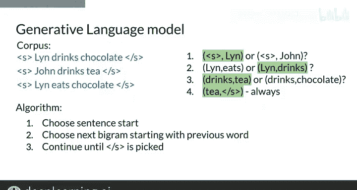

#  079：29_N元语法语言模型 🧠

在本节课中，我们将学习如何构建一个N元语法（N-gram）语言模型。我们将从创建计数矩阵开始，然后将其转换为概率矩阵，并最终将其与语言模型的定义联系起来。我们还将探讨如何处理计算句子概率时可能出现的数值下溢问题，并简要介绍如何使用该模型生成新句子。

---

## 构建计数矩阵

上一节我们介绍了N元语法模型的基本概念。本节中，我们来看看如何从语料库中构建一个计数矩阵。这个矩阵记录了每个N元语法出现的次数。

**公式**：对于一个以单词 `w_n` 结尾的N元语法 `(w_1, w_2, ..., w_n)`，其条件概率的分子是它在语料库中出现的次数。

计数矩阵的行由语料库中所有唯一的 (N-1) 元语法（前缀）组成，列由所有唯一的单词组成。

以下是针对语料库 “I study, I learn” 构建二元语法（Bigram）计数矩阵的示例：

| 行（第一个词） | 列（第二个词） | 计数 |
| :------------ | :------------ | :--- |
| I             | study         | 1    |
| I             | learn         | 1    |
| study         | I             | 0    |
| learn         | I             | 0    |

构建这个矩阵可以通过一次遍历语料库完成，使用一个包含两个词的滑动窗口来识别每个二元语法，并在矩阵对应位置计数加一。

---

## 计算概率矩阵

现在我们已经有了计数矩阵作为概率公式的分子，接下来需要计算分母以获得条件概率。

首先，计算计数矩阵中每一行的总和。这个行总和等价于公式中分母的 (N-1) 元语法前缀的计数。

**公式**：条件概率 `P(w_n | w_1, ..., w_{n-1}) = count(w_1, ..., w_n) / count(w_1, ..., w_{n-1})`

然后，通过将每个单元格的值除以其所在行的总和，对矩阵进行归一化，从而得到概率矩阵。

以前面的计数矩阵为例：
*   行 “I” 的总和为 2（study出现1次 + learn出现1次）。
*   因此，`P(study | I) = 1 / 2 = 0.5`，`P(learn | I) = 1 / 2 = 0.5`。

得到的概率矩阵如下：

| 前缀 | study | learn |
| :--- | :---- | :---- |
| I    | 0.5   | 0.5   |
| study| 0.0   | 0.0   |
| learn| 0.0   | 0.0   |

---

## 连接概率矩阵与语言模型

我们已经得到了概率矩阵，现在可以将其与本周概述中定义的语言模型连接起来。语言模型的核心任务是评估句子概率或预测序列中的下一个词。

**评估句子概率**：模型将句子分割成一系列N元语法，然后在概率矩阵中查找每个N元语法的条件概率，并将它们相乘。

例如，计算句子 “I learn” 的概率：
1.  句子开始标记 `<s>` 后接 “I” 的概率：`P(I | <s>)` （假设为1，简化计算）。
2.  “I” 后接 “learn” 的概率：从矩阵中查得 `P(learn | I) = 0.5`。
3.  “learn” 后接句子结束标记 `</s>` 的概率：`P(</s> | learn)` （假设为1，简化计算）。
4.  总概率 = 1 * 0.5 * 1 = 0.5。

**预测下一个词**：模型提取序列末尾的 (N-1) 元语法作为前缀，在概率矩阵中找到对应的行，并返回概率最高的单词。

---

## 处理数值下溢问题

在计算长句子的概率时，需要将许多介于0和1之间的小数相乘，这可能导致**数值下溢**——计算机难以精确存储极小的十进制数，从而产生误差。

解决这个问题的常用数学技巧是使用对数运算。因为对数的乘积等于其参数对数的和，我们可以将对数概率相加，而不是将原始概率相乘。

**公式**：`log(P(sentence)) = log(P1 * P2 * ... * Pk) = log(P1) + log(P2) + ... + log(Pk)`

这样，我们操作的是相对较大的对数概率值，有效避免了直接相乘导致的下溢问题。

---

## 应用：文本生成

语言模型的一个有趣应用是从头开始生成文本，或者根据一个小的提示进行生成。

以下是使用二元语法模型生成句子的算法步骤：

1.  算法首先随机选择一个以句子开始标记 `<s>` 开头的二元语法，选择概率由概率矩阵中的值决定（值越高，被选中的可能性越大）。
2.  接着，算法从上一步选中的词的**第二个词**作为新的前缀，随机选择一个以此前缀开头的二元语法。
3.  将这个新二元语法的第二个词添加到生成的句子中。
4.  重复步骤2和3，直到选中的二元语法以句子结束标记 `</s>` 结尾。

例如，生成过程可能如下：
*   起始：`<s>`
*   选择：`<s> I`
*   选择：`I study`
*   选择：`study .` （假设 “.” 对应 `</s>`）
*   生成句子：`I study.`

---

## 总结

本节课中我们一起学习了构建N元语法语言模型的完整流程：
1.  **构建计数矩阵**：统计语料库中所有N元语法的出现次数。
2.  **计算概率矩阵**：通过归一化计数矩阵得到每个N元语法的条件概率。
3.  **连接语言模型**：使用概率矩阵评估句子概率或预测下一个词。
4.  **处理下溢问题**：引入对数概率来避免连乘小数值时的计算误差。
5.  **文本生成应用**：了解了如何利用概率矩阵通过随机选择来生成新的句子。

现在你已经知道如何从语料库中计算和获取概率来构建自己的语言模型了。下一节课，我们将学习如何评估这个模型的性能。