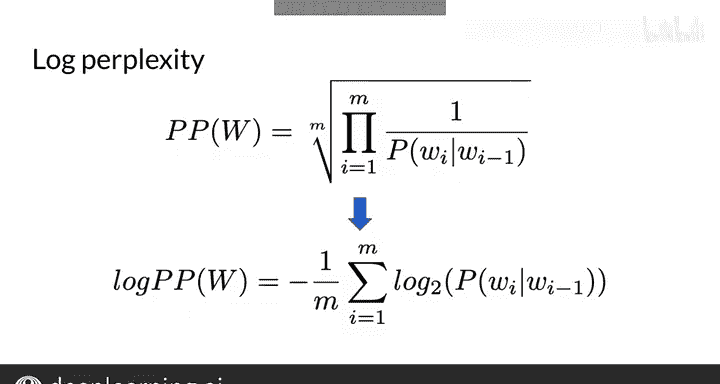

#  080：语言模型评估 📊

在本节课中，我们将学习如何评估一个语言模型的好坏。我们将介绍一个核心评估指标——困惑度，并详细解释其计算方法与意义。

---

## 数据集划分 📂

在之前的课程中，我们了解到语言模型可以为每个句子分配一个概率。模型在训练语料库上进行训练，因此对于训练句子，它可能会分配非常高的概率。为了客观评估模型，我们首先需要将语料库划分为训练集、验证集和测试集。

正如你在其他机器学习项目中所做的那样，你需要创建以下划分：
*   **训练集**：用于训练你的模型。
*   **验证集**：用于调整超参数等任务。
*   **测试集**：在最后阶段使用，用于测试一次并获得一个准确率分数，该分数反映了模型在未见数据上的表现。

对于较小的数据集，常用的划分比例是 80/10/10，即 80% 用于训练，10% 用于验证，10% 用于测试。在文本分析等非常大的数据集中，测试集可能只占训练集的 1%。

在自然语言处理中，主要有两种划分方法：
*   你可以通过选择较长的连续片段（如维基百科文章）来划分语料库。
*   或者，你可以随机选择较短的词序列，例如句子中的词序列。

---

## 理解困惑度 🤔

划分好数据集后，我们可以使用困惑度指标来评估测试集。

困惑度是语言建模中常用的一个指标。如果你熟悉“困惑”这个词，你会知道当一个人对非常复杂的事物感到困惑时，他就是“困惑的”。你可以将困惑度视为衡量文本样本复杂性的指标，即该文本有多复杂。

困惑度用于告诉我们一组句子看起来更像是人类写的，还是像一个简单程序随机选词生成的。人类书写的文本更可能具有较低的困惑度分数。另一方面，随机选词生成的文本则具有较高的困惑度。

---

## 计算困惑度 🧮

让我展示如何计算模型的困惑度。首先，计算测试集中所有句子的概率，然后将该概率取 `-1/M` 次幂。

**公式**：
`困惑度 = (测试集的概率) ^ (-1/M)`

其中，`M` 是测试集中的总词数。本质上，困惑度是测试集概率的倒数，并按测试集中的词数进行了归一化。

因此，语言模型对测试集概率的估计越高，困惑度就越低。值得一提的是，困惑度与衡量不确定性的熵密切相关。

让我们看一个例子，两个语言模型为你的测试集 `W` 返回不同的概率。

测试集中有 100 个词，所以 `M = 100`。
*   **第一个模型** 返回测试集的概率为 `0.9`，这个值非常高。这意味着第一个模型能很好地预测你的测试集，因此模型非常有效。如你所见，该模型和测试集的困惑度约为 `1`，非常低。
*   **第二个模型** 为你的测试集返回一个非常低的概率：`10^(-250)`。对于这个模型和测试集，困惑度约为 `316`，远高于第一个模型。

需要记住的一点是：**困惑度分数越小，句子听起来就越自然**。作为参考，好的语言模型的困惑度分数通常在 `20` 到 `60` 之间，有时甚至更低。对于跟踪字符而非单词的字符级语言模型，困惑度会更低。

---

## N元语法模型的困惑度计算

现在，我们准备为二元语法模型计算困惑度。在二元语法模型中，你计算所有句子的二元语法概率的乘积，然后取 `-1/M` 次幂。

**公式**：
`困惑度 = (∏ P(bigram_i)) ^ (-1/M)`

回想一下，概率的 `-1/M` 次幂等同于 `1/概率` 的 `M` 次方根。

这里需要注意的一点是：在测试集概率相同的情况下，集合大小 `M` 越大，最终的困惑度就越低。如果测试集中的所有句子都被连接起来，公式可以简化为整个集合中二元语法概率的乘积。

另一点需要注意的是，有些论文使用**对数困惑度**而不是困惑度。因此，困惑度公式从 `(1/概率)的M次方根` 变为 `(1/M) * Σ log(词的概率)`。这更容易计算，所以研究人员报告语言模型的对数困惑度并不少见。请注意，通常使用以 `2` 为底的对数。在一个困惑度介于 `20` 和 `60` 之间的好模型中，对数困惑度将在 `4.3` 和 `5.9` 之间。

---

## 困惑度在实际模型中的体现 🚀

那么，改进的困惑度如何体现在生产质量的语言模型中呢？这里有一个《华尔街日报》语料库的例子。
*   如果你采用**一元语法语言模型**，困惑度非常高，达到 `962`。它只是按词的概率生成词。
*   使用**二元语法语言模型**，生成的文本开始变得更有意义一些。
*   使用**三元语法模型**，你可以看到它产生的语言已经相当合理了。此时的困惑度等于 `109`，更接近 `20` 到 `60` 的目标困惑度范围。

正如我之前提到的，在本专项课程的后续部分，你将遇到困惑度分数更低的深度学习语言模型。

---

## 总结 ✨

本节课中，我们一起学习了语言模型的核心评估指标——困惑度。我们了解了如何划分数据集以进行公正的评估，掌握了困惑度的定义、计算方法及其实际意义。记住，较低的困惑度通常意味着模型生成的文本更自然、更像人类语言。

你现在已经理解了什么是困惑度以及如何评估语言模型。为了将它们用于实际任务，我们还需要能够处理在训练集中未出现过的词。我将在下一个视频中向你展示如何做到这一点。