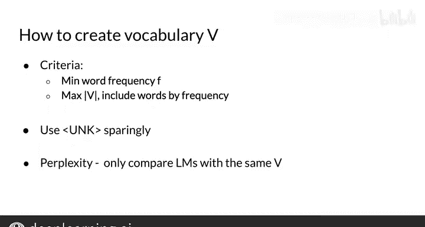

#  081：31_词汇表外词处理 🆕

在本节课中，我们将要学习如何处理语言模型中未曾见过的词汇，即“词汇表外词”。理解并妥善处理这类词汇，对于构建一个健壮的语言模型至关重要。

## 什么是词汇表外词？ 🤔

上一节我们介绍了语言模型的基本概念，本节中我们来看看一个常见的实际问题：词汇表外词。

首先，词汇表是您的语言模型所支持的一组独特单词的集合。在某些任务中，例如语音识别或问答系统，您只会遇到并生成来自一个固定单词集合的词汇。这个固定的单词列表也被称为**封闭词汇表**。

然而，使用固定单词集并不总是能满足任务需求。您常常需要处理以前从未见过的单词。这就导致了**开放词汇表**的出现。开放词汇表意味着您可能会遇到来自词汇表之外的单词，例如训练集中出现的一个新城市名称。这些未知单词也被称为**词汇表外词**，或简称为 **OOV**。

## 如何处理未知词：引入 UNK 标记 🛠️

处理未知词的一种方法是用一个特殊的标记 **`<UNK>`** 来建模它们。为此，您只需将每个未知词替换为 `<UNK>`。

以下是具体操作步骤：

您需要处理您的训练语料库，使其能泛化到未知词。首先，定义哪些单词属于词汇表。任何在训练语料库中但不在词汇表中的单词都将被替换为 `<UNK>`。

现在，您可以像以前一样应用 N-gram 语言模型的概率计算，只是增加了 `<UNK>` 标记。

这是一个如何创建词汇表并用 `<UNK>` 替换稀有词的示例：

这是您的输入训练语料库，您决定词汇表中的单词需要在语料库中至少出现两次。换句话说，单词的最小频率是 **2**。

这是将所有频率小于 2 的单词替换为 `<UNK>` 后的更新语料库。词汇表则是频率大于或等于 2 的单词集合。

当在输入查询上使用语言模型时，查询中任何在词汇表之外的单词也会被替换为 `<UNK>`。因此，正如您在此处看到的，概率计算应用于输入查询，其中 `<UNK>` 替换了词汇表外词 “aom”。

在本专项课程的后续部分，我将向您展示一些处理未知词的其他方法。例如，您可以使用深度学习将它们逐个字符地拼写出来。这些内容将在合适的时机介绍。

## 如何构建词汇表 📚

现在，我们来谈谈如何决定要将哪些单词包含在词汇表 **V** 中。

您可以根据不同的标准从训练语料库中创建词汇表。例如，您可以选择一个最小词频 **F**，这通常是一个较小的数字。在语料库中出现次数超过 **F** 次的单词将成为词汇表 **V** 的一部分。

然后，将所有其他不在词汇表中的单词替换为 `<UNK>`。这是一个简单的启发式方法，但它能确保您关心的、重复出现次数多的单词成为词汇表的一部分。

或者，您可以决定词汇表的最大规模，并只包含频率最高的单词，直到达到最大词汇表规模。

需要考虑的是 `<UNK>` 对困惑度的影响。它会使困惑度变低还是变高？实际上，它通常会**变低**。

所以看起来您的语言模型似乎变得越来越好。但请注意，您可能只是有很多 `<UNK>`。模型可能会以高概率生成一系列 `<UNK>` 标记，而不是有意义的句子。

由于这个限制，我建议谨慎使用 `<UNK>`。

最后，在使用困惑度指标时，请记住只比较具有**相同词汇表**的语言模型。

## 总结 📝

本节课中我们一起学习了如何处理语言模型中的词汇表外词。我们首先定义了封闭词汇表和开放词汇表的区别，并引入了 **OOV** 的概念。接着，我们学习了通过引入特殊标记 **`<UNK>`** 来建模未知词，并详细说明了如何在训练和推理阶段应用此方法。我们还探讨了基于最小词频或最大词汇表规模来构建词汇表的策略，并提醒了过度使用 `<UNK>` 可能带来的问题以及比较模型时保持词汇表一致的重要性。

现在您已经知道如何处理词汇表外词。接下来，我将向您展示一种提高模型在稀有词上性能的方法。