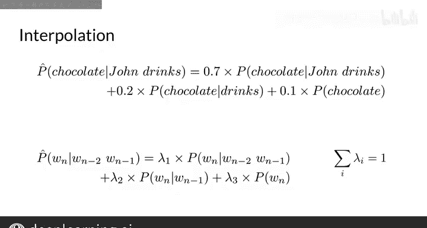

#  082：平滑技术 🧮

在本节课中，我们将学习如何解决N-gram语言模型中因语料库有限而导致的概率估计偏差问题。我们将重点介绍一种名为“平滑”的技术，它能有效处理那些在语料库中未出现过的N-gram，使其获得非零概率，从而提升模型的鲁棒性。

## 1. 缺失N-gram带来的问题

上一节我们介绍了如何处理完全未知的词汇。本节中，我们来看看另一种信息缺失的情况：如何处理那些由语料库中存在的单词组成，但其组合形式（即N-gram本身）却未在语料库中出现的情况。

例如，假设我们有一个由三个句子组成的语料库，其中包含“eat chocolate”、“John drinks”等二元组。请注意，单词“John”和“eats”都存在于语料库中，但二元组“John eats”却缺失了。因此，该二元组的计数为0，其概率也为0。这意味着任何未在语料库中出现过的组合都会被模型视为不可能发生。在这种情况下，仅基于计数的概率估计方法将失效。

## 2. 平滑技术简介

平滑是一种可以帮助你处理N-gram模型中此类情况的技术。你可能还记得在前几周的课程中，平滑被用于词性标注的转移矩阵和概率计算。这里，你将把这种方法应用于N-gram概率估计。那么，平滑究竟是什么意思呢？

让我们先聚焦于“加一平滑”，它也被称为拉普拉斯平滑。加一平滑在数学上改变了基于历史计算单词 `w_n` 的N-gram概率公式。

以下是给定前一个词 `w_{n-1}` 时，单词 `w_n` 的二元组概率公式（其思想可推广到一般的N-gram）：
`P(w_n | w_{n-1}) = (count(w_{n-1}, w_n) + 1) / (sum_{w'}(count(w_{n-1}, w') + 1))`

加一平滑简单地说就是：让我们在分子上加1，同时在分母的每个可能二元组计数上也加1。这种变化可以理解为给每个二元组都增加一次出现次数。因此，那些在语料库中缺失的二元组现在在分母中会有一个非零的概率项（你为每个以 `w_{n-1}` 开头的可能二元组都加了1）。

这相当于在计数矩阵中，为索引为单词 `w_{n-1}` 的那一行的每个单元格都加1，然后对词汇表中的每个单词重复此操作。你可以把加的那个“1”从求和符号中提出来，将词汇表的大小加到分母上。

不过，这种方法仅在语料库的真实计数足够大，足以抵消所加的“1”时才有效。否则，缺失词的概率会被估计得过高。但加一平滑的帮助很大，因为它消除了概率为零的二元组。

## 3. 其他平滑与回退方法

如果你有一个更大的语料库，可以使用加 `k` 平滑（也称为加 `k` 平滑）。这种技术能使概率分布更加平滑。

其公式与加一平滑类似，只需在分子上加 `k`，并在分母的每个可能N-gram上加 `k`，其中分母的总和会增加 `k` 乘以词汇表大小。加 `k` 平滑也可以应用于更高阶的N-gram概率，如三元组、四元组等。

以下是更高级的平滑方法：
*   **克尼瑟-内伊平滑或古德-图灵估计**：这些是更复杂的平滑技术。
*   **回退法**：另一种处理语料库中未出现N-gram的方法是使用低阶N-gram（如 `n-1` gram、`n-2` gram等）的信息。如果 `n` gram信息缺失，就使用 `n-1` gram的信息；如果 `n-1` gram也缺失，就使用 `n-2` gram，依此类推，直到使用低阶N-gram（如 `n-1` gram、`n-2` gram，直至一元组）找到非零概率。这会扭曲概率分布，尤其是在小型语料库上。需要从高阶N-gram中“折扣”一部分概率，用于低阶N-gram。这种经典的**回退方法**就使用了折扣技术。
*   **愚蠢回退**：在非常大的网络规模语料库上，一种名为“愚蠢回退”的方法被证明是有效的。在愚蠢回退中，不应用概率折扣。如果高阶N-gram概率缺失，就直接使用低阶N-gram概率乘以一个常数（实验表明常数约等于0.4时效果很好）。

让我们看一个回退的例子。观察以下语料库，三元组“drink chocolate”的概率无法直接从语料库中估计。因此，将使用二元组“drinks chocolate”的概率乘以一个常数（在你的场景中是0.4）来代替。

回退法的一种替代方法是使用所有阶数N-gram的**线性插值**。这意味着你总是组合加权后的 `n` gram、`n-1` gram直至一元组的概率。

例如，在计算三元组“John drinks chocolate”的概率时，你可以取：
*   70% 的三元组估计概率（即 `P(“John drinks chocolate”)`）
*   加上 20% 的二元组估计概率（即 `P(“drinks chocolate”)`）
*   再加上 10% 的一元组估计概率（即 `P(“chocolate”)`）

更一般地，对于三元组，你会组合三元组、二元组和一元组的加权概率。你用常数（如 `λ1`、`λ2`、`λ3`）来权衡所有这些概率，这些常数之和需要为1。`λ` 值是从语料库的验证部分学习得到的。你可以通过最大化验证集中句子的概率来获得它们。使用从训练部分语料库训练的固定语言模型来计算N-gram概率，并优化 `λ` 值。通过使用更多的 `λ` 参数，插值法可以应用于一般的N-gram。

## 4. 总结

本节课中，我们一起学习了N-gram语言模型中的平滑技术。你现在已经是N-gram语言模型的专家了，你知道了如何创建它们，如何处理词汇表外单词，以及如何通过平滑技术来改进模型。你将在编程练习中看到它们运行得非常好，在那里你将编写第一个生成文本的程序。