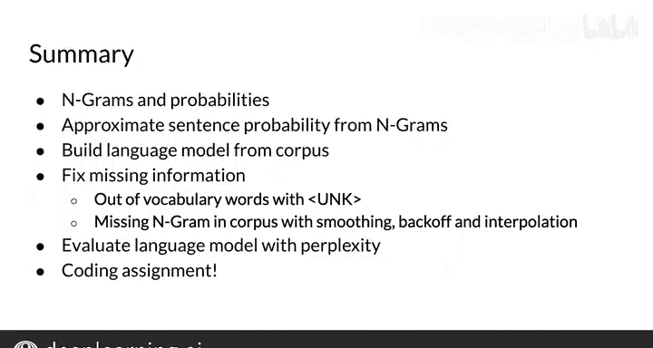

#  083：第33周总结 📚

在本节课中，我们将快速回顾本周学习的所有核心概念，并重点总结主要知识点。

## 概述 📋

本周我们学习了N-gram语言模型，包括如何计算概率以及如何处理文本。接下来，我们将更详细地回顾这些内容。

## 本周学习回顾 🔄

让我们花点时间回顾一下本周完成的所有内容。

你从N-gram的定义开始，学习了如何从语料库中计算它们的概率。

然后，你结合N-gram概率来近似计算一个句子的概率。利用语料库中所有N-gram的信息，你构建了一个语言模型。

这个模型是一个工具，用于估计任何句子的概率。

你还解决了句子中某些部分信息缺失的情况。

你通过几种方式处理了这个问题：通过改造模型以处理词汇表外的单词（使用特殊标记），以及应用多种方法来处理语料库中缺失的N-gram，例如平滑、回退和插值。

最后，你掌握了一个工具来帮助你为任务选择最佳的语言模型，即困惑度指标。

现在，你已经准备好迎接你的作业——句子自动补全。

本周你完成了出色的工作，希望你享受这个过程。祝你的作业顺利，我们下次再见。😊

## 总结与展望 🌟

你已经走了很长的路，本周学习了许多重要的概念。N-gram是基础性的，当你后续在本专项课程中学习更技术性的模型时，它能让你有更好的理解。

编程作业将巩固你对这个概念的理解。

祝你好运，我们下周见。😊