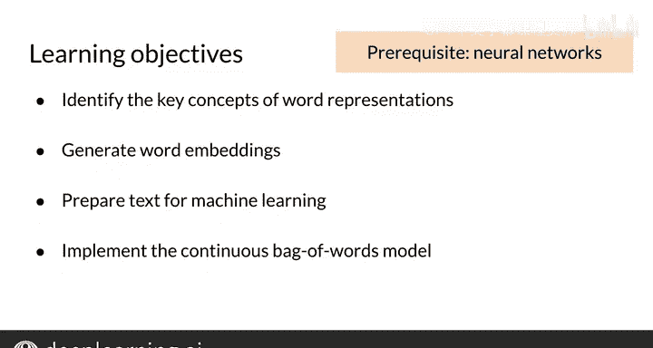

#  086：第36课 词向量概述 🧠📚

在本节课中，我们将要学习词向量的核心概念、应用以及如何从零开始训练它们。词向量是大多数自然语言处理应用的基础，掌握它们对于深入理解NLP至关重要。

---

## 词向量的应用场景 🎯

上一节我们介绍了课程目标，本节中我们来看看词向量的具体应用。

词向量，也称为词嵌入，是大多数消费级和企业级NLP应用的基石。如果你完成了NLP专项课程的一部分，你可能记得曾使用预生成的词向量来寻找词语间的语义类比并计算词语的相似度。

以下是词向量的一些主要应用：

*   **情感分析与文本分类**：你可以将词向量与分类器结合，进行情感分析，或对客户评论、用户反馈调查中的评论进行分类。
*   **机器翻译**：更高级的词向量用例包括构建机器翻译系统。
*   **信息抽取与问答系统**：词向量也广泛应用于信息抽取和问答系统。

这些是你本周的学习目标。

---

## 本周学习目标 🎯

了解了词向量的广泛应用后，我们来明确本周需要掌握的具体技能。

*   **理解词表示的核心概念**：你将学习如何用数字表示词语，以便它们能与数学模型一起使用。我还会介绍词嵌入以及用数字表示词语的优势。
*   **生成词向量**：我将展示模型从数据中学习词向量的通用方法，并举例说明一些常用方法。
*   **为机器学习准备文本**：你将学习如何将文本语料库转换为机器学习模型的训练集。我会提供实用的建议，这些建议可应用于从书籍到推文等各种现实语料库。
*   **实现连续词袋模型**：你将实现连续词袋模型，这是创建词向量的众多方法之一。这是一个简单高效的方法，最初推动了词向量的普及。

当然，还有其他技术如GloVe等也可用于训练词向量。但本周我们将重点学习连续词袋模型。

---

## 预备知识与课程安排 📖

在深入具体模型之前，我们需要确保具备必要的基础知识。

如果你不熟悉神经网络，我强烈建议你先学习DeepLearning.AI的深度学习专项课程的第一门课。如果你熟悉神经网络但有一段时间未使用，也不必担心，我将在本周的课程中进行复习。

---

## 总结 ✨

本节课中我们一起学习了词向量的重要性和广泛的应用场景，明确了本周的学习目标，包括理解词表示、生成词向量、准备文本数据以及实现关键的连续词袋模型。我们已经看到了本周结束时你将能完成的所有很酷的事情，让我们在接下来的视频中开始学习吧。