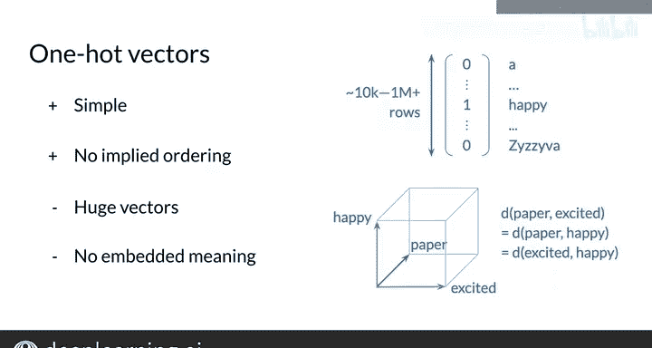

#  087：基本词表示 🧠

在本节课中，我们将学习如何用数字来表示词汇表中的单词。这是自然语言处理的基础步骤。我们将从最简单的方法开始，了解其优缺点，并引出更高级的表示方法。

## 概述

你将能够创建一个矩阵来表示词汇表中的所有单词。矩阵中的每个向量将对应一个单词。接下来，我将展示如何构建这个矩阵。

## 从整数到独热向量

表示单词最简单的方法是，为给定词汇表中的每个单词分配一个唯一的整数。

例如，基于一个包含1000个基本英语单词的词汇表，你可以将数字1分配给单词“a”，数字2分配给“able”，以此类推，直到将数字1000分配给“zebra”。

虽然这种编号方案很简单，但问题之一是单词的顺序（在这个例子中是字母顺序）从语义角度来看没有太大意义。

例如，没有理由认为“happy”应该被分配一个比“hand”更大的数字，或者比“zebra”更小的数字。

## 独热向量表示法

不使用数字索引来编码每个单词，你可以使用列向量来表示单词，其中每个元素对应词汇表中的一个单词。

使用前面1000个单词的词汇表例子，每个向量将包含1000个元素，每一行都用一个单词标记。

现在，你可以通过在与单词标签相同的行中放置一个1，在其他所有位置放置0，来用唯一的列向量编码每个单词。

例如，单词“happy”将被表示为一个向量，在对应“happy”的行中为1，在所有其他行中为0。

对于词汇表中的所有其他单词也是如此。我将这些向量称为**独热向量**，以区别于你将遇到的其他类型的向量。

你可以将单词视为一个分类变量。通过简单地将行中的单词映射到其对应的行号，你可以轻松地在整数和独热向量之间进行转换。

这样，第621号的单词“happy”将被表示为一个在621行（对应单词“happy”）为1的独热向量。反之，在621行有一个1的向量“H”将由整数621表示，对应“happy”。

## 独热向量的优缺点

独热向量相对于使用整数有一个优势，因为独热向量不暗示任何两个单词之间的关系。每个向量只说明单词是“happy”或者不是，单词是“zebra”或者不是。

然而，对于大多数自然语言处理用例来说，独热向量有两个主要限制。

以下是其局限性：

1.  **向量维度巨大**：除了最简单的词汇表，这些稀疏向量将非常庞大。这意味着在计算机上处理独热向量需要大量的空间和处理时间。如果你的向量是用英语单词创建的，你最终可能会有超过一百万行，英语词汇表中的每个单词对应一行。
2.  **无法编码语义**：这种表示法不携带单词的含义。例如，如果你试图通过计算两个独热向量之间的距离来确定两个单词的相似程度，那么你总是会得到任意两个单词对之间相同的距离。例如，使用独热向量，“happy”与“paper”的相似度，和它与“excited”的相似度是一样的。直观上，你会认为“happy”与“excited”比与“paper”更相似。

## 总结与过渡

在本节中，我们介绍了**独热向量**，它非常简单且不隐含顺序。我们也看到了独热向量的缺点，即维度巨大且不编码任何语义。

这正是词嵌入发挥作用的地方，我将在下一个视频中解释。词嵌入将帮助我们解决这些问题。