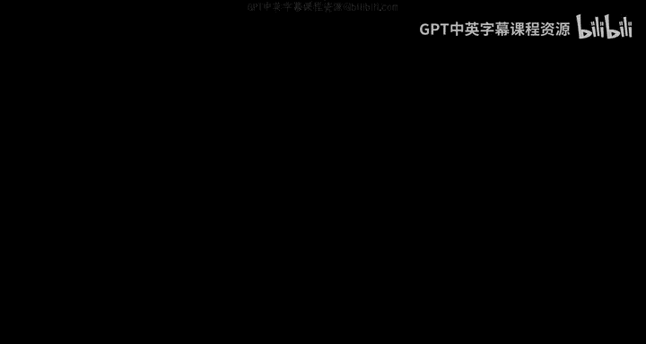
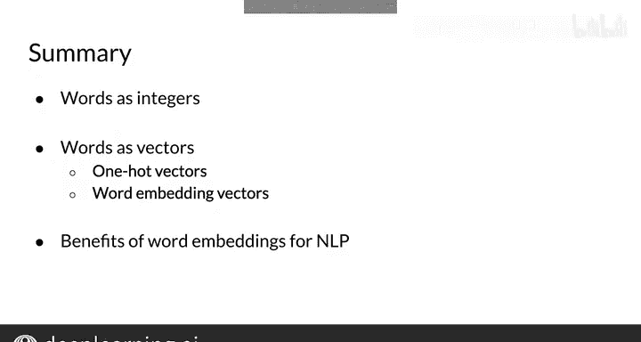

#  088：吴恩达《自然语言处理》P88 - 词嵌入 🧠

在本节课中，我们将学习**词嵌入**的概念。这是一种将单词表示为低维向量的方法，这些向量不仅能高效计算，还能捕捉单词的语义含义。我们将了解词嵌入如何超越独热编码，并成为构建复杂自然语言处理应用的基础。

---

## 从独热编码到词嵌入

上一节我们介绍了如何将单词转换为整数和独热向量。独热向量虽然简单，但维度极高且无法表达单词间的任何关系。本节中，我们来看看如何用更紧凑的向量来编码单词的**含义**。

我即将展示一种方法，它可以将含义编码在维度相对较低的向量中。换句话说，这个向量的维度不一定是词汇表大小 `V` 那么高。

---

## 一维词嵌入：编码情感

我们可以从一个简单的维度开始。想象一条水平的数轴，左边的词在某种意义上被认为是**负面**的，右边的词被认为是**正面**的。更负面的词在更左边，更正面的词在更右边。

你可以将它们在数轴上的位置存储为一个长度为1的向量中的数字。注意，你现在可以使用任何十进制数值，而不仅仅是0和1。这非常有用。

现在，你可以说“happy”（快乐）和“excited”（兴奋）彼此之间比与单词“paper”（纸）更相似，因为代表“happy”的数字更接近代表“excited”的数字。

**公式表示**：`word_vector = [sentiment_score]`，其中 `sentiment_score` 是一个实数。

---

## 二维词嵌入：增加具体性维度

你可以通过添加一条垂直的数轴来扩展这个概念。在这条线上位置更高的词是更具体的**物理对象**，而位置更低的词是更**抽象的概念**。

同样，你可以根据这两个数轴来排列每个单词，并看到那些更具体且更积极的词，比如“puppy”（小狗）和“kitten”（小猫），在空间中更接近。

你可以将代表在两个数轴上位置的两个数字存储为一个长度为2的向量。

**公式表示**：`word_vector = [sentiment_score, concreteness_score]`

---

## 词嵌入的定义与优势

你刚才创建的就是**词嵌入**的一个例子。词嵌入以向量形式表示单词，这种形式维度相对较低（通常是数百到数千维），便于计算，并且承载了单词的含义，使得判断通用词汇表中单词的语义相似度成为可能。

例如，“forest”（森林）的向量通常与“tree”（树）的向量相似，但与“ticket”（票）的向量非常不同。你将在本周的作业中可视化这种相似性。

它还可以用于推理类比，例如找出“Paris（巴黎）之于France（法国），如同Rome（罗马）之于____”中缺失的单词。

---

## 词嵌入的重要性

对单词含义进行编码，也是对整个句子含义进行编码的第一步，这是构建更复杂NLP应用（如问答和翻译）的基础。创建词嵌入是本周课程模块的主要目标之一。

在本周的讲座中，你将实现从简单到更高级方法的词嵌入。你也将开始基于这些更简单的表示进行构建。

---

## 术语说明

理论上，所有单词的向量表示（包括独热向量和词嵌入向量）都被称为**词向量**。但术语“词向量”和“词嵌入”也常用来特指词嵌入向量。所以，如果你在其他地方看到这些术语，不必惊讶。

---

## 总结与过渡

本节课中，我们一起学习了词嵌入的基本思想。我们看到了如何用一个二维向量来告诉你关于单词的一些信息：也许第一个坐标告诉你单词是正面还是负面的，第二个坐标告诉你它是抽象的还是具体的。你拥有的坐标维度越多，能捕捉的信息就越多。

在下一个视频中，我将向你展示如何**学习**这些坐标。