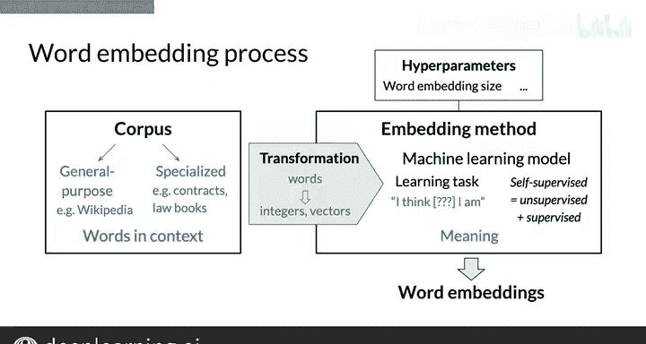

#  089：如何创建词嵌入 🧠

在本节课中，我们将学习如何创建词嵌入。词嵌入是自然语言处理中的核心概念，它能够将单词转换为计算机可以理解的数值向量。我们将探讨创建词嵌入所需的基本要素、过程及其重要性。

---

## 创建词嵌入的两个要素

要创建词嵌入，始终需要两个要素：**文本语料库**和**嵌入方法**。

文本语料库包含了你想要嵌入的单词，这些单词的组织方式应与它们在目标上下文中的使用方式一致。例如，如果你想基于莎士比亚的作品生成词嵌入，那么你的语料库就应该是莎士比亚的完整原始文本，而不是学习笔记、幻灯片或关键词列表。

单词的上下文指的是在该特定单词周围通常会出现哪些其他单词或单词组合。上下文非常重要，因为它赋予每个词嵌入以意义。一个简单的莎士比亚常用词汇列表不足以创建词嵌入。

语料库可以是一般用途的文档集合，例如维基百科文章；也可以是更专业化的，例如特定行业或企业的语料库，以捕捉该领域的细微差别。对于法律主题的自然语言处理用例，你可以使用合同和法律书籍作为语料库。

嵌入方法负责从语料库中创建词嵌入。存在许多可能的方法类型，但在本课程中，我将重点介绍基于机器学习模型的现代方法，这些模型被设定为学习词嵌入。

---

## 机器学习模型与自监督学习

机器学习模型执行一项学习任务，而这项任务的主要副产品就是词嵌入。例如，任务可以是学习根据语料库句子中的周围单词来预测一个单词，就像我将在接下来的视频中描述的连续词袋方法一样，你将在本周的作业中实现它。

任务的具体细节最终将定义单个单词的含义。我将在后续的一个视频中再次讨论这一点。

这个任务被称为**自监督学习**。说它是无监督的，是因为输入数据（语料库）是未标记的；说它是有监督的，是因为数据本身提供了必要的上下文，这通常构成了标签。因此，语料库是一个自包含的数据集，既包含训练数据，也包含能够监督任务的数据。

---

## 超参数与向量维度

词嵌入可以通过一系列超参数进行调整，就像任何机器学习模型一样。其中一个超参数是词嵌入向量的维度。在实践中，这个维度通常从几百到几千不等。

使用更高的维度可以捕捉更细微的含义，但在计算上更加昂贵，无论是在训练时还是在后续使用词嵌入向量时。这最终会导致收益递减。

---

## 语料库的数学表示

最后，为了将语料库输入到机器学习模型中，必须首先将语料库的内容从单词转换为合适的数学表示，即转换为数字。这种表示取决于模型的具体细节，但通常基于我在上一个视频中介绍的简单表示，例如基于整数的单词索引或独热向量。

---

## 总结

在本节课中，我们一起学习了创建上下文词嵌入的高级过程。我们了解到，这需要文本语料库和嵌入方法两个核心要素。模型通过自监督学习任务来生成词嵌入，而超参数如向量维度会影响嵌入的质量和计算成本。语料库需要先转换为数学表示才能被模型处理。

下一步，我将向你介绍几种词嵌入方法，包括你将在本周作业中实现的连续词袋方法。到目前为止，我们学习了一个新术语——自监督学习。这个术语将在机器学习领域反复出现，它是无监督学习和有监督学习的结合。现在，在下一个视频中，我们将看到一些用于词嵌入的方法。