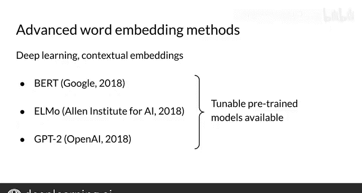

#  090：自然语言处理 | 词嵌入方法概览 (P90) 🧠

## 概述

在本节课中，我们将学习多种词嵌入方法。词嵌入是自然语言处理中的核心技术，它将词语转换为计算机能够理解的数值向量。随着时间推移，科学家们不断发现更好的方法，以捕捉词语更丰富的含义。我们将从基础方法开始，逐步介绍到更先进的模型。

## 基础词嵌入方法

上一节我们了解了词嵌入的基本概念，本节中我们来看看几种经典且实用的基础词嵌入方法。

以下是几种重要的基础词嵌入方法：

*   **Word2Vec**：该方法使用浅层神经网络来学习词嵌入。它提出了两种模型架构。
    *   **连续词袋模型**：这是一种简单但高效的方法，你将在本周的作业中实现它。该模型的目标是学习根据周围的词语来预测缺失的词语。
    *   **连续跳字模型**：也称为带负采样的跳字模型，它与连续词袋模型的做法相反。该模型学习根据给定的输入词来预测其周围的词语。

*   **GloVe**：由斯坦福大学提出，全称为“全局向量”。它通过对语料库的词语共现矩阵的对数进行矩阵分解来生成词嵌入，这与你之前使用过的计数矩阵类似。

*   **FastText**：由Facebook提出，基于跳字模型，并通过将词语表示为字符的n-gram序列来考虑词语的内部结构。这使得模型能够支持未见过的词语（即词汇表外词语），方法是通过其组成的字符序列以及模型初始训练时见过的类似序列来推断其嵌入向量。例如，即使模型从未见过“kitty”这个词，它也能为“kitty”和“kitten”创建相似的嵌入向量，因为这两个词由相似的字符序列组成。FastText的另一个好处是，词嵌入向量可以平均在一起，以构成短语和句子的向量表示。

## 高级上下文相关模型

在之前介绍的基础模型中，一个给定的词总是具有相同的嵌入向量。然而，词语的含义常常依赖于上下文。接下来，我们将探讨一些更复杂的建模方法。

这些方法使用先进的深度神经网络架构，根据词语的上下文来细化其含义的表示。在这些更高级的模型中，词语根据其上下文拥有不同的嵌入向量。这支持了对多义词或具有相似含义词语的更好处理，例如“plants”这个词，既可以指像花这样的生物体，也可以指工厂，或者作为副词具有更多不同的含义。

以下是几个生成上下文相关词嵌入的高级模型示例：

*   **BERT**：谷歌提出的“来自Transformer的双向编码器表示”。
*   **ELMo**：艾伦人工智能研究所提出的“来自语言模型的嵌入”。
*   **GPT-2**：OpenAI提出的“生成式预训练转换器2”。

如果你想使用这些高级方法，可以在互联网上找到现成的预训练模型，并且可以使用你自己的语料库对这些模型进行微调，以生成高质量的、特定领域的词嵌入。

## 总结

本节课中，我们一起学习了词嵌入方法的发展历程。你现在掌握了一些创建词嵌入的工具，从基础的Word2Vec、GloVe、FastText，到能够编码更复杂语义信息的最新Transformer模型。这非常棒！接下来，我将介绍你将在本周作业中使用的连续词袋模型。

你已经看到了词嵌入方法的一段简史。我们从Word2Vec一路走到了最新的Transformer方法。目前，Transformer是最先进的人工智能方法之一。