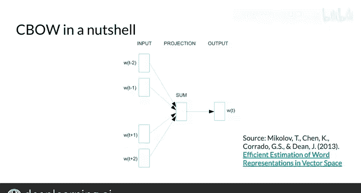

#  091：连续词袋模型 (CBOW) 🧠

在本节课中，我们将学习连续词袋模型（CBOW）的基本原理。这是一种用于生成词嵌入的机器学习模型，其核心思想是通过上下文单词来预测中心单词。我们将了解其整体算法结构、如何从语料库创建训练数据，以及模型背后的基本逻辑。

---

## 模型概述与目标 🎯

上一节我们介绍了词嵌入的基本概念，本节中我们来看看一种具体的实现模型——连续词袋模型。

该模型的目标是：**根据给定的上下文单词，预测缺失的中心单词**。其背后的原理是，如果两个不同的单词在各种句子中经常被一组相似的单词所包围，那么这两个单词在含义上往往是相关的，或者说它们在语义上是相关的。

例如，在句子 “The little **something** is barking” 中，如果语料库足够大，模型将学会预测这个缺失的单词是与“狗”相关的词，比如 “dog”、“puppy”、“hound” 或 “terrier” 等。因此，模型最终将根据上下文来学习单词的含义。

---

## 从语料库到训练数据 📊

了解了模型目标后，我们来看看如何将原始文本语料库转化为模型可以处理的训练数据。

假设我们的语料库是句子：“I am happy because I am learning.”（暂时忽略标点）。对于语料库中的某个单词（例如 “happy”，我们称之为**中心词**），我们将其**上下文单词**定义为：中心词前后的各两个单词。这里，我们记 `c = 2`，表示前后各取两个单词。`c` 被称为上下文的半长，是模型的一个超参数，你也可以选择其他数量的单词，这里只是一个例子。

因此，对于中心词 “happy”，其上下文单词是：`[“I”, “am”, “because”, “I”]`。我们定义**窗口**为中心词加上其上下文单词的总和。这里，窗口大小 = 1个中心词 + 2个前文词 + 2个后文词 = 5。

为了训练模型，我们需要一组训练样本，每个样本由**上下文单词**和需要预测的**中心词**组成。

以下是创建训练样本的过程：

以下是基于示例句子生成训练样本的步骤：

1.  第一个窗口是 `[“I”, “am”, “happy”, “because”, “I”]`。模型将接收上下文单词 `[“I”, “am”, “because”, “I”]` 作为输入，并应预测中心词 `“happy”`。
2.  将窗口滑动一个单词，下一个训练样本的窗口是 `[“am”, “happy”, “because”, “I”, “am”]`。模型的输入是上下文单词 `[“am”, “happy”, “I”, “am”]`，目标中心词是 `“because”`。
3.  再次滑动窗口，模型将接收 `[“happy”, “because”, “I”, “am”, “learning”]` 中的上下文单词，并应预测目标中心词 `“I”`。

这基本上就是连续词袋模型创建训练数据的方式。正如在原论文的模型架构图中所示，**上下文单词是输入，中心单词是输出**。

---

## 总结与回顾 📝

本节课中我们一起学习了连续词袋模型（CBOW）的运作方式。

**核心公式/逻辑**：
- **输入**：上下文单词（例如，`[“I”, “am”, “because”, “I”]`）
- **输出/预测目标**：中心单词（例如，`“happy”`）
- **目标函数**：最大化给定上下文条件下中心词的概率。

简单来说，在CBOW模型中，你尝试使用上下文单词（周围的单词）来预测中心单词，而作为该算法的副产品，你最终会得到我们想要的词向量（词嵌入）。

在接下来的视频中，我们将深入探讨这一过程在数学和代码上是如何具体实现的。