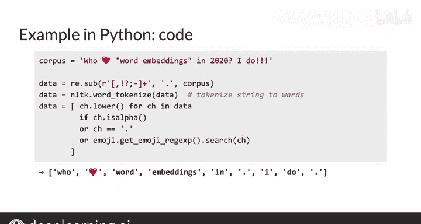

#  092：清洗与分词 🧹➡️🔡

在本节课中，我们将学习如何为自然语言处理任务准备文本数据。具体来说，我们将探讨**清洗**与**分词**这两个关键步骤，它们是将原始文本转化为模型可理解形式的基础。

---

## 概述

我们将探索清洗与分词。我在第一门课程中已经简要提及过这个话题，但在此仍有必要再次深入讨论。让我们开始吧。

我会提供一些实用建议，指导你如何清洗一个语料库，并通过一个称为**分词**的过程，将其拆分为单词，或者更准确地说，拆分为**词元**。

在第一门课程中，我先前讨论过数据准备、清洗和分词，但现在我将更详细地展开说明。

---

## 清洗语料库的实用建议


以下是处理文本数据时需要考虑的几个关键方面。

### 1. 大小写处理

首先，你应该将语料库中的单词视为**大小写不敏感**。例如，单词 “the” 无论其大小写形式如何，都应被统一表示。你可以通过将整个语料库转换为全小写或全大写来实现这一点。

**代码示例：**
```python
corpus_lower = original_corpus.lower()
```

### 2. 处理标点符号

其次，你需要处理标点符号。
*   你可以将所有表示句子中断的标点符号（如句号、逗号、问号）表示为一个特殊的词元，例如 `<PUNCT>`。
*   你可以忽略非中断性的标点符号，如引号。
*   你可以将多个连续的标点符号（如三个问号）合并为一个。

### 3. 处理数字

接下来，你需要处理数字。
*   如果数字在你的应用场景中不承载重要含义，你可以删除所有数字。
*   然而，数字可能具有与你用例相关的重大意义。例如，“3.14” 是圆周率π，“90210” 是一个电视剧名，也是加州比弗利山庄的电话区号。在这种情况下，你可以将这些数字按原样保留在语料库中。
*   如果你的语料库包含许多独特的数字（如许多区号），你可能会发现将所有数字替换为一个特殊词元（如 `<NUMBER>`）更有意义。这能让模型知道重要的是“这是一个数字”，而不是试图区分“90210”和其他区号或电话号码。

### 4. 处理特殊字符

还需要处理特殊字符，例如数学符号、货币符号、章节段落标记、行尾标记等。通常，删除这些字符是安全的做法。

### 5. 处理特殊词汇

最后，特别是如果你在处理现代用户输入的语料库（如推文或消费者评论），你应该处理特殊词汇，例如表情符号和话题标签（如 `#NLP`）。这取决于你是否希望以及如何让你的模型理解它们的含义。例如，你可以考虑将每个表情符号或话题标签视为一个独立的词元。

---

## 分词实践示例

上一节我们介绍了清洗语料库的通用原则，本节中我们来看看一个具体的代码示例，演示如何实现其中的部分建议。

以下是一个使用Python的基本示例。本例中的语料是：`"Who loves word embeddings in 2020? I do! 😊"`，它包含一个表情符号、标点符号和一个数字。

**以下是导入和初始化所需库的代码：**
```python
import nltk
import re
import emoji
from nltk.tokenize import word_tokenize

nltk.download('punkt')  # 下载分词所需的数据
```

我使用了流行的NLTK库来执行分词。它有一个名为 `punkt` 的智能分词模块，可以处理常见的标点符号用法。例如，它知道缩写和中间名中的句点并不表示句子结束。我还使用了 `emoji` 库，以便向你展示如何处理表情符号。

**接下来是实际的逻辑代码：**
```python
# 原始语料
corpus = "Who loves word embeddings in 2020? I do! 😊"

# 1. 将所有中断性标点替换为句号
corpus_cleaned = re.sub(r'[!?]+', '.', corpus)
# 结果: "Who loves word embeddings in 2020. I do. 😊"

# 2. 使用NLTK分词
tokens = word_tokenize(corpus_cleaned)
# 分词结果: ['Who', 'loves', 'word', 'embeddings', 'in', '2020', '.', 'I', 'do', '.', '😊']

# 3. 筛选并转换词元：保留字母、句号、表情符号，并转为小写
filtered_tokens = [
    token.lower() for token in tokens
    if token.isalpha() or token == '.' or token in emoji.EMOJI_DATA
]
# 最终结果: ['who', 'loves', 'word', 'embeddings', 'in', 'i', 'do', '.', '😊']
```

如你所见，标点符号（包括引号）已被分离为独立的词元。最后，通过列表推导式，我保留了词元并将其转换为小写，条件是它们属于以下类别之一：字母字符、句号（即之前的中断性标点）、表情符号。这样就移除了像“2020”这样的数字和未知的特殊字符。最终得到的数组是：`['who', 'loves', 'word', 'embeddings', 'in', 'i', 'do', '.', '😊']`。

现在，你可以使用这个数组来提取中心词及其周围的上下文词，这将是下一部分详细讨论的内容。

---



## 总结

本节课中我们一起学习了自然语言处理中数据预处理的两个核心步骤：**清洗**与**分词**。我们讨论了统一大小写、处理标点符号和数字、过滤特殊字符以及保留表情符号等现代词汇的策略，并通过一个Python示例演示了如何利用NLTK库实现基本的分词流程。经过这些步骤，杂乱的原始文本被转化为了规整的词元序列，为后续构建词嵌入模型（如连续词袋模型）做好了准备。

在了解了清洗与分词之后，我们已经准备好继续学习连续词袋模型的其他部分。在下一个视频中，我们将探索**滑动窗口**，你可以将其想象为一个在文本语料库上滑动的窗口。我们将在那里详细讨论它。下次见。😊