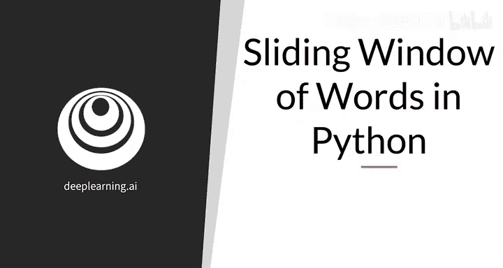
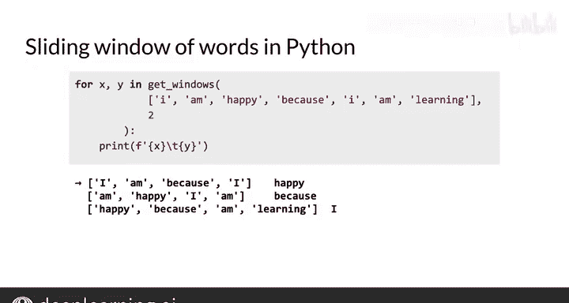

#  093：Python中的滑动窗口 🪟


在本节课中，我们将学习如何从语料库中提取中心词和上下文词，这是训练连续词袋模型的关键步骤。我们将通过Python代码实现一个滑动窗口函数来完成这一任务。

---



上一节我们介绍了训练连续词袋模型需要中心词和上下文词。本节中，我们来看看如何从已处理的语料库中实际获取这些词。

假设你已经清洗并分词了一个语料库，现在得到一个由单词或标记组成的数组。以下是如何从中提取中心词及其上下文词，这些将作为训练模型的样本。

以下是实现此功能的Python代码。

```python
def get_windows(words, C):
    i = C
    while i < len(words) - C:
        center_word = words[i]
        context_words = words[i-C:i] + words[i+1:i+C+1]
        yield context_words, center_word
        i += 1
```

`get_windows` 函数接收两个参数：
*   `words`：一个单词或标记的数组。
*   `C`：存储在变量 `C` 中的上下文半宽，即中心词每侧要选取的单词数量。在上一个视频中，这个值是2，因此总窗口大小为5。

函数初始化一个计数器，其值为第一个前面有足够多单词的词的索引。例如，在句子“I am happy because I am learning”的分词数组中，`C=2`。第一个可用的中心词是“happy”，其索引为2，正好等于 `C` 的值。

接着，函数开始一个循环，从该索引运行，直到最后一个可能的中心词（即后面还有两个词的词）为止。循环的停止条件是索引小于数组长度减去 `C`。

在循环的每次迭代中：
1.  提取中心词，即当前索引处的单词。
2.  创建一个数组，包含中心词前的 `C` 个单词和中心词后的 `C` 个单词。
3.  返回上下文词和中心词。

这里使用了Python中的 `yield` 关键字而非 `return`。简单来说，`return` 会立即退出函数，而 `yield` 会返回一个值并暂停函数执行，这个函数被称为生成器函数。当需要更多值时，函数会从暂停处继续运行。使用 `yield` 可以多次从函数返回值，这正是我们在 `while` 循环每次迭代中所做的。

最后，将索引加1，使滑动窗口向右移动一个单词。

总结一下，`get_windows` 函数接收一个语料库和上下文大小，并为每个连续的窗口返回上下文词和中心词。

以下是使用此函数的方法。

```python
# 示例用法
sentence = ["I", "am", "happy", "because", "I", "am", "learning"]
context_size = 2

for context_words, center_word in get_windows(sentence, context_size):
    X = context_words  # 特征（上下文词）
    y = center_word    # 目标（中心词）
    print(f"Context: {X}, Center: {y}")
```

我们使用一个循环来获取连续的上下文词和中心词元组，并分别赋给 `X` 和 `y`。这里采用了机器学习中常见的特征和目标表示法，因为对于连续词袋模型，上下文词是特征，中心词是目标。

如果在数组 `["I", "am", "happy", "because", "I", "am", "learning"]` 上运行此代码，并设置上下文半宽为2，将得到如下输出。



接下来，你将把这组单词转换为一组可以被连续词袋模型消费的向量。

---

本节课中，我们一起学习了如何在Python中使用滑动窗口提取中心词和上下文词。这对于编程练习非常有用。你还了解了Python中 `yield` 功能的使用，它通常用于数据生成器，或者可以将其视为能持续以小批量提供数据的函数。