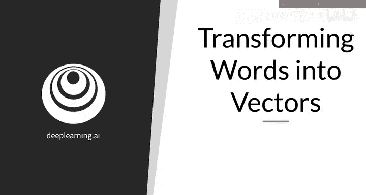
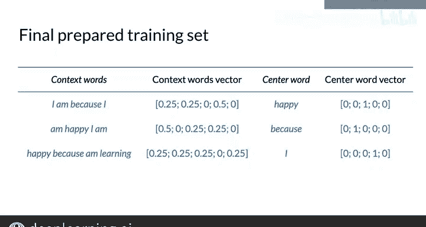

#  094：44_将词转换为向量 📝

在本节课中，我们将学习如何将文本数据中的中心词和上下文词转换为数学模型可以处理的向量形式。这是训练连续词袋模型的关键准备步骤。

---

## 概述

上一节我们介绍了如何从语料库中提取中心词和上下文词。本节中，我们来看看如何将这些词语转换为数学向量，以便输入到连续词袋模型中。

## 创建词汇表

首先，你需要为语料库创建一个词汇表。词汇表是语料库中所有唯一词的集合。

以例句“I am happy because I am learning”为例，其词汇表包含五个词：`am`、`because`、`happy`、`I`、`learning`。

## 将词编码为独热向量

接下来，你可以将词汇表中的每个词编码为一个列独热向量。向量的每一行对应词汇表中的一个词。

以下是创建独热向量的方法：
*   词汇表按字母顺序排列（其他顺序亦可）。
*   每个词的向量在其对应行位置为1，其余位置为0。

例如，对于上述五词词汇表：
*   `am` 的向量为 `[1, 0, 0, 0, 0]^T`
*   `because` 的向量为 `[0, 1, 0, 0, 0]^T`
*   `happy` 的向量为 `[0, 0, 1, 0, 0]^T`
*   `I` 的向量为 `[0, 0, 0, 1, 0]^T`
*   `learning` 的向量为 `[0, 0, 0, 0, 1]^T`

**中心词**将以这种独热向量的形式输入模型。

## 创建上下文向量

对于**上下文词**，你需要创建一个单一的向量来代表整个上下文窗口。

以下是创建上下文向量的步骤：
1.  将每个上下文词转换为对应的独热向量。
2.  计算这些独热向量的平均值。

例如，假设上下文词为 `I, am, because, I`。
*   `I` 的独热向量：`[0, 0, 0, 1, 0]^T`
*   `am` 的独热向量：`[1, 0, 0, 0, 0]^T`
*   `because` 的独热向量：`[0, 1, 0, 0, 0]^T`
*   另一个 `I` 的独热向量：`[0, 0, 0, 1, 0]^T`

计算平均值：
`( [0,0,0,1,0]^T + [1,0,0,0,0]^T + [0,1,0,0,0]^T + [0,0,0,1,0]^T ) / 4 = [0.25, 0.25, 0, 0.5, 0]^T`

得到的向量 `[0.25, 0.25, 0, 0.5, 0]^T` 就是用于模型的上下文表示。

## 训练数据示例

对于第一个滑动窗口 “I am happy because I”，最终用于训练连续词袋模型的向量表示如下：
*   **上下文向量**：`[0.25, 0.25, 0, 0.5, 0]^T` （代表 “I, am, because, I”）
*   **中心词向量**：`[0, 0, 1, 0, 0]^T` （代表 “happy”）

语料库中其余的训练数据也按此方法处理。

---

## 总结

本节课中我们一起学习了如何将词语转换为向量。我们首先从语料库创建词汇表，然后将中心词编码为独热向量，最后通过计算平均值将一组上下文词合并为一个上下文向量。至此，你已经完成了从原始语料库到模型可处理数据的全部准备工作。

既然中心词和上下文词都已完全表示为向量，接下来我们就可以深入探讨模型本身了。在下一个视频中，我们将学习连续词袋模型的架构。