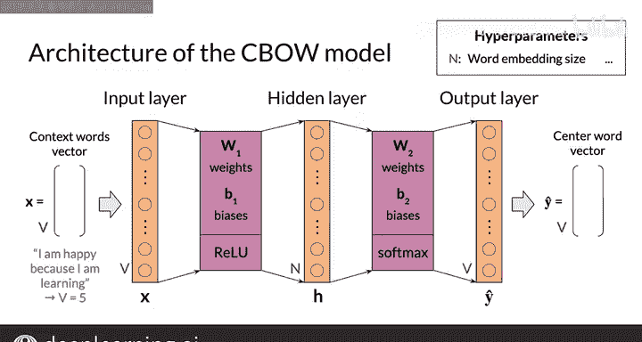

#  095：吴恩达《自然语言处理》P95 - CBOW模型架构 🏗️

在本节课中，我们将学习连续词袋模型的神经网络架构。我们将了解其输入、输出、隐藏层的设计，以及各层之间的连接方式。

---

## 概述

上一节我们介绍了CBOW模型的基本概念。本节中，我们来看看用于训练该模型的具体神经网络架构。

CBOW模型基于一个浅层的密集神经网络，它包含一个输入层、一个隐藏层和一个输出层。模型的输入是上下文词的向量，输出是预测的中心词向量。

## 模型架构详解

输入向量记为 **X**，输出向量记为 **ŷ**。这两个向量的大小都等于词汇表的大小 **V**。例如，如果语料是“I am happy because I am learning”，则词汇表包含5个词，因此 **V = 5**。在实际应用中，**V** 的值通常在数千的量级。

接下来是隐藏层。在词嵌入的课程中我们提到，词嵌入的维度是一个需要自行设定的超参数。我们记词嵌入的维度为 **N**，其典型值可以是100或300。隐藏层的神经元数量应设置为与期望的词嵌入维度 **N** 相等。我们将隐藏层的向量表示记为 **H**。

这是一个常规的前馈网络，也称为密集神经网络，因此三层之间是全连接的。

以下是模型中涉及的权重矩阵和偏置向量：

*   **W1**：连接输入层和隐藏层的权重矩阵。
*   **B1**：隐藏层的偏置向量。
*   **W2**：连接隐藏层和输出层的权重矩阵。
*   **B2**：输出层的偏置向量。

神经网络在训练过程中将学习这些矩阵和向量。作为一个小提示，后续我们将从这些矩阵中推导出词嵌入。

## 激活函数

现在，我们需要为隐藏层和输出层选择激活函数。隐藏层激活函数的结果将传递到下一层（即输出层）。同样，输出层激活函数的结果将作为模型的预测结果呈现。

*   对于**隐藏层**，我们将使用**线性整流函数**。
*   对于**输出层**，我们将使用**Softmax函数**。

激活函数本身值得深入讨论，我将在后续视频中详细描述它们。

至此，您已经了解了连续词袋模型的整体架构。接下来，我将详细讲解前面提到的矩阵和向量的维度，这是完成本周实践作业所需的重要部分。

---

## 总结

本节课中，我们一起学习了CBOW模型的神经网络架构。我们明确了其输入输出向量的维度与词汇表大小 **V** 相关，隐藏层维度与词嵌入维度 **N** 相等，并认识了连接各层的权重矩阵 **W1**、**W2** 和偏置向量 **B1**、**B2**。最后，我们确定了隐藏层和输出层将分别使用线性整流函数和Softmax函数作为激活函数。