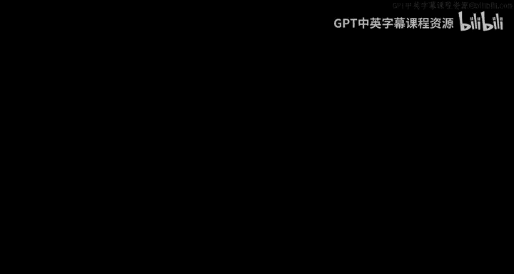
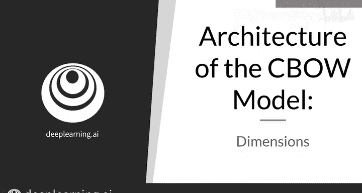
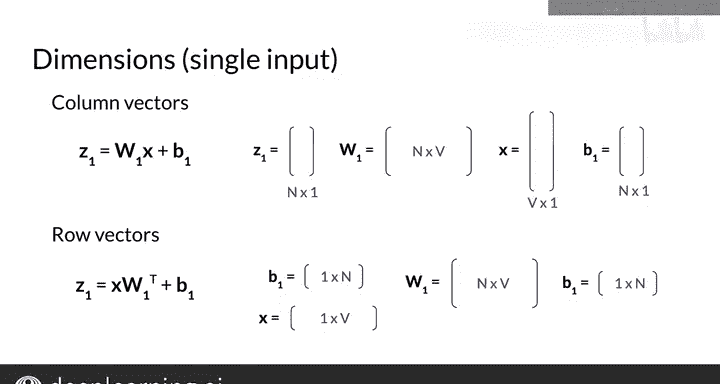

#  096：CBOW模型维度架构详解 📐

在本节课中，我们将深入探讨连续词袋模型的维度架构。理解模型中每一步的向量和矩阵维度，对于后续的编程实现至关重要，能有效避免常见的维度不匹配错误。

上一节我们介绍了CBOW模型的基本架构，本节中我们来看看模型中各层向量和矩阵的具体维度。

## 模型架构回顾 🏗️

首先，输入层由一个小写字母 **x** 表示。它是一个具有 **V** 行的列向量，其中大写 **V** 是词汇表的大小。

为了获得将存储在隐藏层中的值，你需要首先计算输入层值的加权和并加上偏置项。即 **W1 * x + B1**，我们称结果为 **Z1**。

小写字母 **h** 指的是存储在隐藏层中的值列向量。

为了得到 **h**，你需要将 **z1** 的值传入一个ReLU激活函数。

## 维度详解 📏

以下是各层维度的具体说明：

*   **W1**：输入层与隐藏层之间的权重矩阵，具有 **n** 行和 **V** 列，其中 **n** 是词嵌入的维度大小。
*   **B1**：隐藏层的偏置向量，为隐藏层的每个神经元设置一行，因此总共有 **n** 行。
*   当你计算 **W1 * x** 并加上偏置向量 **B1** 时，会得到一个具有 **n** 行的列向量。通过ReLU函数后，维度保持不变。
*   因此，隐藏层由一个具有 **n** 行的列向量表示。

接下来，为了获得输出层的值，你需要首先计算隐藏层值的加权和并加上偏置项。即 **W2 * h + B2**，我们称结果为 **z2**。**z2** 中的值有时被称为“logits”。

为了得到输出 **ŷ**，你需要将 **z2** 的logits值通过一个softmax激活函数。激活函数的细节将在后续课程中介绍。

以下是输出层维度的具体说明：

*   **W2**：隐藏层与输出层之间的权重矩阵，具有 **V** 行和 **n** 列。
*   **B2**：输出层的偏置向量，为每个输出神经元设置一行，因此总共有 **V** 行。
*   当你计算 **W2 * h** 并加上偏置向量 **B2** 时，会得到一个具有 **V** 行的列向量。通过softmax激活函数后，维度同样不变。
*   最终，你得到一个具有 **V** 行的输出列向量 **ŷ**。

## 行向量处理 🔄

如果你遇到的情况是使用行向量而非列向量，那么你需要使用转置矩阵并在矩阵乘法中调整项的顺序来进行计算。

例如，对于列向量，你计算 **h = W1 * x + B1**。如果 **x** 和 **B1** 是行向量，那么你需要计算 **x * W1^T + B1** 来得到 **z1**，进而得到行向量 **h**。

## 批处理模式 🧺

接下来，我将展示如何使用神经网络进行批处理，即同时处理多个样本，而不是一次只处理一个样本。

## 总结 📝

本节课中，我们一起学习了CBOW模型中各层向量和矩阵的维度。了解这些维度将有助于你在编程作业中正确构建模型，希望你再也不会遇到著名的“维度不匹配”错误了。在下一个视频中，让我们更深入地探讨这个模型。