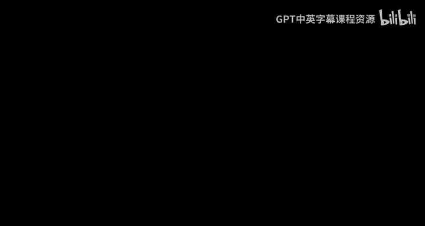
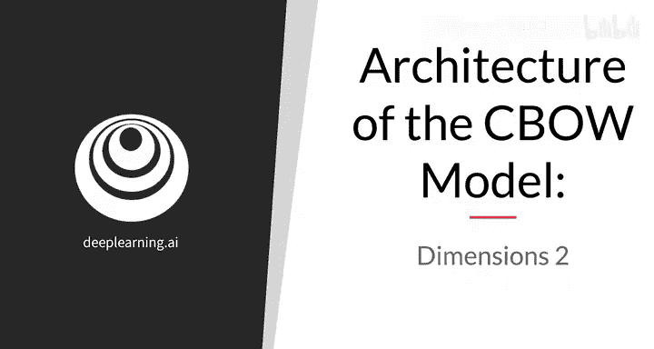
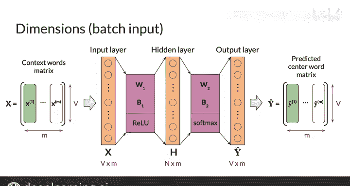

#  097：CBOW模型维度架构与向量化 🧠

在本节课中，我们将学习连续词袋（CBOW）模型如何处理多个输入样本，以及如何通过向量化技术高效地进行批量计算。我们将深入探讨模型的维度变化、矩阵运算，并简要介绍激活函数的作用。

---

## 批量处理与向量化

上一节我们介绍了使用单个输入示例的CBOW模型架构。本节中我们来看看，如果同时输入多个样本并获取多个输出，模型该如何进行向量化计算。

你已经熟悉了在单个输入情况下，神经网络中向量和矩阵的维度。在实际训练中，为了加速学习过程，我们通常希望一次性传入多个样本。这种方法称为**批量处理**，你将在本周的作业中亲自实践它。

假设你想在每次迭代中向神经网络传入 **M** 个上下文词向量。**M** 被称为**批量大小**，它是你在训练时定义的一个模型超参数。

以下是实现向量化的关键步骤：

1.  你可以将这 **M** 个列向量并排组合，形成一个维度为 `(V, M)` 的矩阵，我们将其记为大写 **X**。其中 **V** 是词汇表大小。
2.  将这个矩阵 **X** 输入网络。隐藏层的输出将是一个矩阵 **H**，代表 **M** 个样本的隐藏层值。其计算公式为：
    **H = ReLU(W1 * X + B1)**
    这里，**W1** 是权重矩阵，**B1** 是偏置矩阵。**H** 的维度是 `(N, M)`，其中 **N** 是隐藏层神经元数量。
3.  需要注意的是，原始的偏置向量 **b1** 需要被复制 **M** 次，扩展成维度为 `(N, M)` 的偏置矩阵 **B1**，以便将偏置项加到每个加权和上。在编程中，这被称为**广播**，NumPy等库会自动处理。
4.  输出层的结果矩阵 **Ŷ**（包含 **M** 个输出）的计算公式为：
    **Ŷ = softmax(W2 * H + B2)**
    同样，偏置向量 **b2** 也需要广播为矩阵 **B2**。**Ŷ** 的维度是 `(V, M)`。
5.  最后，你可以将 **Ŷ** 分解回 **M** 个列向量。每个输出列向量都对应输入矩阵 **X** 中的一个输入上下文向量。

## 激活函数简介

现在，你已经掌握了CBOW模型的维度计算，并能对输入输出进行向量化处理。这为构建一个可工作的模型打下了坚实基础。

在接下来的视频中，我们将深入探讨本模型所使用的激活函数，进一步接近一个完整的CBOW模型实现。

---

本节课中我们一起学习了CBOW模型的批量处理与向量化方法。我们了解了如何将多个输入样本组织成矩阵进行计算，明确了各层输入、输出及参数的维度变化，并引入了激活函数的概念。掌握这些是高效实现神经网络模型的关键步骤。