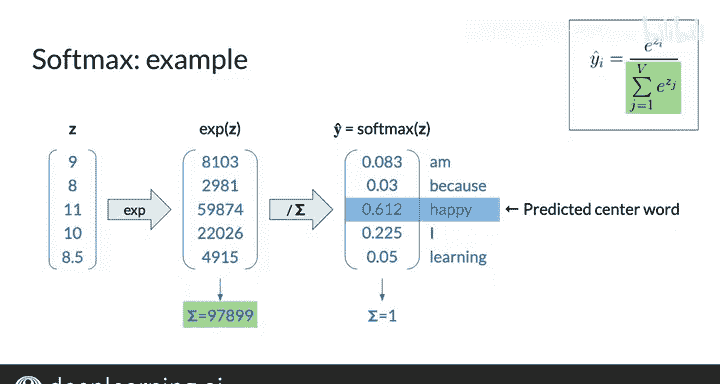

#  098：CBOW模型激活函数架构 🧠

在本节课中，我们将学习神经网络中两个至关重要的激活函数：**线性整流单元** 和 **Softmax函数**。我们将了解它们的工作原理、数学定义以及在连续词袋模型中的应用。

---

## 激活函数的作用

在深入讲解Softmax函数之前，我们先了解一下激活函数在神经网络中的角色。除了输入层的神经元直接使用输入值外，网络的每一层都会先计算其输入的加权和并加上偏置项，然后将结果传递给一个激活函数。

对于隐藏层，其计算过程如下：
1.  首先计算 **z1 = W1 * x + b1**。
2.  然后，将 **z1** 传递给该层的激活函数，得到隐藏层的值 **H**。

---

## 线性整流单元

线性整流单元是一种流行的通用激活函数。它只在神经元的加权输入之和为正数时才“激活”该神经元，并将这个正数结果传递下去。

**数学上，ReLU函数定义为：**
`ReLU(x) = max(0, x)`

其函数图像是一个将负数部分“截断”为0的折线。

**以下是一个向量运算的示例：**
假设隐藏层计算得到的向量 **z1** 为 `[-0.3, 5.1, 0.2, -4.6]`。
将ReLU函数应用于 **z1** 后，得到的隐藏层向量 **H** 为 `[0, 5.1, 0.2, 0]`。
可以看到，所有负值（如-0.3和-4.6）都变成了0，而正值（如5.1和0.2）则保持不变。

---

## 输出层与Softmax函数

现在，我们来看输出层。输出层计算隐藏层值的加权和并加上偏置项，即 **z = W2 * H + b2**。

然后，将向量 **z** 传递给该层的激活函数。在CBOW模型中，这个激活函数是 **Softmax函数**，其输出是预测向量 **ŷ**。

Softmax函数的工作原理如下：
*   **输入**：一个包含任意实数的向量。
*   **输出**：一个数值在0到1之间的向量，且所有元素之和为1。这个输出可以被解释为一组互斥事件的概率。

在连续词袋模型中，将Softmax应用于 **z** 后，会得到一个输出向量 **ŷ**，其维度与语料库词汇表的大小相同。向量中每个位置的值，可以被解释为：给定特定的上下文词向量 **x** 时，中心词是词汇表中对应位置那个词的概率。

**Softmax函数的数学公式如下：**
如果输入向量 **z** 的元素为 `z_i`（i 从 1 到 V，V为词汇表大小），输出向量 **ŷ** 的元素为 `ŷ_i`，那么：
`ŷ_i = e^{z_i} / Σ_{j=1}^{V} e^{z_j}`

指数函数 `e^{z_i}` 将所有输入转换为正数，分母的求和项则对向量进行归一化，确保所有输出值之和为1。

---

## Softmax计算示例

让我们通过一个数值例子来具体说明。假设输出层计算得到的向量 **z** 为：
`z = [2.0, 1.0, 0.1]`

**计算步骤如下：**
1.  计算每个元素的指数：
    `e^z = [e^{2.0}, e^{1.0}, e^{0.1}] ≈ [7.389, 2.718, 1.105]`
2.  计算所有指数值的和：
    `总和 = 7.389 + 2.718 + 1.105 = 11.212`
3.  将每个指数值除以总和，得到概率：
    `ŷ = [7.389/11.212, 2.718/11.212, 1.105/11.212] ≈ [0.659, 0.242, 0.099]`

现在，如果将每个位置映射到词汇表（例如，位置1对应“happy”，位置2对应“sad”，位置3对应“neutral”），那么我们可以这样解释输出：给定当前的上下文，模型预测中心词是“happy”的概率为65.9%，是“sad”的概率为24.2%，是“neutral”的概率为9.9%。其中概率最高的“happy”就是模型的最终预测结果。

---

## 总结

本节课中，我们一起学习了神经网络中两个核心的激活函数。

*   **ReLU函数** 将所有负输入值变为0，而正输入值则原样通过。它的公式是 `ReLU(x) = max(0, x)`。
*   **Softmax函数** 将一个实数向量转换为一个概率分布向量。它的输出值在0到1之间，且总和为1，非常适合用于多分类任务的输出层。其公式为 `ŷ_i = e^{z_i} / Σ_j e^{z_j}`。

理解这两个函数是构建和理解包括CBOW在内的许多神经网络模型的基础。