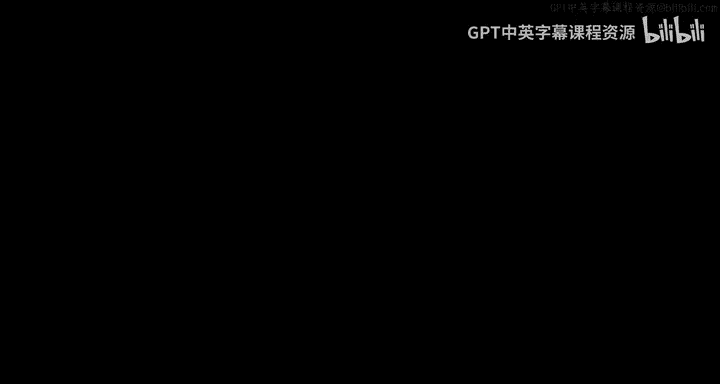
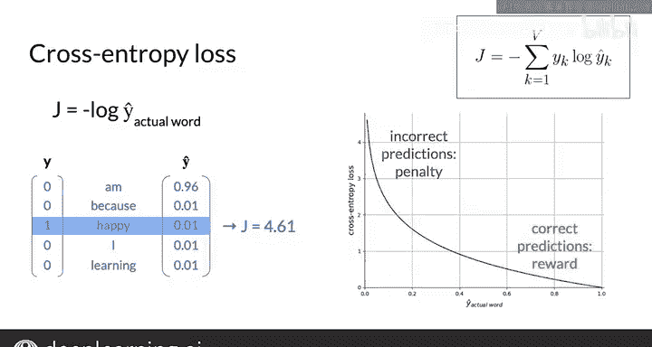

#  099：49_训练CBOW模型成本函数 🧠

在本节课中，我们将学习连续词袋模型所使用的成本函数。我们将理解为何选择交叉熵损失函数，并探讨其如何衡量模型预测的准确性。

上一节我们介绍了CBOW模型的基本结构，本节中我们来看看其训练过程中需要最小化的目标——成本函数。

## 成本函数概述

考虑一个机器学习模型。一个训练样本由输入和真实目标组成，模型基于输入预测出一个值。

损失函数用于衡量单个输入训练样本的预测值与真实值之间的误差。对于连续词袋模型，输入上下文词由向量 **X** 表示，真实值是代表实际中心词的向量 **Y**，预测值是向量 **Y_hat**。学习过程的目标是找到最小化损失的参数。

给定训练数据集，在连续词袋模型中，学习过程调整的参数是权重矩阵 **W1**、**W2** 以及偏置向量 **B1**、**B2**。

## 交叉熵损失函数

你将使用的损失函数是交叉熵损失。这里不深入理论，你只需知道交叉熵损失函数常与分类模型一起使用，而分类模型通常与神经网络中的Softmax输出层结合，正如你在连续词袋模型中使用的那样。

如果你曾使用过逻辑回归，你可能已经知道交叉熵损失函数的一种简单形式，即对数损失，它适用于只有两个类别的情况。

使用连续词袋模型的符号表示，一个训练样本的交叉熵损失公式为：

**J = - Σ (k=1 to V) [ Y_k * log(Y_hat_k) ]**

## 损失计算示例

以下是一个具体示例，说明如何计算交叉熵损失。

考虑输入上下文词 “I am because I”，实际中心词是 “happy”。对应的向量 **Y** 在 “happy” 对应的行上为1，其他为0。预测值可能是向量 **Y_hat**，其最大值在 “happy” 对应的第0行。这个向量将被解释为预测 “happy” 为中心词，这是正确的预测。

计算交叉熵损失：
*   `log(Y_hat)` 是这个向量。
*   将每个元素与 **Y** 的对应元素相乘，得到这个向量（使用 `⊙` 表示逐元素乘法）。注意，只有一个非零值，即 -0.49。
*   求和得到这个值，损失是负的求和结果，因此为 0.49。

现在，如果预测错误呢？假设预测向量是 `[0.01, 0.96, 0.01, 0.01, 0.01]`，即预测 “am” 而不是 “happy”。
*   `log(Y_hat)` 是这个向量。
*   与 **Y** 逐元素相乘得到这个向量。
*   求和为 -4.61，损失是 -1 乘以这个值，因此为 4.61。

可以看到，当预测错误时，损失更大。

## 损失函数特性

更一般地说，交叉熵损失可简化为 **-1 * log(预测向量中对应实际中心词的那个元素的值)**。

如果将交叉熵损失绘制为“对实际中心词的预测值”的函数图像，可以看到：
*   如果模型预测正确，**Y_hat** 值接近1，则损失接近0。这是因为 `log(1) = 0`。
*   另一方面，如果模型预测错误，则实际词的 **Y_hat** 将接近0，导致损失值很高。原因是当 `x` 趋近于0时，`log(x)` 的极限是负无穷。因此，对于使用 `-1 * log` 的损失函数，当 **Y_hat** 趋近于0时，损失趋近于正无穷。

所以，损失函数奖励正确的预测，惩罚错误的预测。

你已经计算了一个训练样本的交叉熵损失，并看到了交叉熵损失与实际预测值的关系图。

## 总结

本节课中我们一起学习了连续词袋模型的成本函数——交叉熵损失。我们理解了其公式 **J = - Σ Y_k * log(Y_hat_k)**，并通过示例看到它如何有效地衡量预测误差：正确预测时损失低，错误预测时损失高，从而引导模型参数向正确方向更新。

下一节视频，我们将探讨CBOW模型的前向传播过程。