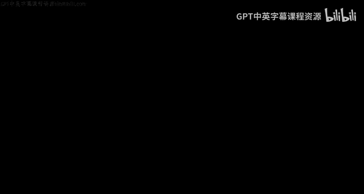
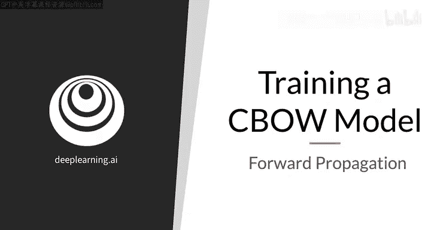
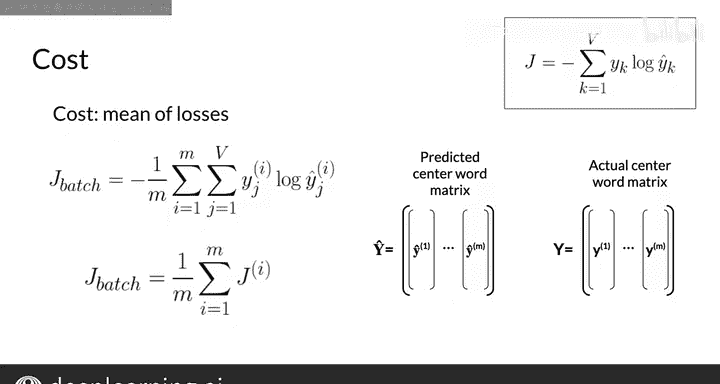

#  100：CBOW模型前向传播详解 🧠

在本节课中，我们将学习连续词袋（CBOW）模型的前向传播过程。我们将看到输入数据如何经过神经网络的激活层，最终转化为预测结果。

上一节我们介绍了交叉熵损失函数，以及它如何衡量CBOW模型在单个预测中的误差。本节中，我们来看看如何使用批量的训练样本来训练神经网络。

## 前向传播回顾

前向传播是指将输入值从神经网络的输入层开始，依次通过每一层，最终传递到输出层，并在此过程中计算各层数值的过程。

以下是前向传播的核心步骤：

1.  从一批训练样本开始，这些样本表示为一个矩阵 **X**，其维度为 **V × M**。其中 **V** 是词汇表大小，**M** 是批次大小。
2.  将 **X** 前向传播到神经网络中，得到输出矩阵 **Ŷ**，其维度同样为 **V × M**。
3.  输出矩阵 **Ŷ** 简单地将 **M** 个输出列向量堆叠起来，每个向量对应一个训练样本的输入向量。

## 从损失到成本

为单个样本计算误差时，我们使用交叉熵损失函数。当处理批量样本时，我们将计算成本。成本与损失的目的相同，并且实际上基于损失函数。

在实践中，“损失”和“成本”这两个术语经常互换使用。但在本课程中，我们用“损失”指代单个样本的误差，用“成本”指代一批样本的误差。

一批样本的交叉熵成本，就是这 **M** 个独立样本的交叉熵损失的平均值。

以下是批量训练样本的交叉熵成本公式：

**J_batch = - (1/M) * Σ (i=1 to M) Σ (j=1 to V) [ y_j^(i) * log(ŷ_j^(i)) ]**

这个公式可以重写为：

**J_batch = (1/M) * Σ (i=1 to M) J^(i)**

其中，**J^(i)** 是第 **i** 个样本的损失。通过这种方式，可以将成本直观地理解为各个样本损失的平均值。

## 下一步：优化网络

接下来，你将使用这个成本函数来调整神经网络的参数，以改进其预测效果。

本节课中我们一起学习了CBOW模型的前向传播过程，以及如何为批量样本计算交叉熵成本。在下一节视频中，你将学习如何利用这个成本函数来训练你的词向量。