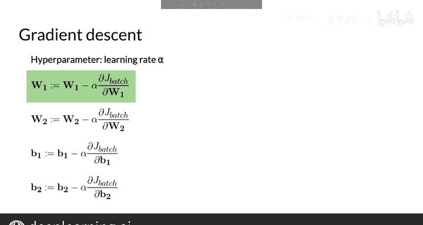

#  101：反向传播与梯度下降 🧠

在本节课中，我们将学习如何训练连续词袋模型。具体来说，我们将了解如何通过反向传播算法计算成本函数的梯度，并利用梯度下降法来更新神经网络的权重和偏置，从而最小化模型的预测误差。

---

上一节我们介绍了CBOW模型的基本结构和前向传播过程。本节中，我们来看看如何通过训练来优化模型的参数。

我将展示如何找到线性层和词嵌入的权重，以最小化这两个矩阵或权重向量。为此，你需要最小化成本函数。为了最小化成本，你将使用两种技术。

第一种技术是**反向传播**。反向传播是一种算法，用于计算成本函数相对于神经网络权重和偏置的偏导数或梯度。请记住，批次成本 `J_batch` 是权重和偏置的函数。“反向”一词源于通过链式法则求导公式的方式，即从输出层开始，然后利用先前计算出的导数逐层向后计算。顺便提一下，反向传播是动态规划的一个典型例子，这是你在本课程第一周学习过的概念。

第二种技术是**梯度下降**。它利用计算出的梯度来调整神经网络的权重和偏置，以最小化成本。

我不会深入探讨反向传播或梯度下降的数学细节。但如果你有兴趣了解更多，可以查看神经网络课程，以理解各种公式是如何推导的。

首先，让我们使用反向传播来计算执行梯度下降所需的成本函数偏导数。

你需要计算成本函数相对于神经网络参数的偏导数。在本例中，参数是 `W1`、`W2`、`B1` 和 `B2`。这些计算过程冗长，在实践中，你将使用机器学习库来为你处理反向传播。

因此，我将直接给出公式，你可以在本周的作业中实现它们。

以下是成本函数相对于权重矩阵 `W1` 的偏导数公式：

`∂J/∂W1 = (1/m) * (∂J/∂Z2) * A1^T`

这是成本函数相对于 `W2` 的偏导数公式：

`∂J/∂W2 = (1/m) * (∂J/∂A2) * H^T`

以下是偏置向量 `B1` 的公式。让我在此稍作停顿。在这个公式中，我引入了 `1_m` 向量，这是一个包含 `m` 个元素且所有元素均为1的行向量。如果你将一个有 `m` 行的矩阵 `A` 乘以转置后的 `1_m` 向量，你将得到一个列向量，其中每个元素等于 `A` 矩阵对应行元素的总和。需要说明的是，引入 `1_m` 向量主要是为了形式化地书写数学公式。在实践中，当你在 Python 中实现时，计算列和的最简单方法是使用 NumPy 的 `sum` 函数，而无需使用 `1_m` 向量。在 `sum` 函数中，你需要指定参数 `axis=1` 来对列求和，并且需要将参数 `keepdims` 设置为 `True`，以便结果可以在后续计算中被广播到所需大小的矩阵中。

最后，这是 `B2` 的公式，它也使用了 `1_m` 向量。就本课程而言，你无需理解这些公式是如何推导的，可以直接使用它们。

现在，既然你已经有了这些梯度，就可以使用梯度下降来更新权重矩阵和偏置向量了。

计算中包含一个学习率 `alpha`，它是模型的一个超参数。以下是更新权重和偏置的公式：

`W1_new = W1 - α * (∂J/∂W1)`
`W2_new = W2 - α * (∂J/∂W2)`
`B1_new = B1 - α * (∂J/∂B1)`
`B2_new = B2 - α * (∂J/∂B2)`

其思想是取原始参数，然后减去 `alpha` 乘以它们的梯度。由于 `alpha` 被选为一个小于1的小正数，乘以 `alpha` 的效果是减少每个变量在每一步的更新量。较小的 `alpha` 允许权重和偏置进行更渐进的更新，而较大的数值则允许权重更快地更新。例如，新的权重矩阵 `W1` 将等于原始的 `W1` 减去 `alpha` 乘以在反向传播步骤中计算出的 `∂J/∂W1`。

你现在已经掌握了训练连续词袋模型所需的一切知识。在下一个视频中，你将学习如何从训练好的连续词袋模型中提取词嵌入向量。

---

梯度下降法让你能够计算相对于权重和偏置的偏导数。一旦计算出这些偏导数，你就可以更新权重。`alpha` 参数决定了更新时步长的大小。

---

本节课中我们一起学习了训练CBOW模型的核心步骤：首先通过反向传播算法计算成本函数相对于各层参数的梯度，然后利用梯度下降法，结合学习率 `alpha`，迭代更新模型的权重和偏置，最终使模型的预测误差最小化。