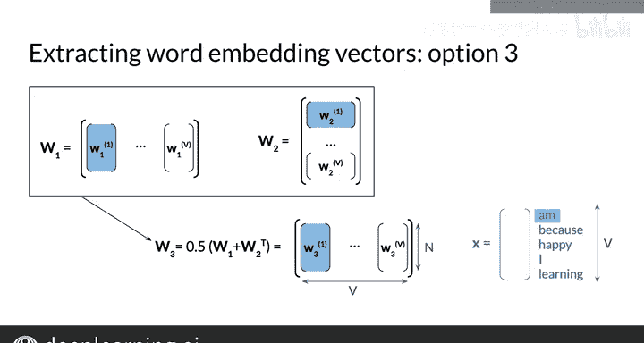

#  102：提取词嵌入向量 🧠

在本节课中，我们将学习如何从训练好的连续词袋模型神经网络中提取词嵌入向量。词嵌入是自然语言处理中的核心概念，它能够将词汇表示为具有语义信息的密集向量。

---

## 概述

我们已经学习了如何通过前向传播、反向传播和梯度下降来训练连续词袋模型的神经网络。然而，训练过程并不会直接输出词嵌入向量，它们是训练过程的副产品。接下来，我们将探讨几种从训练好的神经网络权重中提取词嵌入向量的方法。

---

## 提取词嵌入向量的三种方法

上一节我们介绍了词嵌入是训练过程的副产品，本节中我们来看看具体如何提取它们。以下是三种主要的提取方法：

### 方法一：使用权重矩阵 W1 的列向量

第一种方法是将权重矩阵 **W1** 的每一列视为词汇表中一个词的嵌入列向量。矩阵 **W1** 的列数等于词汇表的大小 **V**，因此每一列对应一个词。

**公式**：
`word_embedding_for_word_i = W1[:, i]`

其中，**W1** 的列与词汇表中词的顺序与输入向量或矩阵的行顺序一致。例如，在语料库 “I am happy because I am learning” 中，如果输入向量的行对应 “am”, “because”, “happy”, “I”, “learning”，那么 **W1** 的第一列就是 “am” 的词嵌入列向量，第二列是 “because” 的词嵌入列向量，依此类推。

### 方法二：使用权重矩阵 W2 的行向量

第二种方法是将权重矩阵 **W2** 的每一行视为词汇表中一个词的嵌入行向量。矩阵 **W2** 的行数等于词汇表的大小 **V**，因此每一行对应一个词。

**公式**：
`word_embedding_for_word_i = W2[i, :]`

同样，**W2** 的行与词汇表中词的顺序与输入向量或矩阵的行顺序一致。沿用上面的例子，**W2** 的第一行就是 “am” 的词嵌入行向量，第二行是 “because” 的词嵌入行向量。

### 方法三：平均前两种表示

第三种也是最后一种方法，是取前两种表示的平均值。如果你想得到词嵌入列向量，可以计算 **W1** 和 **W2** 转置的平均值，从而得到一个新的矩阵 **W3**。

**公式**：
`W3 = (W1 + W2.T) / 2`

然后，你可以像之前一样，从 **W3** 的每一列中提取词嵌入向量。在视觉示例中，“am” 的词嵌入将是 **W3** 的第一列，即 **W1** 的第一列和 **W2** 的第一行的平均值。

在本周的作业中，你将通过平均 **W1** 的转置和 **W2** 来提取词嵌入作为行向量。

---

## 过渡到评估

现在你已经知道了如何训练和提取这些词向量，在接下来的课程中，你将学习如何评估它们。具体来说，你将了解两种类型的评估指标：内在评估和外在评估。

---

## 总结

本节课中我们一起学习了从训练好的连续词袋模型神经网络中提取词嵌入向量的三种方法：
1.  使用权重矩阵 **W1** 的列向量。
2.  使用权重矩阵 **W2** 的行向量。
3.  取前两种表示的平均值。

理解这些提取方法是应用词嵌入进行下游任务的基础。