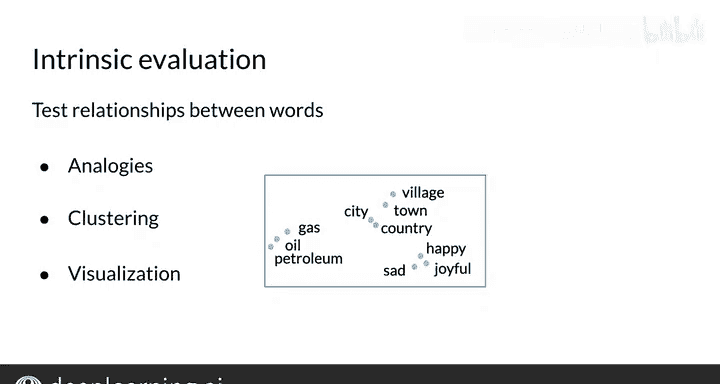

#  103：评估词嵌入的内在评估方法 🧠

在本节课中，我们将要学习如何评估词嵌入模型的质量。词嵌入是将词语映射到高维向量的技术，评估其好坏至关重要。我们将重点介绍**内在评估**方法，这种方法直接检验词嵌入本身是否捕捉到了词语之间的语义和语法关系。

---

## 两种评估指标

评估指标主要分为两类：**内在评估**和**外在评估**。

根据你试图优化的具体任务，你可以选择其中一种进行评估。接下来，让我们深入了解内在评估。

---

## 什么是内在评估？🔍

内在评估方法旨在评估词嵌入**本身**在多大程度上捕捉了词语之间的语义或语法关系。

*   **语义**指的是词语的含义。
*   **语法**指的是词语的语法结构。

---

## 如何进行内在评估？

以下是几种常用的内在评估方法。

### 1. 词语类比测试

你可以通过词语类比任务来测试词嵌入。这包括测试语义类比和语法类比。

*   **语义类比**：例如，找出“法国之于巴黎，如同意大利之于____”中的缺失词。
*   **语法类比**：例如，测试复数、时态和比较级。例如，“sing（唱）之于sang（唱了，过去式），如同being（是）之于____（was，过去式）”。

**需要注意的一点是**，这种方法可能存在多个正确答案。例如，“狼之于狼群，如同蜜蜂之于____”，这里的集体名词缺失词可能是“蜂群”或“殖民地”。

这里有一个来自原始Word2Vec研究论文的例子，其中的词嵌入是在一个巨大的训练集上创建的。

需要说明的是，这些词嵌入是由**连续跳字模型**创建的，而不是连续词袋模型。但评估原理是相同的。

需要注意的是，类比并不完美。例如，词嵌入未能完全捕捉化学元素与其符号之间的关系。铜的符号是Cu，锌的符号是Zn，金的符号是Au，铀的符号是U。但词嵌入模型输出的结果是“钚”，而不是“U”。

---

### 2. 聚类分析

你也可以通过使用聚类算法对相似的词嵌入向量进行分组，来判断这些簇是否捕捉到了相关的词语，从而进行内在评估。

这个过程可以使用人工制作的参考标准（如词典）来自动化评估。

下图是一篇关于词嵌入评估的论文中的聚类可视化结果。

如果你观察词语簇，可以看到“fight（战斗）”和“agitate（煽动）”彼此接近。同样，“hair care（护发）”和“hairdress（美发）”也彼此接近。

这很有趣，对吧？

---

### 3. 可视化

在本周的作业中，你将可视化词嵌入向量。这属于一种基本的内在评估，它依赖于人类判断来评估嵌入的质量。

但在介绍作业之前，我将向你展示另一种评估词嵌入质量的方法：**外在评估**。

---

## 本节总结 📝

本节课我们一起学习了词嵌入的**内在评估**方法。

内在评估允许你测试词语之间的关系。你可以将其用于**聚类分析**、**词语类比**和**可视化**。

在下一个视频中，你将学习一些略有不同的内容，即**外在评估**。