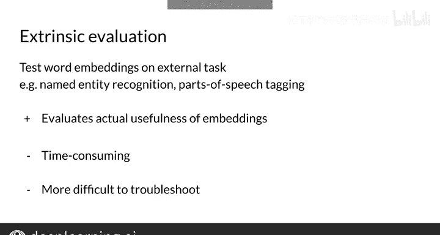

#  104：54_评估词嵌入外在评估 🧪

在本节课中，我们将要学习如何通过**外在评估**方法来评估词嵌入模型的质量。我们将了解外在评估的基本概念、具体任务示例，并分析其优缺点。

---

## 概述

上一节我们介绍了通过内在评估（如类比推理任务）来衡量词嵌入的质量。本节中，我们来看看另一种评估方式——**外在评估**。外在评估通过将词嵌入应用于实际的外部任务，并以该任务的性能指标作为词嵌入质量的代理标准。

## 什么是外在评估？

为了在外部任务上测试你的词嵌入，你可能会采用外在评估。例如，如果你构建了一个语音识别系统，那么了解它是否有效的唯一方法，就是在实际任务中测试整个系统。这种方法可能比内在评估更有效。

外在评估的具体做法是：使用词嵌入来执行一个外部任务，这个任务通常就是你最初需要词嵌入去解决的现实世界问题。

然后，使用该任务的性能指标（如准确率）作为词嵌入质量的代理。

## 有用的词级别任务示例

以下是两个常见且有用的词级别任务示例，它们常被用于外在评估：

*   **命名实体识别**：识别文本中具有特定意义的实体，如人名、组织名、地点等。
    *   例如，在句子 “Andrew works at DeepLearning.AI” 中，“Andrew” 是一个命名实体，被归类为“人物”；“DeepLearning.AI” 是另一个命名实体，被归类为“组织”。
*   **词性标注**：为句子中的每个单词标注其词性（如名词、动词、形容词等）。

你可以训练一个模型来帮助识别和分类句子中的命名实体，然后在测试集上使用选定的评估指标（如准确率或F1分数）来评估这个分类器。分类器在评估指标上的表现，代表了词嵌入和分类任务结合后的综合性能。

## 外在评估的优缺点

外在评估方法是确保词嵌入真正有用的最终测试。然而，它也存在一些主要缺点：

*   评估比内在评估更耗时。
*   如果性能不佳，性能指标无法提供具体信息，说明是端到端流程中的哪个特定部分出了问题——是词嵌入本身，还是用于测试它们的外部任务。

## 总结

本节课中我们一起学习了词嵌入的**外在评估**方法。我们了解到，外在评估通过在实际应用任务中的表现来衡量词嵌入的实用性，但它也存在**更难排查问题**和**更耗时**的缺点。至此，你已经掌握了内在和外在两种评估词嵌入的方法。如果你想深入了解这个主题，可以参考相关论文。

在进入下一个视频之前，让我们简要回顾一下所学内容：外在评估评估的是词嵌入的实际有用性，但更难进行问题排查且更耗时。