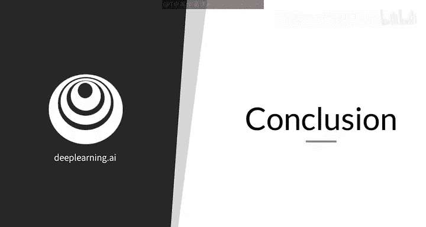
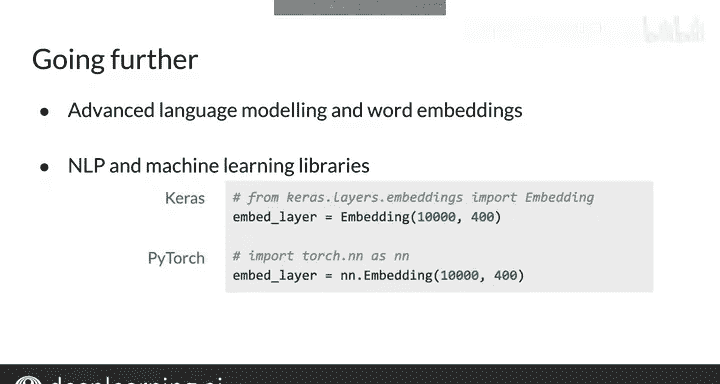

#  105：词嵌入技术总结与展望 🎯

在本节课中，我们将回顾本周学习的核心内容——词嵌入技术。你将了解如何从零开始训练词向量，并掌握其在自然语言处理中的实际应用。课程最后，我们将展望更高级的语言模型技术。

---

## 概述

本周我们全面学习了词嵌入技术。词嵌入能够将单词的含义捕捉到向量中，这些向量可用于简单和高级的自然语言处理应用。

你本周已经掌握了许多知识。让我们通过一些回顾来巩固你的新技能，并为接下来的作业做好准备。

---

## 本周核心技能回顾

上一节我们介绍了词嵌入的基本概念，本节中我们来具体回顾一下你已掌握的技能。

你不仅学会了如何使用词向量，还掌握了如何从零开始训练它们。这是一项非常有用的技能。

以下是本周你学到的具体内容：

*   **准备数据**：你将读取并标记化语料库以构建词汇表。
*   **创建词表示**：将单词映射到索引，以及反向映射，并将这些索引转换为独热向量。
*   **学习词嵌入**：通过创建连续词袋模型来学习词嵌入。
*   **构建与训练模型**：为该模型构建神经网络，进行训练，并提取得到的词嵌入向量。
*   **可视化评估**：将词嵌入向量可视化，作为一种内在评估方式。

---

## 最终作业实践

在最终的作业中，你将有机会实践本周学到的所有新技能。

完成作业后，你将能更好地转向更高级的语言建模和词嵌入方法。

这些更复杂的方法支持词汇表外的单词，并能更好地捕捉单词的多种可能含义。这些能力对于自然语言处理在现实世界中的应用至关重要。

---

## 现实世界中的应用与工具

最后，你需要知道，尽管在本次作业中你是从零开始实现一切，但在现实世界中，你通常会使用自然语言处理和机器学习库来完成繁重的工作。

花些时间探索这些库是值得的。

具体对于词嵌入，TensorFlow和PyTorch等库允许你使用单行代码在神经网络中添加一个嵌入层。其他库如Transformers也允许你这样做。

---

## 总结

本节课中我们一起学习了词嵌入技术的完整流程，从理论到实践。恭喜你完成本周的学习！你现在不仅知道如何使用词向量，还知道如何从零开始训练它们。这确实是一项非常有用的技能。