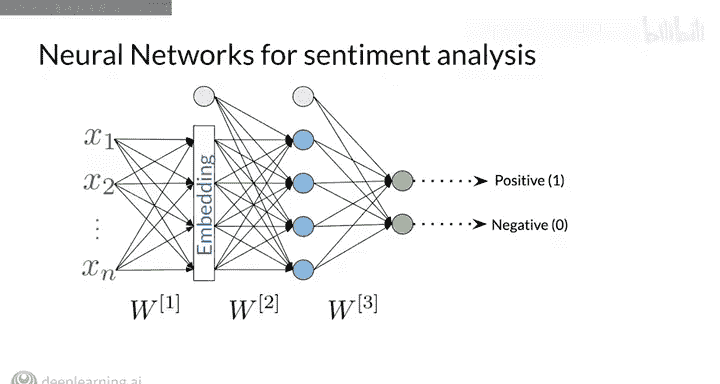
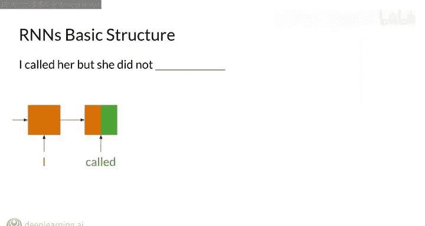
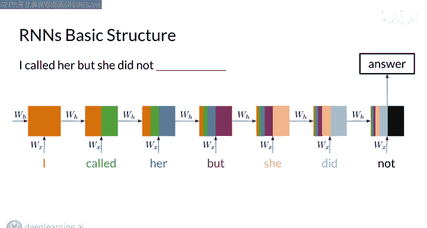
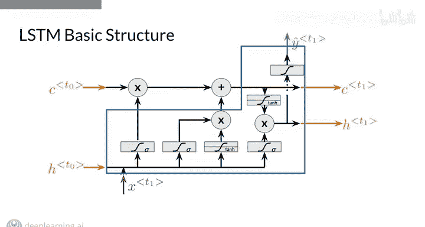
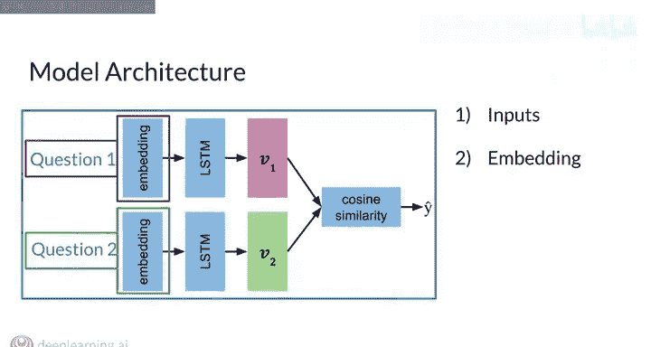
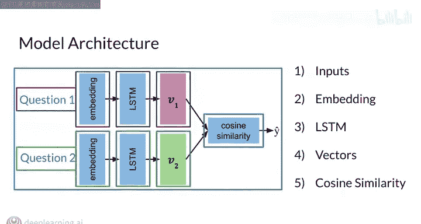
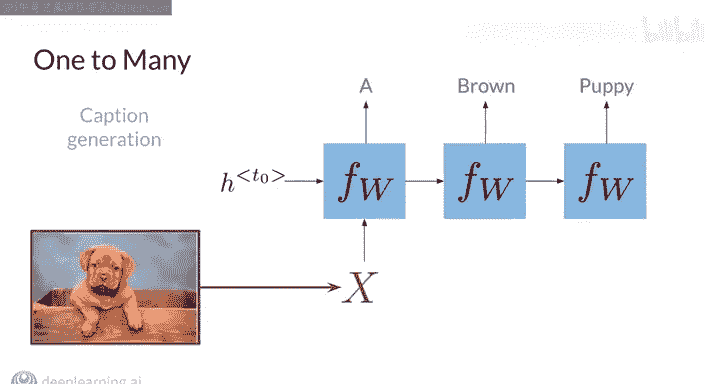
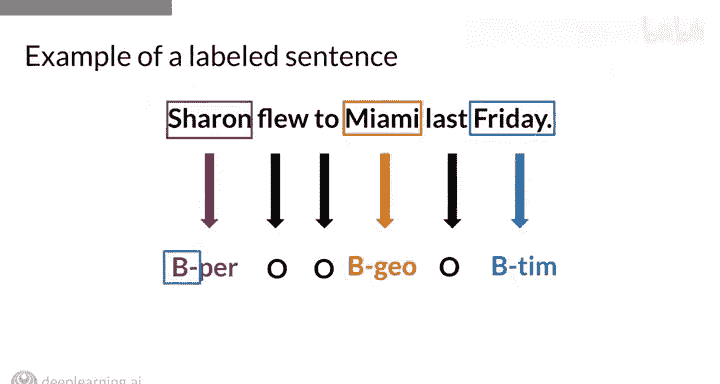
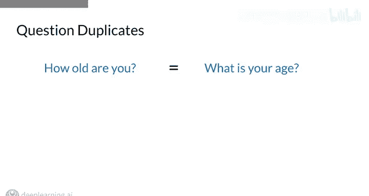

#  107：序列模型与自然语言处理 🧠💬

在本课程中，我们将学习如何利用序列模型构建强大的自然语言处理应用。我们将从情感分析入手，逐步深入到文本生成、命名实体识别以及重复问题检测等核心任务。

---

## 概述

欢迎来到本专项课程的第三门课。这门课程名为“使用序列模型的自然语言处理”。在本课程中，你将构建一系列实用的NLP应用。首先，你将使用深度神经网络将情感分析提升到新的水平。接着，你将使用循环神经网络（RNN）构建一个语言生成器。然后，你将把长短期记忆（LSTM）单元应用于命名实体识别问题。最后，你将使用孪生网络来识别重复问题，例如在在线论坛中判断不同用户是否在用不同措辞询问本质上相同的问题。通过在本课程中掌握的技能，你将能够构建强大的NLP系统，解决跨行业的广泛问题。

我们很高兴欢迎Lucas和Eice担任本课程的讲师，他们将与你一同深入探讨这些主题。

---

## 课程内容详解

上一节我们对课程进行了整体介绍，本节中我们来看看课程的具体内容和目标。

以下是本课程你将构建的核心应用：

1.  **情感分析**：你将利用深度神经网络，构建一个比第一门课程中基于朴素贝叶斯的分类器更强大的情感分析分类器。
2.  **语言生成**：你将使用循环神经网络创建一个高级模型来生成文本。这可以看作是从基础技能迈向构建真实世界NLP应用的关键一步。
3.  **命名实体识别**：你将应用LSTM单元来解决命名实体识别问题，即从句子中识别出如人名、地名等特定实体。这是许多重要NLP系统的基石。
4.  **重复问题检测**：你将使用孪生网络来解决识别文本重复的问题。判断两段文本是否互为重复，是构建在线论坛和搜索引擎等应用的核心模块。

---

## 课程基础与进阶

在了解了具体应用后，我们来看看本课程与之前课程的衔接。

本专项课程的前两门课为你打下了坚实的基础，提供了必要的背景知识和核心技能来应对本课程。例如，在第一门课中，你已经使用简单的朴素贝叶斯分类器完成了情感分析。现在，你将利用深度神经网络的力量构建一个更鲁棒的情感分析分类器。同样，在第二门课中，你已经学习了如何使用相对简单的n-gram语言模型来预测序列中的下一个词。本课程将在此基础上，使用循环神经网络创建高级的文本生成模型。

---

## 应用场景与意义

理解了技术路线后，本节我们探讨这些应用的实际价值。

情感分析是一个复杂但极具价值的问题，在许多应用中都需要确定句子的情感倾向。语言建模所能解决的问题几乎是无限的，从翻译、自动补全到从零开始生成文本。命名实体识别是信息提取的关键步骤。而重复问题检测，初听起来可能不那么有趣，但实际上是构建在线论坛和搜索引擎等系统的核心组成部分。我们非常高兴能向你展示这些应用，并将你的技能提升到新的水平。

---

## 总结

本节课中，我们一起学习了第三门课程“序列模型与自然语言处理”的总体介绍。我们了解到，本课程将引导我们使用深度神经网络、RNN、LSTM和孪生网络等序列模型，构建包括高级情感分析、文本生成、命名实体识别和重复问题检测在内的四个核心NLP应用。这些技能将帮助我们解决现实世界中的广泛问题。

这是一门令人兴奋的课程，让我们开始吧。祝你好运，学习愉快！