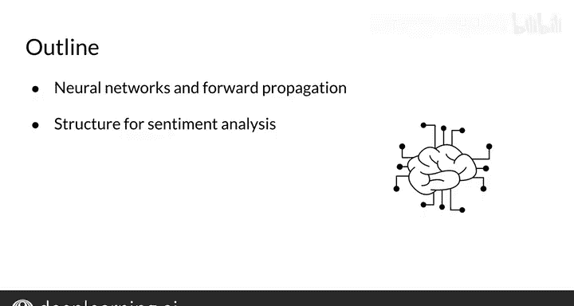
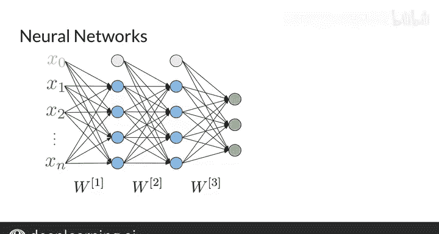
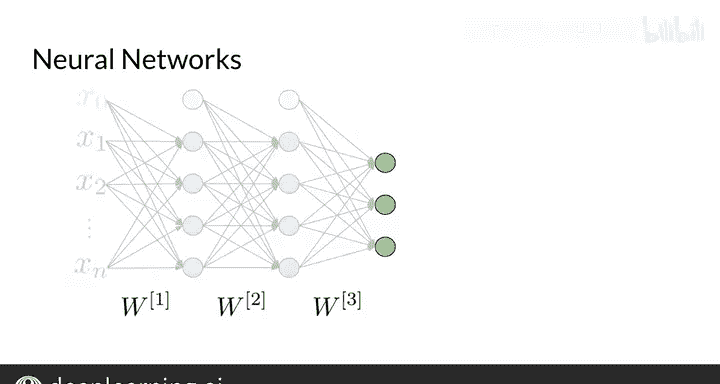
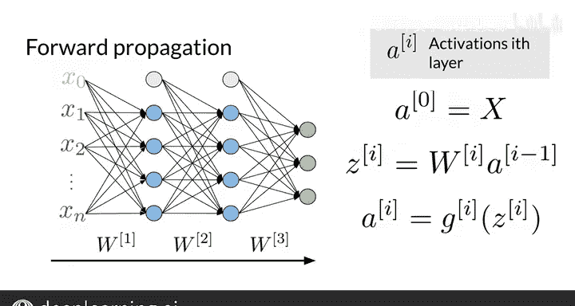
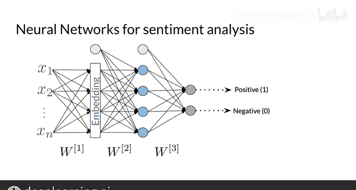
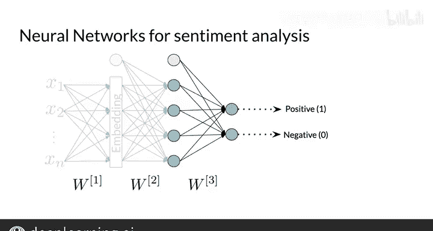
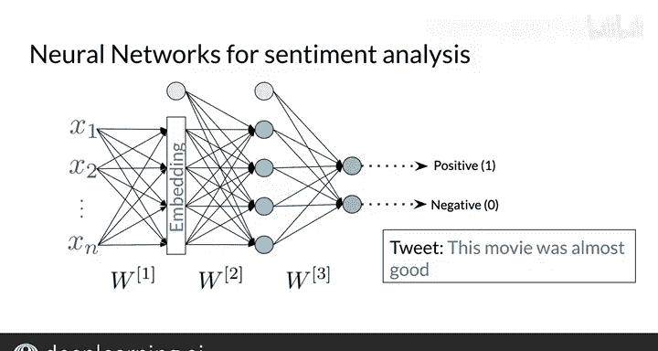
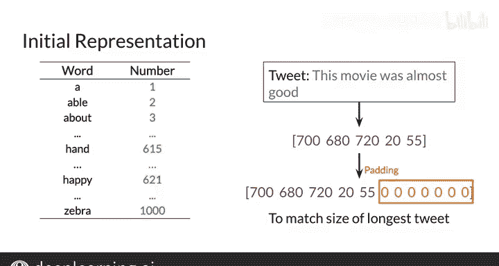
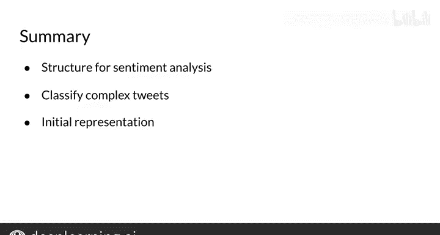

#  109：用于情感分析的神经网络 🧠

在本节课中，我们将学习如何构建一个用于情感分析的神经网络。我们将回顾神经网络的基本结构，并了解如何将其应用于处理复杂的、带有细微差别的推文情感分类任务。

---

## 神经网络结构回顾

上一节我们介绍了情感分析的基本概念，本节中我们来看看用于此任务的神经网络结构。

神经网络是一种计算结构，它以简化的方式尝试模仿人脑识别模式的方式。它们在人工智能的许多应用中都有使用，并且在包括自然语言处理在内的各种任务上被证明非常有效。

请看这个简单的神经网络示例，它具有 n 个输入参数、两个隐藏层和三个输出单元。

作为输入，该神经网络接收一个具有 n 个特征的数据表示 X。然后在隐藏层中执行计算。最后，它输出一个结果，在本例中输出大小为 3。

让我们看看它在数学上是如何工作的。我将每一层的激活表示为上标 I，其中 I 是层号。首先，定义上标 0 为输入向量 x。要获取每一层激活值 a，必须计算 z 上标 I 的值，该值取决于该层的权重矩阵和前一层的激活值 a。

最后，通过对 Z 的值应用激活函数 G 来获得每一层的值。如你所见，这个计算从神经网络的左侧向前推进到右侧。这就是为什么这个过程被称为**前向传播**。

---

## 本模块的神经网络设计

了解了基本结构后，我们来看看为本模块作业专门设计的神经网络。

对于本模块的作业，你将实现一个如下所示的神经网络。

作为输入，它将接收推文的简单向量表示。它将有一个嵌入层，将你的表示转换为适合此任务的最优表示。最后，它将有一个使用 ReLU 激活函数的隐藏层，以及一个使用 Softmax 函数的输出层，该层将给出推文具有积极或消极情感的概率。

这个神经网络将允许你预测复杂推文的情感。例如，像“这部电影几乎算好”这样的推文，使用朴素贝叶斯等更简单的方法无法正确分类，因为它们会遗漏重要信息。

---

## 输入表示与填充处理

现在，我们来看看如何为神经网络准备输入数据。

你将用于此神经网络的初始表示 X 将是一个整数向量，类似于之前情感分析的工作。首先，你需要列出词汇表中的所有单词。接下来，为此应用，你将给每个单词分配一个整数索引。然后，对于推文中的每个单词，添加词汇表中的索引以构建每个推文的向量。

以下是构建向量表示的步骤：
1.  列出词汇表。
2.  为每个单词分配一个整数索引。
3.  对于每条推文，遍历其中的单词，并用对应的索引构建向量。

在你获得所有推文的向量表示之后，你需要确定最大向量大小，并用零填充每个向量以匹配该大小。这个过程称为**填充**，它确保所有向量具有相同的大小，即使你的推文长度不同。

---

## 总结与预告

本节课中我们一起学习了用于情感分析的神经网络。我们快速回顾一下。至此，你已经熟悉了用于对一组复杂、微妙的推文进行情感分类的神经网络的一般结构。你还回顾了本模块中将使用的整数表示方法。

在本视频中，你看到了使用神经网络进行情感分析的概述，了解了如何使用填充以及如何表示一条推文。在下一个视频中，我们将更深入地探讨情感分析。

