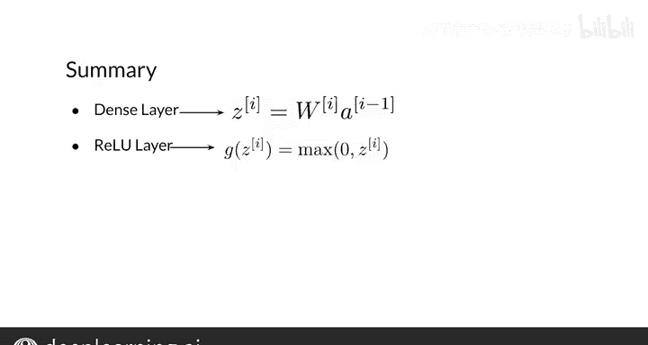

#  110：3_全连接层与ReLU 🧠

在本节课中，我们将要学习神经网络中最常用的两种核心层：全连接层（Dense Layer）和ReLU层。我们将详细探讨它们的工作原理、数学表达以及在构建神经网络模型中的作用。

---

## 概述

大多数神经网络都包含两种非常常用的层。一种是全连接层，它负责网络中层与层之间的信息传递。另一种是ReLU层，它的作用是保持网络的稳定性。接下来，我们将对它们进行更详细的探索。

---

## 全连接层详解

上一节我们介绍了神经网络的基本结构，本节中我们来看看其中的核心计算层——全连接层。

首先，我将回顾在前几个视频中已经提到的全连接层，然后向你展示ReLU层是如何工作的。

回忆一下，在一个隐藏单元 `J` 中，会顺序发生两个计算。
1.  首先，它计算与该隐藏单元相关的权重和来自前一层的激活值之间的点积。
2.  然后，将一个非线性函数应用于该点积的结果。

观察一个隐藏层 `I`（即使在简单的神经网络中也是如此），你将拥有多个单元，其中第一个计算是点积，记为 `Z[I][J]`。

全连接层通过将权重矩阵 `W[I]` 与前一层的激活值 `A[I-1]` 相乘，一次性计算出所有这些点积。其中，权重矩阵包含一组可以在训练过程中学习的参数。

**公式表示：**
`Z[I] = W[I] * A[I-1] + b[I]`
（注：为完整起见，此处补充了偏置项 `b`，这是全连接层的标准公式）

在全连接层之后，通常会对每个隐藏单元中的 `Z` 值应用一个非线性函数 `G`。

---

## ReLU层的工作原理

上一节我们介绍了全连接层的计算，本节中我们来看看紧随其后、至关重要的非线性激活函数——ReLU。

ReLU函数是完成此任务的典型选择。它在将值发送到下一层之前，将所有负值映射为0。它计算一个函数，对于 `Z_subj` 的负值返回0，而对于正的 `Z_subj` 则不做任何改变。

这相当于对每个隐藏单元取0和 `Z` 之间的最大值。

**公式表示：**
`A[I][J] = ReLU(Z[I][J]) = max(0, Z[I][J])`

ReLU代表“修正线性单元”，当你查看其函数图像时会觉得这个名字很贴切，因为函数的负值部分被“修正”以匹配水平轴（即X轴）。

正如你在此处所见，负值部分被置零，正值部分保持线性。

你现在已经更详细地了解了全连接层，我也向你展示了ReLU层的工作原理。

---

## 模型组合概述

接下来，我将讨论如何将这些组件组合成一个完整的模型。通过交替堆叠全连接层和ReLU层，我们可以构建出能够学习复杂模式和关系的深度神经网络。

---

## 总结

本节课中我们一起学习了神经网络的两个基本构建模块：
1.  **全连接层**：负责进行层间的线性变换（权重与输入的矩阵乘法）。
2.  **ReLU激活层**：负责引入非线性，将线性变换后的负值输出置零，保留正值，这是网络能够学习复杂函数的关键。

理解这两层是理解现代深度学习模型的基础。在后续课程中，我们将看到如何将它们组合起来，构建出功能强大的神经网络。