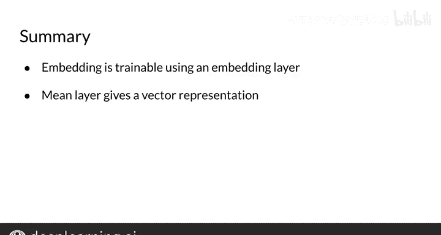

#  111：嵌入层与均值层 🧠

在本节课中，我们将学习神经网络中两种重要的层：**嵌入层**和**均值层**。我们将了解它们的作用、工作原理以及如何在序列模型中应用它们。

---

上一节我们介绍了密集层和ReLU层。本节中，我们来看看另外两种在自然语言处理中非常有用的层：**嵌入层**和**均值层**。

## 嵌入层详解 🔍

在自然语言处理中，我们通常有一个由独特单词组成的集合，称为**词汇表**。

嵌入层的作用是：将词汇表中每个单词对应的索引，映射到一个具有特定维度的向量表示。例如，一个维度为2的嵌入层。

以下是嵌入层的工作原理：

*   嵌入层接收一个单词索引（例如，单词“I”的索引）。
*   它根据一个可训练的权重矩阵，返回该单词对应的向量表示。
*   例如，对于单词“I”，嵌入层可能返回向量 `[0.020, 0.006]`；对于单词“NLP”，可能返回 `[-0.009, 0.050]`。

嵌入层中的所有权重值都是**可训练的**。这意味着，当你在模型中使用嵌入层时，模型会学习到最适合当前NLP任务的单词向量表示。

在你的模型中，嵌入层需要学习的权重矩阵大小为：
`词汇表大小 × 嵌入维度`
嵌入维度的大小可以作为模型的一个**超参数**进行调整。通过这个层，模型可以针对特定任务优化单词的向量表示，就像优化其他层的权重矩阵一样。

## 从嵌入到均值：处理序列 🧩

嵌入层能够将单词映射为向量。那么，如何处理像“I am happy”这样的一系列单词（例如一条推文）呢？

以下是处理流程：

1.  嵌入层会依次将句子中的每个单词映射为其对应的嵌入向量。
2.  最终，它会返回一个**词嵌入矩阵**。

如果你使用填充向量来表示不同长度的推文，理论上可以将这个矩阵展开，并将其值输入到神经网络的下一层。但这样做可能会导致需要训练的参数数量过多。

作为一种替代方案，我们可以计算嵌入向量在每个特征维度上的**平均值**。这正是**均值层**所做的事情。

均值层接收一个词嵌入矩阵，并返回一个向量。这个向量的长度等于嵌入维度，它代表了整个输入序列（如一条推文）的“平均”语义。

**请注意**：均值层本身**没有任何可训练的参数**，因为它只是执行简单的算术平均计算。它的优势在于，无论输入文本序列有多长，经过均值层后，输出向量的维度都保持不变，这简化了后续层的处理。

## 课程总结 📝

本节课中，我们一起学习了嵌入层和均值层。

*   **嵌入层**：将词汇表中的单词索引映射为可训练的、密集的向量表示。使用嵌入层可以让模型针对特定任务学习到最佳的词汇表示。
*   **均值层**：接收一个词嵌入矩阵，并通过对所有单词向量取平均值，生成一个固定长度的向量来表示整个文本序列（如一条推文）。它没有可训练参数，主要用于降维和特征聚合。

现在，你的工具箱里已经有了四种基础层：**密集层**、**ReLU层**、**嵌入层**和**均值层**。这些知识足以为你打下坚实的基础，让你可以开始构建自己的神经网络模型。