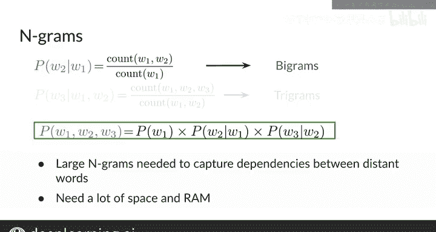

#  113：传统语言模型的局限性 🧠

在本节课中，我们将学习传统N-gram语言模型的基本原理，并重点探讨其在实际应用中的主要局限性，特别是对存储空间和内存的高要求。

## 概述

上一节我们介绍了N-gram语言模型的基本概念。本节中，我们将深入分析该模型的局限性，并理解为何在处理长序列或大规模语料时，它会变得不切实际。

## N-gram模型回顾

N-gram语言模型通过计算条件概率来评估一个词序列的可能性。具体来说：

*   对于**二元语法（Bigram）**，使用前一个词来计算当前词的条件概率。
*   对于**三元语法（Trigram）**，使用前两个词来计算条件概率。
*   推广到**N-gram模型**，则使用前 **`n-1`** 个词来计算条件概率。

最终，整个句子的概率通过将序列中每个词的条件概率相乘得到。对于一个三元组句子，其二元语法模型的计算公式如下：

**`P(w1, w2, w3) = P(w1) * P(w2|w1) * P(w3|w2)`**

## N-gram模型的局限性

尽管N-gram模型直观易懂，但它存在几个显著的缺点。

以下是N-gram模型面临的主要挑战：

1.  **捕捉长距离依赖困难**：为了捕捉句子中相距较远的词语之间的依赖关系，模型需要计算非常长的词序列的条件概率。这在数据稀疏的情况下难以准确估计。
2.  **存储需求巨大**：模型需要存储所有可能词组合的概率。随着N的增大或词汇表的扩展，需要存储的概率数量会呈指数级增长，占用大量的磁盘空间和内存。
3.  **数据稀疏性问题**：即使拥有大型语料库，许多长尾的、特定的词序列也可能出现次数极少，导致其概率估计不可靠。

可以预见，随着模型复杂度的提升，这种方法很快就会变得不切实际。

## 过渡到更高效的模型

鉴于传统N-gram模型的这些限制，开发者们在资源受限的场景（如手机应用程序）中可能希望寻求替代方案。

接下来，我将向你介绍**循环神经网络（RNNs）** 和**门控循环单元（GRUs）**。这两种模型在处理如机器翻译等自然语言处理任务时，比N-gram模型高效得多。

## 总结

本节课我们一起学习了传统N-gram语言模型的工作原理，并重点分析了它的核心局限性：难以建模长距离依赖，以及随着模型复杂度增加，对存储空间和内存的需求会变得极其庞大。正是这些缺点推动了像循环神经网络（RNNs）这样更高效模型的发展。