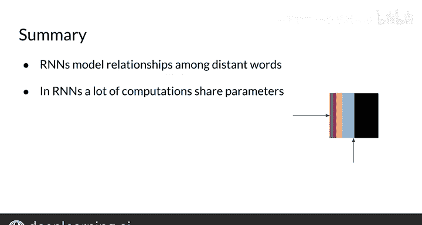

#  114：循环神经网络 (RNN) 🧠

## 概述
在本节课中，我们将要学习循环神经网络（RNN）的基本概念。我们将了解RNN相比传统N元语法模型的优势，并初步探索其工作原理。

---

## RNN的优势与应用场景

你已经理解了语言模型完成句子的基本思想。让我们来看一个具体的例子。

**例句**：Nor was supposed to study with me. I called her, but she did not ______.

如果你使用一个传统的语言模型，比如三元语法模型，来尝试完成这个句子，你会比较不同单词在“did not”之后出现的概率，然后选择概率最高的词。例如，你的模型可能会选择单词“have”，因为在典型的文本语料库中，看到这个三词序列的概率很高。

然而，在这个句子中使用“have”没有任何意义。一个更好的选择是“answer”。

RNN的优势在于，它不受限于只看前n个单词。它能够将信息从句子开头传播到结尾。因此，如果你为此任务训练一个RNN，你会得到一个更好的预测结果，即单词“answer”，尽管这个词本身出现的概率可能较低。

如果你想用一个N元语法模型来完成这样的句子，你将不得不考虑长达六个词的序列，这在实际应用中是非常不切实际的。

---

## RNN的工作原理

为了理解循环神经网络如何工作，我们以上一个例子中的第二句话为例。

**例句**：I called her, but she did not ______.

一个基础的RNN将信息从句子开头传播到结尾。这个过程从序列的第一个单词开始，最左侧的隐藏值在这里被计算。然后，它将部分计算出的信息传播出去，获取序列中的第二个单词，并计算出新的值。

这个过程可以这样描述：橙色的区域表示第一次计算出的值，绿色的区域表示第二个单词。第二次计算出的值使用了橙色的旧值和绿色的新单词。之后，它获取第三个单词，以及从第一个和第二个单词传播来的值，并利用这两者计算另一组值，依此类推。

这个示意图中的每个方框都代表了每一步所做的计算。颜色代表了每次计算所使用的信息。正如你所见，最后一步所做的计算包含了句子中所有单词的信息。在最后一步，循环神经网络能够预测出单词“answer”。

---

## RNN的核心机制

循环神经网络的神奇之处在于，序列中每个单词的信息都乘以相同的权重 **Wₓ**。而从开头传播到结尾的信息则乘以权重 **Wₕ**。

换句话说，这个计算模块对序列中的每个单词都会重复执行。因此，唯一可学习的参数就是 **Wₓ**、**Wₕ** 以及用于做出最终预测的权重 **W**。

这就是它们被称为“循环”神经网络的原因：它们计算出的值会一遍又一遍地反馈给自身，直到做出预测。

RNN的主要优势在于它们能够在序列内部传播信息，并且大部分计算共享参数。

---

## 总结与预告

本节课中，我们一起学习了循环神经网络（RNN）的基本原理。我们看到，相比传统的N元语法模型，RNN能够利用更长的上下文信息来做出更准确的预测，例如在句子补全任务中。其核心机制是通过共享的权重参数，将序列中每个步骤的信息循环传递下去。

在上面的例子中，我们看到了一个从单词序列开头传播信息到结尾，并在最后做出单一预测的RNN。

下一节，我们将看看不同类型的RNN架构、简单架构背后的数学原理以及实现它们的方法。