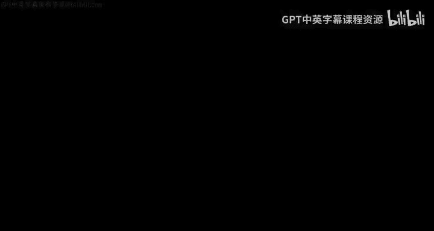
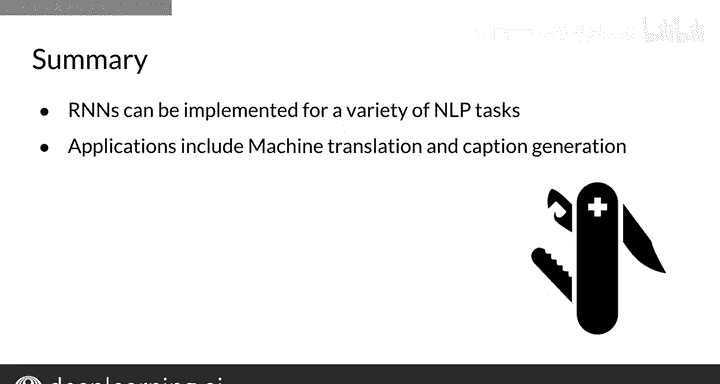

#  115：RNN的应用 🧠

在本节课中，我们将学习循环神经网络（RNN）的不同应用场景。我们将根据输入和输出的特点，对任务进行分类，并了解每种任务对应的RNN架构。通过本节课，你将理解RNN如何被灵活地应用于多种自然语言处理任务中。

---

## 任务类型分类 📊

AI领域存在多种不同类型的任务。本节将根据输入和输出的性质对它们进行分组。

### 一对一任务

一对一任务接收一组低相关或不相关的特征 **X** 作为输入，并返回单个输出 **Y**。例如，如果你有你最喜欢的欧洲足球锦标赛球队的一系列比赛得分作为输入，你可以使用一个循环神经网络来预测你球队在排行榜上的位置。

然而，请注意，这种循环神经网络与传统神经网络没有太大区别。它仅多了一个额外的隐藏状态 **H⁰**。因此，对于这类任务，RNN并不是特别有用。

### 一对多任务

如果你想要一个神经网络接收任意图像，并生成一段用英语描述该图像内容的标题（例如，“一只棕色的小狗”），你可以构建一个RNN。这类任务被称为“一对多”，因为你的RNN接收单个图像，并生成多个词语来描述它。

### 多对一任务

你可能已经熟悉这类任务的一个实际例子：情感分析。在这种情况下，如果你有一个单词序列（例如，一条推文“我非常开心”）作为输入，你的模型应该输出该推文的情感是消极还是积极。😊

你的RNN会将序列中的每个单词作为不同步骤的输入，将信息从开始传播到结束，并输出情感判断。

### 多对多任务

最后，多对多任务涉及多个输入和多个输出。例如，在机器翻译中，你有一个法语单词序列，你想得到它在另一种语言（如英语）中的对应序列。

RNN非常适合这项任务，因为它们能将信息从开始传播到结束。这使得它们能够捕捉整个序列的总体含义。

这种特定的架构——编码器-解码器——在机器翻译中非常流行。该神经网络的第一部分不返回任何输出 **Ŷ**，被称为编码器，因为它将序列编码为一个单一的表示，该表示捕捉了句子的整体含义。随后，这个表示被解码为另一种语言的单词序列。

---

## 总结 📝

本节课中，我们一起学习了循环神经网络（RNN）的多种应用架构。RNN是强大的架构，可用于解决NLP中的许多有趣问题。

以下是RNN的一些主要应用领域：
*   机器翻译
*   图像描述生成

你可以将RNN视为多功能的工具，可以根据具体情况进行调整。根据你试图解决的任务，你可以选择上述架构中的一种。在下一个视频中，我将讨论一个简单的循环神经网络，然后你可以将其应用于所有这些架构。