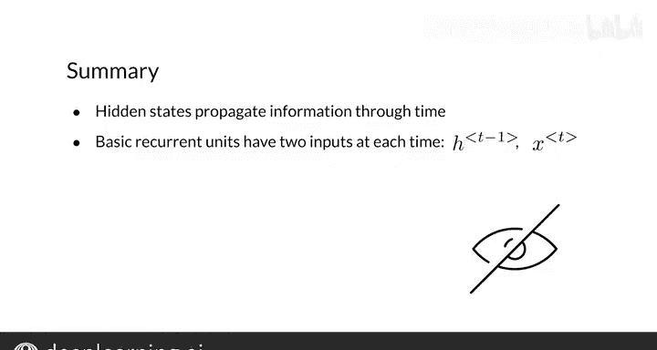

#  116：简单RNN中的数学 🧮

在本节课中，我们将学习简单循环神经网络（RNN）背后的数学原理。我们将了解RNN如何通过时间步处理序列数据，以及如何进行计算和预测。课程内容将涵盖RNN的基本结构、前向传播公式以及核心计算步骤。

---

## RNN的基本结构与思想

上一节我们介绍了RNN的优势和基本思想。RNN看似结构复杂，但其计算过程实际上相当直观。

本节中我们来看看RNN如何在时间序列中传播信息，以及如何进行序列预测。我们将熟悉基本循环单元背后的数学，为后续实现RNN的前向传播做好准备。

观察这个基础的RNN结构。它有一个典型的架构。在每个时间步，它接收一个输入 **x**、一个隐藏状态 **H**，并生成一个预测 **Ŷ**。此外，它还会将一个新的隐藏状态传播到下一个时间步。

---

## 隐藏状态的计算公式

每个时间步 **t** 的隐藏状态由一个激活函数 **g** 计算得出。该函数的参数等于参数矩阵 **WH** 与上一个隐藏状态 **Ht-1** 的乘积，再与输入变量 **xt** 拼接，最后加上一个偏置项 **b**。

完整的公式如下所示，其中 **xt** 和 **Ht-1** 分别与不同的参数相乘，然后将得到的向量按元素相加。

**Ht = g( WH * [Ht-1, xt] + b )**

在计算出时间 **t** 的隐藏状态后，可以通过另一个激活函数 **g** 来获得预测值 **Ŷ**。该函数的参数等于隐藏状态与另一组参数 **WYH** 的乘积，再加上一个偏置项。

**Ŷt = g( WYH * Ht + b )**

这两个公式共同构成了简单RNN的全部数学基础。

---

## 计算步骤详解

现在，让我们详细看看计算的顺序。

聚焦于RNN的第一个单元。它接收上一个隐藏状态和当前输入变量 **x** 作为输入，**x** 可能是一个句子中的第一个单词。

以下是计算当前隐藏状态和预测值的步骤：

1.  首先，计算 **x** 和 **Ht-1** 与各自参数的乘积。
2.  然后，将得到的两个向量按元素相加。
3.  接着，将结果向量通过一个激活函数（如tanh）。
4.  得到当前隐藏状态 **Ht** 后，将其与另一组可学习参数 **WYH** 相乘。
5.  最后，将乘积结果通过另一个激活函数（如softmax），得到当前预测 **Ŷt**。

在RNN相关的文献中，你会看到类似这里的图示，它们展示了计算顺序以及信息如何在循环单元内传播。

---

## 核心概念与总结

本节课中我们一起学习了简单RNN的数学原理。需要理解的关键点是：**隐藏状态是允许RNN在时间（或者说，在序列的不同位置）中传播信息的变量**。正如你所见，在每个时间步，循环单元都有两个输入。

你现在已经了解了RNN的前向传播方程和成本函数。在下一节视频中，我将向你展示RNN的成本函数是如何工作的。